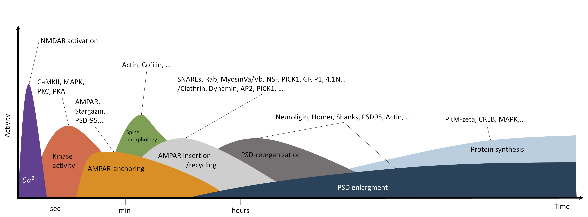

.. _`sec:introduction_pyrid`:

Introduction
============

The cell environment
--------------------

Cells are crowded and inhomogeneous. Its components are constantly
undergoing transitions between different states via biochemical
reactions. They are translocated actively or via diffusion while their
movement is restricted by the shape of cell compartments. Biomolecules
move either in 3d within the cell on a 2d surface within cell membranes.
New proteins are constantly synthesized while others are broken down.
Interactions between molecules drive phase separation and protein
aggregation. This list of processes governing cells could go on.
Depending on the research question at hand, we would like to be able to
account for any of these features in a model.

As an example, synaptic plasticity at excitatory synapses is mediated
mainly by a change in AMPA receptor number at the postsynaptic density
(PSD) (:numref:`fig:ampar_trafficking`). Of the different forms of
synaptic plasticity that have been discovered, long-term potentiation
(LTP) is the most noted (:numref:`fig:synpl_processes`).
Therefore, it is of great interest to understand how AMPARs are
trafficked. However, this question is not easily answered as AMPARs have
a multitude of interaction partners which are important for AMPAR
targeting.

.. figure:: Figures/AMPAR_Trafficking.png
   :width: 50%
   :name: fig:ampar_trafficking

   **AMPAR trafficking at the synapse.** Whereas LTP, LTD but also
   homeostatic synaptic plasticity involve many different biomolecular
   processes, many of them target at some point the AMPA receptor, which
   mediates synaptic transmission at excitatory synapses. The
   trafficking of AMPARs can be related to various processes such as
   spine growth and receptor binding that are depicted in this figure.

The transmembrane domain of AMPARs forms a complex with various
auxiliary proteins such as Stargazin. These auxiliary proteins interact
with scaffolding proteins in the intracellular space of the postsynapse
such as PSD95. In addition, trans-synaptic complexes composed, e.g., of
neuroligin and neurexin bind to PS95 and presynaptic proteins such as
N-cadherin are known to interact with AMPARs
:cite:p:`Baranovic2021, Tanaka2012b`. The many proteins at
synapses result in a crowded environment. In addition, the synaptic
cleft only measures 20-30 nm in width. As such, effects of molecular
crowding are accompanied by geometric restrictions.

   **Processes involved in synaptic plasticity (long-term
   potentiation).** Long-term potentiation involves several different
   processes on different time- and spatial scales. High frequency
   stimulation and strong postsynaptic depolarization result in the
   influx of :math:`Ca^{2+}`. Calcium elevation occurs on the ms
   timescale and occurs locally in the dendrite and at dendritic spines
   :cite:p:`Frick2004`. Subsequently, calcium ions activate
   different kinases such as CaMKII, PKC and PKA. CaMKII in particular
   is essential for LTP induction. The activation of CaMKII is transient
   and occurs locally at the dendritic spine
   :cite:p:`Lisman2012, Lee2009`. The increased kinase
   activity triggers many subsequent processes. For example,
   phosphorylation of AMPAR subunits, PSD scaffolding proteins and
   auxiliary proteins such as Stargazin cause binding of additional
   AMPARs at the postsynaptic density
   :cite:p:`Opazo2012, Penn2017, Huganir2013, MacGillavry2011`.
   In addition, induction of LTP triggers spine growth, which also
   depends, among others, on CaMKII activation, F-actin elevation and
   cofilin
   :cite:p:`Fukazawa2003, Okamoto2009, Matsuzaki2004`. LTP
   and spine growth are accompanied by enhanced protein recycling,
   endocytosis and exocytosis
   :cite:p:`Park2004, Park2006, Patterson2010`. Maintenance
   and expression of late LTP depends on the synthesis of new proteins
   :cite:p:`Abraham2008, Bramham2008`. Protein synthesis,
   actin dynamics and translocation result in the reorganization and
   growth of the PSD
   :cite:p:`Kerr2012, Bosch2014, Meyer2014, Araki2015, Hruska2018`.

As mentioned above, the trafficking of transmembrane proteins such as
AMPARs that move on a 2d surface while inside the membrane is governed
also by their interaction with intracellular scaffolding proteins that
move in 3d space such as PSD95. In order to fully understand AMPAR
trafficking we may also want to investigate the behaviour of the
intracellular interaction partners. In a series of experiments,
:cite:p:`Zeng2016, Zeng2018, Zeng2019` have shown that the
PSD proteins PSD95, Shank, SynGAP and Homer undergo liquid-liquid phase
separation (LLPS) in vitro, raising the assumption that also in vivo the
PSD may form via a similar mechanism. Indeed, many proteins have been
found to form liquid like condensates and this topic has gained a lot of
attention in recent years as LLPs has many properties that seem to be
important for cell functions in that it enables compartmentalization in
the presence of constant protein exchange
:cite:p:`Banani2017`. Indeed, experimental studies have found
that the PSD is not entirely rigid but able to change its structure and
composition under control conditions and in response to synaptic
plasticity :cite:p:`Wegner2018, Bosch2014, Hruska2018`. This
raises several questions, e.g, of how stable are PSD condensates, and
under what conditions do they form? Also, how does the interaction with
transmembrane proteins shape the composition, structure and stability of
such condensates?

Importantly, erroneous factors that bias LLPS can lead to pathological
conditions via protein aggregation. As such, LLPS might have
implications for diseases such as Alzheimer, ALS, and cancer
:cite:p:`Lu2021, Molliex2015, Wegmann2018`. A better
understanding of phase separation is therefore of great interest in
general as well as a possible mechanism involved in synaptic
transmission and plasticity. The geometric restrictions at the synaptic
cleft are also of great importance for experimental procedures.
Fluorescent labeling of proteins often involve antibodies that can be
10-20 nm in size, impairing AMPAR movement inside and in the vicinity of
the synaptic cleft :cite:p:`Lee2017`. However, the effects of
crowding and of large probes at the synaptic cleft have not been
investigated apart from :cite:p:`Lee2017` such that older
experimental results may need to be reevaluated. Computer models could
help to better understand these effects and to better interpret
experimental data.

To summarize, their exist several open questions of which here only very
few have been addressed:

#. How is receptor trafficking influenced by different crowded
   environments, by the interaction with other molecules and by synapse
   geometry.

#. How do PSD composition and structure influence receptor distributions
   and vice versa.

#. Under what conditions do the PSD proteins undergo phase separation
   and how stable is the PSD? How is the phase behaviour of the PSD
   shaped by the interaction with transmembrane proteins?

#. ...

If we want to understand synaptic transmission and plasticity in more
detail, we should take into account the structure of the PSD, the spine
morphology and multivalent protein-protein interactions and we need to
ask how these factor might influence receptor distribution and
trafficking. This becomes important especially in the light of diseases.
Synaptic signaling, neuronal growth etc. are robust also because their
exists some redundancy in protein function. However, sometimes a small
bias can result in erroneous functioning. To understand when and under
what conditions these may arise we need to study not only the single
proteins but we need to put these into an environment where they can
interact in large populations. For this, however, we need powerful and
especially flexible tools that can be relatively quickly adapted to
target a new research question. In the following chapter I will
introduce PyRID, a new tool for reaction diffusion simulations of
interacting particles.

Modeling approaches
-------------------

One big problem that arises not only in terms of modeling synaptic
plasticity but for many cell processes in general are the different time
and spatial scales at which these processes occur as well as the large
number of complex molecules involved. A number of cell processes can be
simulated on the required time scale by using simplifications. Various
methods utilizing different approximations have therefore been developed
(:numref:`fig:modelling_methods`). For example, large signaling
pathways can be formulated in terms of systems of ODEs, also termed
reaction rate equations in this setting, or in terms of chemical master
equations which can be solved efficiently using stochastic simulation
algorithms such as the Gillespie SSA
:cite:p:`Smolen2012, Johnson2021`. However, this approach
neglects most aspects of the cellular environment, e.g. by assuming a
well mixed, homogeneous system. Also, intrinsic time delays are not
captured out of the box but can be accounted for to some degree by a
multi-compartment description where molecules hop between compartments.
Therefore, it is often required to add spatial dimensions. This can be
done, using voxel- (3D) or lattice- (2D) based methods, i.e. we solve
our chemical master equation per voxel and simulate diffusion by means
of molecules hopping between voxels. However, the approach does assume
that within each voxel the system is well mixed and that the voxel size
is much larger than the size of the molecules. Therefore, The voxel
based approach is mainly useful for large scale simulations but breaks
down for smaller systems. System scales above :math:`\mu m` and on time
scales of minutes are feasible. In this regard, the synapse and
sub-synaptic structures such as the PSD have to be considered as small
systems. Similarly, the ODE approach can be extended to partial
differential equations to include spatial dimensions. However, the PDE
approach underlies similar limitations and is not well suited for small
scale simulations with just a few hundred molecules. For models of the
synapse and sub-synaptic structures, particle based approaches are
therefore much better suited. A review on the above discussed approaches
can also be found in :cite:p:`Johnson2021`. There exist many
particle-based simulation methods. All atom molecular dynamics
simulations model the system of interest in great detail, however are
not suitable to investigate processes on larger scales, i.e., consisting
of hundreds to thousands of proteins and that take place on a micrometer
scale (size of the synapse). As such, coarse-graining approaches are
necessary where groups of atoms are approximated by single beads. The
level of coarse-graining can range from single amino acids to arbitrary
reductions of the polypeptide chain of the proteins
:cite:p:`Kmiecik2016, Dignon2019`. Mesoscopic molecular
dynamics takes this approach to the extreme and allows for the
simulation of thousands of proteins. Instead of representing proteins
per atom or per amino sequence, each protein is reduced to a minimal
representation of its excluded volume, i.e. an approximation of its
average rigid shape, and the interaction sites that are of interest in a
specific scenario, which may be represented by a single particle.
Thereby, in the minimal case, molecules are represented as patchy
particles :cite:p:`Espinosa2019`. Tools by which either of
the above approaches can be implemented are, e.g. LAMMPS, Gromacs or
HooMD. Coarse graining is a large field of research itself and many
problems such as defining a proper force field have to be solved.
However, a discussion on this topic is way beyond the scope of this
work. A review on coarse grained protein models can be found ,e.g., in
:cite:p:`Kmiecik2016`. Whereas mesoscopic molecular dynamics
allows for the simulation of the interaction of hundreds of proteins,
reaction kinetics are, however, usually neglected. The particle based
reaction diffusion approach simulates the Brownian dynamics of molecules
and also includes stochastic simulation algorithms for uni- and
biomolecular reactions :cite:p:`Kerr2008, Anderson2020`.
However, most particle-based reaction diffusion models represent
molecules as points and neglect force fields and pairwise particle
interactions. Therefore, whereas this simplification allow for even
larger simulations than the mesoscopic MD approach with 10 thousands of
molecules and time scales on the order of :math:`\mu s-s`, it is often
unrealistic, especially in crowded environments. Popular tools for
particle-based reaction diffusion simulations are, e.g., MCell
(CellBlender) and Smoldyn. The only particle-based reaction diffusion
simulator that accounts for particle interactions via potential energy
functions is ReaDDy. However, ReaDDy does out of the box not support
simulations in arbitrary 3D geometries and is also not well suited for
mesoscopic modeling as defined above as it does not support rigid bead
models of molecules. Therefore, I here introduce a new tool named PyRID,
which is a Python based simulator for reaction-diffusion models of
interacting particles. PyRID runs about as fast as ReaDDy, is flexible
and modifiable and supports 3D mesh geometries, surface diffusion, rigid
bead models and many types of uni and bimolecular reactions. A
comparison of features between PyRID, ReaDDy, MCell and Smoldyn is shown
in :numref:`fig:FeatureComparison`.

   **Modeling approaches.** Independent of whether one models the
   individual signaling pathways or processes such as exocytosis and
   spine growth, the question of the method is important. As discussed
   in the text, all-atom molecular dynamics are in principle capable of
   replicating all the processes we are interested in but are by far too
   computationally expensive. Such, only simulations on the nm spatial
   and the ns time-scale are possible. Therefore, coarse graining and
   mean field approaches are necessary. These, however, come at the cost
   of of neglecting many details. At the extreme, ordinary differential
   equations neglect any spatial and stochastic properties and are
   therefore suited to model processes on very long time scales.
   Intermediate approaches such as particle based reaction diffusion
   simulations or mesoscopic molecular dynamics are able to simulate
   biochemical reactions and molecular interactions by rate based
   approaches and coarse grained force fields. Which method to use
   strongly depends on the scientific question.

.. container:: landscape

   .. figure:: Figures/FeatureComparison_V3.png
      :width: 50%
      :name: fig:FeatureComparison

      **Feature comparison.** Please note that this feature comparison
      is not complete and biased towards PyRID as only the main features
      of PyRID are compared to the other tools. Each of the tools
      mentioned here have some unique abilities and features that are
      not necessarily supported by the other tools or PyRID. However, to
      do an all-encompassing comparison would go beyond the scope of
      this work.

