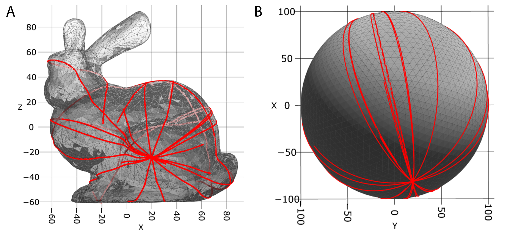

=================
Mesh compartments
=================

Compartmentalization is believed to play an important role in cell processes. Therefore, we would like to be able to restrict diffusion and reactions to the volume and surface of arbitrarily shaped compartments. Here, we follow the route of MCell \cite{Kerr2008} and represent compartments by triangulated meshes. This approach has several benefits over alternative approaches, such as representing compartments via force fields or other particles. However, the particle approach is highly inefficient. For example, it does not straightforwardly allow for surface diffusion, while the force field approach, in practice, strongly limits the compartment shape complexity. On the other hand, triangulated meshes are heavily used in computer graphics. Therefore, a large number of highly optimized algorithms exist. Also, triangulated meshes are very well suited to represent arbitrary complex compartment geometries. 

Volume molecules
----------------

The collision response of a molecule with the mesh is calculated in two different ways. For large rigid bead molecules, each triangle exerts a repulsive force on the individual beads; for small, isotropic molecules or atoms, we use a ray tracing algorithm.

**Contact forces**

Contact detection generally consists of two phases, 1) neighbor searching and 2) contact resolution. 
Contact detection and update of contact forces can become fairly complex, depending on the required accuracy, the complexity, the type of geometries involved, and whether frictional forces need to be accounted for. Contact resolution of the more complex type is found primarily in discrete element method simulations :cite:p:`Hu2013`. Here, however, we will not require exact accuracy but instead use a relatively simple but for the purpose sufficiently accurate approach.
A bead is said to be in contact with a mesh element (which can be a vertex, edge, or face) if the distance is smaller than the bead radius. In this case, a repulsive force is exerted on the bead:

.. math::
    U_{wall, i} = \sum_j^N \frac{k}{2} (r_{ij}-d)^2 \Omega_{ij}.

Here, :math:`N` is the number of neighboring mesh elements. :math:`\Omega_{ij}` accounts for the amount of overlap of bead i with mesh element j and the type of mesh element. :math:`\Omega_{ij}` can, in principle, become fairly complex; therefore, we here use a simple approximation, where :math:`\sum_j^N \Omega_{ij} = 1/N` for :math:`N \in \mathcal{F}` where :math:`\mathcal{F}` is the set of all neighboring faces the bead is in contact with. Thereby, we assume that the bead overlaps by the same amount with each mesh element and only account for overlaps with faces as valid contacts but not edges or vertices. If :math:`\mathcal{F} = \emptyset`, we take only the distance to the closest mesh element to calculate the repulsive force. To calculate the distance between the bead and a triangle, we use the "Point to Triangle" algorithm by :cite:t:`Eberly2001`, which seems to be slightly faster than the algorithm by :cite:t:`Ericson2004`.

**Ray tracing**

Contact force calculations are disadvantageous for small, spherical molecules because they require a very small integration time step. Here, ray tracing is more convenient as it works independently of the chosen time step. In this approach, which is similar to the contact detection used in MCell :cite:t:`Kerr2008`, the displacement vector :math:`\boldsymbol{\Delta R}` of the molecule is traced through the simulation volume and collisions with the compartment boundary or the mesh are resolved via reflection.

.. math::
    \boldsymbol{\Delta R}_{refl} = \boldsymbol{\Delta R} - 2 (\boldsymbol{\Delta R} \cdot \hat{\boldsymbol{n}}) \hat{\boldsymbol{n}},

where :math:`\hat{\boldsymbol{n}}` is the normal vector of the mesh surface element.
Collision tests are done using the "Fast Voxel Traversal Algorithm for Ray Tracing" introduced by :cite:t:`Amanatides87`.

Surface molecules
-----------------

Surface molecules laterally diffuse within the mesh surface and can represent any transmembrane molecules such as receptors. Here, I take a similar approach to MCell. Thereby, a molecule diffuses in the plane of a triangle until it crosses a triangle edge. In this case, the molecule's displacement vector is advanced until that edge and then rotated into the plane of the neighboring triangle. The rotation axis is given by the triangle edge. Thereby, the molecule will move in a strait line on the mesh surface (Figure :numref:`fig:gedodesic_StanfordBunny`). This method is equivalent to unfolding the triangles over the shared edge such that they end up in a common tangent space, i.e. such they are co-planar, advancing the position vector, and folding/rotating back. From the latter method it becomes intuitively clear that the molecule will indeed move in a straight line on the mesh surface.
As PyRID supports anisotropic rigid bead molecules, the orientation of the molecule needs to be updated as well for each triangle that is crossed. It is not sufficient, however, to rotate the molecule only after it has reached its final position, because the final orientation depends on the exact path that is taken (in case multiple triangles are crossed) and not only on the normal vector/orientation of the target triangle plane. To the best of my knowledge there does not exist a published reference implementation for propagating a position vector on a mesh surface. Therefore, in the following, I will present the method in a bit more detail.
The triangle edge intersection test can be made efficient by the use of barycentric coordinates. Let :math:`\boldsymbol{p}_0, \boldsymbol{p}_1, \boldsymbol{p}_2` be the three vertices of a triangle. Also, the vertices are numbered in counter clockwise order and the triangle origin is at :math:`\boldsymbol{p}_0`. Then, the center of the molecule :math:`R_0` can be described in barycentric coordinates by

.. math:: 
    :label: eq:barycentric_coord_1

    \boldsymbol{R}_0 = \boldsymbol{p}_0 + u(\boldsymbol{p}_1-\boldsymbol{p}_0) + v (\boldsymbol{p}_2-\boldsymbol{p}_0),

and the molecule displacement vector by

.. math::
    \boldsymbol{\Delta R} = du(\boldsymbol{p}_1-\boldsymbol{p}_0) + dv (\boldsymbol{p}_2-\boldsymbol{p}_0),

Efficient algorithms to compute the barycentric coordinates :math:`u` and :math:`v` can, e.g., be found in \cite{Ericson2004}.
We may also number the triangle edges in counter clockwise order, starting from the triangle origin :math:`\boldsymbol{p}_0`. As such, we are on the line :math:`\boldsymbol{p}_0 + u(\boldsymbol{p}_1-\boldsymbol{p}_0)` (edge 0) if  :math:`v=0`, on the line :math:`\boldsymbol{p}_0 + v (\boldsymbol{p}_2-\boldsymbol{p}_0)` (edge 2) if :math:`u = 0` and on the line :math:`u \boldsymbol{p}_1 + v \boldsymbol{p}_2` (edge 1) if :math:`u+v=1`.
Thereby, the edge intersection test comes down to solving

.. math::
    :label: eq:edge_intersection

    \begin{split}
    & u+t_{1}\cdot du = 0 \\
    & v+t_{0}\cdot dv = 0 \\
    & (u+t_{2} \cdot du) + (v+t_{2} \cdot dv) = 1 ,
    \end{split}

where :math:`t_{i}` with :math:`i \in \{0,1,2\}` is the distances to the respective edge :math:`i` along the displacement vector. We find that the intersections occur at

.. math::
    :label: eq:edge_intersection_2

    \begin{split}
    & t_{1} = -\frac{u}{du} \,\, (\text{edge 1}) \\
    & t_{0}=-\frac{v}{dv} \,\, (\text{edge 0})\\
    & t_{2}=\frac{1-u-v}{du+dv} \,\, (\text{edge 2}) .
    \end{split}

To determine with which edge :math:`\boldsymbol{R}+\boldsymbol{\Delta R}` intersects first, we simply need to check for the smallest positive value of :math:`t_{i}`.
Afterward, we advance :math:`\boldsymbol{R}` to the intersecting edge, reduce :math:`\boldsymbol{\Delta R}` by the corresponding distance traveled and transform :math:`\boldsymbol{R}` to the local coordinate frame of the neighboring triangle. The rotation of :math:`\boldsymbol{\Delta R}` into the plane of the neighboring triangle can be made efficiently using Rodrigues' rotation formula

.. math::
    :label: eq:Rodrigues

    \Delta \boldsymbol{R}_{rot} = \Delta \boldsymbol{R} \cos(\phi) + (\boldsymbol{a}_n \times \Delta \boldsymbol{R}) \sin(\phi) + \boldsymbol{a}_n (\boldsymbol{a}_n \cdot \Delta \boldsymbol{R}) (1-\cos(\phi)),

where 

.. math::
    :label: eq:cos_sin_phi

    \begin{split}
    & \cos(\phi) = \frac{\hat{\boldsymbol{n}}_1 \cdot \hat{\boldsymbol{n}}_2}{|\hat{\boldsymbol{n}}_1| |\hat{\boldsymbol{n}}_2|} \\
    & \sin(\phi) = \frac{\hat{\boldsymbol{n}}_1 \times \hat{\boldsymbol{n}}_2}{|\hat{\boldsymbol{n}}_1| |\hat{\boldsymbol{n}}_2|}
    \end{split},

where :math:`\hat{\boldsymbol{n}}_1` and :math:`\hat{\boldsymbol{n}}_2` are the normal vectors of the two neighboring triangles. The :math:`\cos(\phi)` and :math:`\sin(\phi)` can also be used to formulate the rotation quaternion to propagate the molecule orientation:

.. math::
    :label: eq:quaternion_cos_sin_phi

    \boldsymbol{q} = \cos(\phi/2) + \boldsymbol{a}_{n} \sin(\phi/2),

where :math:`\sin(\phi/2)` and :math:`\cos(\phi/2)` can be calculated from the half-angle formulas for sine and cosine. The molecule's quaternion is than propagated by quaternion multiplication. The procedure is stopped if :math:`\boldsymbol{R}_0 +\Delta \boldsymbol{R}` end up inside the triangle the molecule is currently located on (:math:`0<=u<=1, 0<=v<=1, u+v<=1`).

    
    Geodesic path. **(A)** Geodesic paths of molecules (N=10) diffusing in only one direction on the mesh surface of the stanford bunny.

Distribution of molecules
-------------------------

**Volume molecules**

The distribution of molecules in the simulation volume becomes a special problem when we have mesh compartments and account for the excluded volume of the molecules. A standard approach from molecular dynamics first loosely distributes the molecules in the simulation box and then shrinks the simulation volume until a target density is reached. This approach could be transferred to a system with mesh compartments. However, here, we might also care about the compartment size. As such, we would need to choose a larger than target compartment size and shrink it until we reach the target size. If the density is too large, we may randomly delete molecules until the target density is also reached. A second approach would be to utilize the Monte Carlo method to distribute the molecules. However, this approach is more time-consuming. A third approach, which is the one we use in PyRID, uses a so-called Poisson-Disc sampling algorithm :cite:p:`Bridson2007`. This approach has the benefit of being computationally efficient and relatively simple to implement. It, however, has the disadvantage of not reaching densities above 30\% and is only well suited for approximately spherical molecules. To distribute highly aspherical molecules, currently, the only useful method that works well with PyRID is to distribute the molecules using Monte-Carlo sampling and then resolve overlaps via a soft repulsive interaction potential.
The Poison-disc asmpling algorithm consists of 3 steps. 1) A grid is initialized, where the cell size is set to :math:`r/\sqrt{3}`. 2) A sample point is created and inserted into a list of active elements. 3) While the active list is not empty, new random points around the annulus (r-2r) of the active sample points are created. If no other sample points exist within the radius r, the new sample point is accepted and inserted into the grid and the active list. If, after k trials, no new sample point is found, the active sample point is removed from the active list. For PyRID, this algorithm has been extended to account for polydisperse particle distributions. The details of the new algorithm can be found in the appendix.

**Surface molecules**

The distribution of molecules on the surface of a mesh compartment is a little more involved. Here, we utilize an algorithm introduced by :cite:t:`Corsini2012`.

1. Generate a sample pool S using Monte-Carlo-Distribution-2D().
2. Divide space into cells and count the number of samples in each cell.
3. Randomly select a cell weighted by the number of active samples in each cell 
   (active sample: sample that is not yet occupied or deleted).
4. Randomly select a sample from the selected cell.
5. Randomly choose a particle type of radius Ri (weighted by the relative number of each type we want to distribute).
6. Check whether the distance of the selected sample to the neighboring samples that are 
   already occupied is larger or equal to Ri+Rj.
7. If True, accept the sample and add the molecule type and position to an occupied sample list. 
   Next, delete all other samples within radius Ri, as these won't ever become occupied anyway.
8. Update the number count of samples for the current cell.
9. While the desired number of molecules is not reached, return to 3. However, set a maximum number 
   of trials.
10. If there are no active samples left before we reach the desired molecule number and the maximum number of trials, generate a new sample pool.

.. figure:: Figures/Poisson-Disc-Sampling.png
    :width: 50%
    :name: fig:Poisson-Disc-Sampling
    
    **Poisson Disc Sampling of polydisperse spheres.** **(A)**~Example distribution for three different sized particle types. **(B)** Poisson Disc sampling confined to the volume of a mesh compartment.

