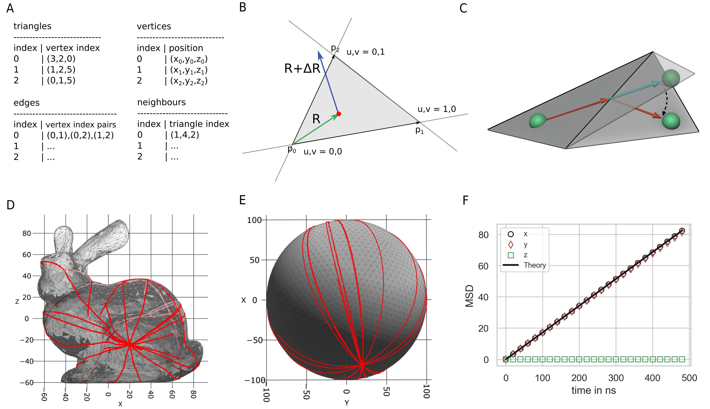

.. _`sec:methods_pyrid`:

Theory and Methods
==================

In this section, I will introduce and discuss the main methods used in
PyRID. I start in section 1.1 :ref:`sec:rb_mol` by introducing the
scheme by which bead molecules are represented. Followed by the
derivation of an algorithm for the propagation of translational and
predominantly rotational diffusion. The rotational and translational
mobility tensors dictate the translational and rotational motion of
anisotropic rigid bodies. Therefore, in section
1.3 :ref:`sec:mobility_tensors` I outline the calculation of the
mobility tensors based on a modified Oseen tensor
:cite:p:`Carrasco1999`. One of the main features of PyRID
that distinguishes it from other molecular dynamics tools such as
LAMMPS, Gromacs and HooMD is the ability to simulate arbitrary
unimolecular and bimolecular reactions using stochastic simulation
algorithms. In section 1.7 :ref:`sec:Reactions` I describe how these
reactions are evaluated in PyRID. Another notable feature of PyRID is
its ability to restrict the motion of molecules to complex compartment
geometries represented by triangulated meshes. Section
1.5 :ref:`sec:Compartments` gives a brief overview of how compartment
collisions and surface diffusion are handled. The remainder of this
chapter discusses some additional methods and algorithms: Distribution
of molecules in mesh volumes and on surfaces, fast data structures for
molecular dynamics simulations, fixed concentration boundary conditions
and barostat/pressure calculation for rigid bead model systems.

.. _`sec:rb_mol`:

Rigid bead molecules
--------------------

.. dropdown:: Implementation
    
    :func:`pyrid.molecules.rigidbody_util.RBs`
    :func:`pyrid.molecules.particles_util.Particles`

    :func:`pyrid.system.distribute_surface_util.evenly_on_sphere`

Proteins and other molecules are not point like particles. Especially
the interactions between proteins are not accurately described by
isotropic energy potentials. Instead, the physical properties of
bio-molecular systems emerge from an-isotropic multivalent interactions
:cite:p:`Dignon2018, Espinosa2019`. Protein-protein
interaction can be accurately simulated in all-atom molecular dynamics
simulations. However, even modern computers and algorithms are not
efficient enough to simulate systems with more than a few molecules on
time scales relevant for processes such as protein assembly and LLPS.
Therefore, coarse graining methods are needed
:cite:p:`Tozzini2005`. Rigid bead models are a method of
minimal coarse graining that have some important benefits. Strong and
short ranged interactions between atoms are replaced by a rigid bead
topology. This allows for integration time steps several orders larger
than in all-atom simulations when atoms within the molecule are held
together by an energy potential. Usually, the beads of a rigid bead
model do not represent single atoms but pattern the geometry of the
molecule of interest :cite:p:`Torre2001`, significantly
reducing the overall number of particles that need to be simulated. In
addition, experimentally or theoretically estimated diffusion tensors
can be used to accurately describe the diffusive motion of molecules.
Importantly, multivalent protein-protein interactions can be described
by patches located on the bead model surface. On the downside, the
properties of coarse grained model systems strongly depend on the choice
of interaction potentials and other model parameters. The estimation of
these model parameters is fairly involved and is out of the scope of
this work.

The position of each bead i of molecule j can be characterized by

.. math:: \boldsymbol{R}_i(t) = \boldsymbol{R}_{i}^{local}(t) + \boldsymbol{R}_{j}^{O}(t)

where

.. math:: \boldsymbol{R}_{i}^{local}(t) = \boldsymbol{A}_j(t) \cdot \boldsymbol{X}_{i}^{local} .

Here :math:`\boldsymbol{X}_{i}^{local}` are the coordinates of bead i in
the local reference frame, and :math:`\boldsymbol{A}(t)` and
:math:`\boldsymbol{R}_{j}^{O}(t)` are the rotation matrix and center of
diffusion of molecule j in the lab reference frame respectively. The
center of diffusion propagates in response to external forces
:math:`\boldsymbol{F}(t)` exerted, e.g., by particle-particle
interactions or an external force field, and due to hydrodynamic
interactions and collisions of the beads with solvent molecules
(Brownian motion). Thereby, the total force :math:`\boldsymbol{F}(t)`
acting on the molecules’ center of diffusion is the sum of all forces
:math:`\boldsymbol{f}_i(t)` acting on the individual beads:

.. math:: \boldsymbol{F}(t) = \sum_{i = 1}^{N_{beads}}. \boldsymbol{f}_i(t),

where :math:`N_{beads}` is the total number of beads contained in the
molecule.

.. _`sec:propagators`:

Propagation of translational and angular motion
~~~~~~~~~~~~~~~~~~~~~~~~~~~~~~~~~~~~~~~~~~~~~~~

.. dropdown:: Implementation
    
    :func:`pyrid.molecules.rigidbody_util.RBs.update_B`
    :func:`pyrid.molecules.rigidbody_util.RBs.update_dX`
    :func:`pyrid.molecules.rigidbody_util.RBs.update_dq`
    :func:`pyrid.molecules.rigidbody_util.RBs.update_force_torque`
    :func:`pyrid.molecules.rigidbody_util.RBs.calc_orientation_quat`
    :func:`pyrid.molecules.rigidbody_util.RBs.update_orientation_quat`
    :func:`pyrid.molecules.rigidbody_util.RBs.set_orientation_quat`
    :func:`pyrid.molecules.rigidbody_util.RBs.update_particle_pos`
    :func:`pyrid.molecules.rigidbody_util.RBs.update_particle_pos_2D`
    :func:`pyrid.molecules.rigidbody_util.RBs.update_topology`

    :func:`pyrid.math.transform_util.sqrt_matrix`

    :func:`pyrid.system.update_pos.update_rb`
    :func:`pyrid.system.update_pos.update_rb_compartments`

The motion of an isolated rigid bead molecule in solution can be
described in terms of the Langevin equation for translational and
rotational motion. Note that we are always considering isolated
molecules in dispersion and do not account for the hydrodynamic
interaction between molecules as this is computationally very expensive
(:math:`O(N^2)-O(N^3)`) :cite:p:`Geyer2009, Dlugosz2011`. In
the most general case the Langevin equation for translational and
rotational motion reads
:cite:p:`Ermak1978, Dickinson1985, Jones1991`:

.. math:: m \frac{d^2\boldsymbol{r}(t)}{dt^2} = \boldsymbol{F} - \Big(\boldsymbol{\Xi}^{tt} \frac{d\boldsymbol{r}}{dt} + \boldsymbol{\Xi}^{tr} \frac{d\boldsymbol{\phi}}{dt}\Big) + \boldsymbol{R}^t

.. math:: \frac{d}{dt} \Big( I \frac{d \boldsymbol{\phi}(t)}{dt} \Big) = \boldsymbol{T} - \Big(\boldsymbol{\Xi}^{rr} \frac{d\boldsymbol{\phi}}{dt} + \boldsymbol{\Xi}^{rt} \frac{d\boldsymbol{r}}{dt}\Big) + \boldsymbol{R}^r,

where :math:`\boldsymbol{r}(t)` is the position of the molecule center
and :math:`\boldsymbol{\phi}(t)` the rotation angle.
:math:`\boldsymbol{F}` is the total force exerted on the molecule and
:math:`\boldsymbol{T}` is the torque. :math:`\boldsymbol{R}^t` and
:math:`\boldsymbol{R}^r` describe the random, erratic movement of the
molecule due to collisions with the solvent molecules where

.. math:: \langle \boldsymbol{R}^a(t)\rangle = 0

.. math:: \langle R^a_i(t) R^b_j(t')\rangle = 2 k_B T \Xi_{ij}^{ab} \delta(t-t'),

with :math:`a,b \in \{t,r\}`. :math:`\Xi_{ij}^{ab}` are the components of the 3 x 3 friction tensors. Here,
:math:`\boldsymbol{\Xi}^{tt}, \boldsymbol{\Xi}^{rr}, \boldsymbol{\Xi}^{tr}, \boldsymbol{\Xi}^{rt}`
are the translational, rotational and translation-rotation coupling
friction tensors of the rigid body in the lab frame. Also,
:math:`\boldsymbol{\Xi}^{ab} = k_B T (\boldsymbol{D}^{-1})^{ab}`
(Einstein relation). Due to the translation-rotation coupling, the
equations for rotation and translation are not independent. For low-mass
particles, such as molecules, and for long enough time intervals, the
acceleration of the molecules can be neglected in the description of the
diffusion process. As such it is convenient to describe the motion of
molecules by overdamped Langevin dynamics also called Brownian motion
where
:math:`I \frac{d^2 \phi(t)}{dt^2} = m \frac{d^2 x(t)}{dt^2} = 0`:

.. math:: \frac{d\boldsymbol{r}(t)}{dt} = \boldsymbol{M}^{tt} \boldsymbol{F} + \boldsymbol{M}^{tr} \boldsymbol{T} + \boldsymbol{S}^t

.. math:: \frac{d \boldsymbol{\phi}(t)}{dt} = \boldsymbol{M}^{rr} \boldsymbol{T} + \boldsymbol{M}^{rt} \boldsymbol{F} + \boldsymbol{S}^r.

with

.. math:: \langle \boldsymbol{S}^a(t)\rangle = 0

.. math:: \langle S^a_i(t) S^b_j(t')\rangle = 2 k_B T M_{ij}^{ab} \delta(t-t'),

where
:math:`\boldsymbol{M}^{tt}, \boldsymbol{M}^{rr}, \boldsymbol{M}^{tr}, \boldsymbol{M}^{rt}`
are the translational, rotational and translation-rotation coupling
mobility tensors of the rigid body in the lab frame and
:math:`\boldsymbol{M}^{ab} = \frac{\boldsymbol{D}^{ab}}{k_B T}`. :math:`M_{ij}^{ab}` are the components of the 3 x 3 mobility tensors. Also
:math:`\boldsymbol{M}^{rt} = \boldsymbol{M}^{tr,T}`. In most cases, the
effect of the translation-rotation coupling on the molecular dynamics is
negligible. However, translation-rotation coupling increases the
complexity of the propagation algorithm for the translation and rotation
vectors. Therefore, in the following, we will consider translation and
rotation as being independent. In this case, the propagator for the
Cartesian coordinates as well as the orientation angle can be formulated
as :cite:p:`Ilie2015`

.. math::
    :label: eq:drdt

    \boldsymbol{r}(t) = \boldsymbol{r}(t-\Delta t) + \boldsymbol{A} \boldsymbol{M}^{tt,b} \boldsymbol{A}^T \boldsymbol{F} \Delta t + \boldsymbol{A} \sqrt{2 \boldsymbol{M}^{tt,b} k_B T}\, \boldsymbol{W}^t(\Delta t)

.. math::
    :label: eq:dphidt
    
    \boldsymbol{\phi}(t) = \boldsymbol{\phi}(t-\Delta t) + \boldsymbol{A} \boldsymbol{M}^{rr,b} \boldsymbol{A}^T \boldsymbol{T} \Delta t + \boldsymbol{A} \sqrt{2 \boldsymbol{M}^{rr,b} k_B T}\, \boldsymbol{W}^r(\Delta t).

Here, :math:`\boldsymbol{W}(\Delta t)` is a 3-dimensional Wiener
process, i.e.
:math:`\boldsymbol{W}(t+\Delta t) - \boldsymbol{W}(t) \sim \mathcal{N}(0, \Delta t)`,
which can be argued from the central limit theorem and the assumption
that the forces of the solvent molecules act with equal probability from
all directions. The superscript :math:`b` indicates that the mobility
tensors :math:`\boldsymbol{M}^{ab,b}` are given in terms of the
body/local frame of the molecule, which is much more convenient when we
talk about the propagation algorithm. In this context,
:math:`\boldsymbol{A}` is the rotation matrix of the molecule. One
problem with the rotational equation of motion is that several issues
arise depending on how rotations are represented. Propagating the
rotation in terms of Euler angles, e.g., will result in numerical drift
and singularities :cite:p:`Baraff2001, Ilie2016`. Therefore,
especially in computer graphics, it is standard to represent rotations
in unit quaternions, which is much more stable and has fewer issues in
general. An algorithm for the rotation propagator based on quaternions
can, for example, be found in :cite:p:`Ilie2015`. In the
following, I will introduce a more concise derivation of the very same
algorithm.

Quaternion propagator
^^^^^^^^^^^^^^^^^^^^^

.. dropdown:: Implementation
    
    :func:`pyrid.math.transform_util.rot_quaternion`
    :func:`pyrid.math.transform_util.quat_mult`
    :func:`pyrid.math.transform_util.quaternion_plane_to_plane`
    :func:`pyrid.math.transform_util.quaternion_random_axis_rot`
    :func:`pyrid.math.transform_util.quaternion_to_plane`
    :func:`pyrid.math.transform_util.rot_quaternion`

    :func:`pyrid.system.distribute_vol_util.random_quaternion`
    :func:`pyrid.system.distribute_vol_util.random_quaternion_tuple`

The orientation/rotation of the molecule can be described by a unit
quaternion :math:`\boldsymbol{q} = q_0 + i\,q_1 + j\,q_2 + k\, q_3`
where :math:`\boldsymbol{q}^2 = \sum_{i=0}^3 q_i^2 = 1`. Quaternions can
be thought of as an extension to complex numbers and were introduced in
1844 by Sir William Rowan Hamilton :cite:p:`Hamilton1844`.
The rotation quaternion :math:`\boldsymbol{q}(t)` propagates in response
to the torque
:math:`\boldsymbol{T}_i(t) = \boldsymbol{F}_i(t) \times \boldsymbol{r}_{i}`
exerted by the external forces, where :math:`\boldsymbol{r}_{i}` is the
distance vector between bead i and the center of diffusion of molecule. The rotation matrix can be represented in terms of rotation
quaternions by :cite:p:`Baraff2001` (:func:`pyrid.molecules.rigidbody_util.RBs.calc_orientation_quat`):

.. math::

   \begin{split}\boldsymbol{A}
       = 
       \begin{pmatrix}
           1-2(q_2^2+q_3^2) & 2(q_1 q_2-q_0 q_3) & 2(q_1 q_3+q_0 q_2) \\
           2(q_1 q_2+q_0 q_3) & 1-2(q_1^2+q_3^2) & 2(q_2 q_3-q_0 q_1) \\
       2(q_1 q_3-q_0 q_2) & 2(q_2 q_3+q_0 q_1) & 1-2(q_1^2+q_2^2) \\
       \end{pmatrix},
       \end{split}

The goal is to derive a propagator for the rotation quaternion. A
well-established connection between the angular velocity and the unit
quaternion velocity is :cite:p:`Baraff2001`:

.. math::
    :label: eq:dg(dphi)

    \frac{d\boldsymbol{q}}{dt} = \frac{1}{2} \frac{d\boldsymbol{\phi}}{dt} \boldsymbol{q} = \boldsymbol{B} \frac{d\boldsymbol{\phi}}{dt}

where

.. math::

   \begin{split}\boldsymbol{B}
       = \frac{1}{2}
       \begin{pmatrix}
           -q_1 & -q_2 & -q_3 \\
           q_0 & q_3 & -q_2 \\
           -q_3 & q_0 & q_1 \\
           q_2 & -q_1 & q_0 \\
       \end{pmatrix}.
       \end{split}

Inserting :math:numref:`eq:dphidt` into :math:numref:`eq:dg(dphi)`, we get:

.. math::
    :label: eq:dqdt

    \boldsymbol{q}(t) = \boldsymbol{q}(t-\Delta t) + \boldsymbol{B}\boldsymbol{A} \boldsymbol{M}^{rr,b} \boldsymbol{A}^T \boldsymbol{T} \Delta t + \boldsymbol{B} \boldsymbol{A} \sqrt{2 \boldsymbol{M}^{rr,b} k_B T}\, \boldsymbol{W}^r(\Delta t).

The factor :math:`\boldsymbol{B}\boldsymbol{A}` can, however, be
simplified:

.. math::

   \begin{split}
       \boldsymbol{B}\boldsymbol{A}
       = & \frac{1}{2}
       \begin{pmatrix}
           -q_1 & -q_2 & -q_3 \\
           q_0 & q_3 & -q_2 \\
           -q_3 & q_0 & q_1 \\
           q_2 & -q_1 & q_0 \\
       \end{pmatrix}
       \begin{pmatrix}
           1-2(q_2^2+q_3^2) & 2(q_1 q_2-q_0 q_3) & 2(q_1 q_3+q_0 q_2) \\
           2(q_1 q_2+q_0 q_3) & 1-2(q_1^2+q_3^2) & 2(q_2 q_3-q_0 q_1) \\
       2(q_1 q_3-q_0 q_2) & 2(q_2 q_3+q_0 q_1) & 1-2(q_1^2+q_2^2) \\
       \end{pmatrix}\\
       = & \frac{1}{2}
       \begin{pmatrix}
          -q_1 & -q_2 & -q_3 \\
           q_0 & q_3 (1-2 q^2 ) & q_2 (2 q^2 -1) \\
           q_3 (2 q^2 -1) & q_0 & q1 (1-2 q^2 ) \\
           q_2 (1-2 q^2) & q_1 (2 q^2-1) & q_0 \\
       \end{pmatrix} \\
       = & \frac{1}{2}
       \begin{pmatrix}
          -q_1 & -q_2 & -q_3 \\
           q_0 & -q_3 & q_2 \\
           q_3 & q_0 & -q_1 \\
           -q_2 & q_1 & q_0 \\
       \end{pmatrix},
       \end{split}

where :math:`q^2 = q_0^2+q_1^2+q_2^2+q_3^2 = 1`. For the quaternion to
accurately represent the rotation, we need to ensure that it keeps its
unit length. However, due to the finite time step in simulations, the
quaternion will diverge from unit length over time. Thus, it is
necessary to frequently re-normalize the quaternion.
:cite:t:`Ilie2015` point out that re-normalization will
introduce a bias by changing the sampled phase space distribution.
Thereby, it is more appropriate to introduce a constraint force using
the method of undetermined Lagrange multipliers as is used in molecular
dynamics algorithms such as SHAKE. However, for integration time steps
used in practice, I found the error introduced by re-normalization to be
negligible. Validation of the above algorithms are presented in section
:ref:`sec:val_diff`.

.. _`sec:mobility_tensors`:

Mobility tensor for rigid bead models
~~~~~~~~~~~~~~~~~~~~~~~~~~~~~~~~~~~~~

.. dropdown:: Implementation
    
    :func:`pyrid.molecules.hydro_util`

    :func:`pyrid.molecules.hydro_util.A`
    :func:`pyrid.molecules.hydro_util.P`
    :func:`pyrid.molecules.hydro_util.calc_D`
    :func:`pyrid.molecules.hydro_util.calc_Xi`
    :func:`pyrid.molecules.hydro_util.calc_mu`
    :func:`pyrid.molecules.hydro_util.calc_zeta`
    :func:`pyrid.molecules.diffusion_tensor`
    :func:`pyrid.molecules.hydro_util.diffusion_tensor_off_center`
    :func:`pyrid.molecules.hydro_util.levi_civita`
    :func:`pyrid.molecules.hydro_util.supermatrix_inverse`
    :func:`pyrid.molecules.hydro_util.transform_reverse_supermatrix`
    :func:`pyrid.molecules.hydro_util.transform_supermatrix`
    :func:`pyrid.system.system_util.System.set_diffusion_tensor`

    :func:`pyrid.math.transform_util.valid_mobility_tensor_test`

In order simulate the motion of molecules with the algorithms introduced
above, we need to calculate the molecule’s diffusion tensor. Diffusion
tensors have also been estimated experimentally
:cite:p:`Niethammer2006` or using molecular dynamics
simulations :cite:p:`Chevrot2013`. However, for many
proteins, the diffusion tensor is unknown. Therefore, it would often be
more convenient to calculate the diffusion tensor directly from the
coarse-grained representation of a molecule in terms of the rigid bead
model. Pioneering work in this direction has been done by
:cite:t:`Bloomfield1967` and :cite:t:`Torre1977`.
In the following I will only present the main results that are needed
for the calculation of the rigid bead model diffusion tensor. For the
interested reader, a more in depth introduction can be found in
:ref:`sec:appendix_a` Appendix A.

In general, the mobility and/or diffusion tensor of an anisotropic rigid
body can be calculated from the inverse of the rigid body’s friction
supermatrix :cite:p:`Carrasco1999`:

.. math::
    :label: eq:mobility_supermatrix

    \begin{pmatrix}
    \boldsymbol{M}^{tt} & \boldsymbol{M}^{tr} \\
    \boldsymbol{M}^{rt} & \boldsymbol{M}^{rr} \\
    \end{pmatrix}
    = 
    \frac{1}{k_B T}
    \begin{pmatrix}
    \boldsymbol{D}^{tt} & \boldsymbol{D}^{tr,T} \\
    \boldsymbol{D}^{rt} & \boldsymbol{D}^{rr} \\
    \end{pmatrix}
    = 
    \begin{pmatrix}
    \boldsymbol{\Xi}^{tt} & \boldsymbol{\Xi}^{tr} \\
    \boldsymbol{\Xi}^{rt} & \boldsymbol{\Xi}^{rr} \\
    \end{pmatrix}^{-1}.

Therefore, the main challenge lies in deriving an expression for the
translational, rotational and translation-rotation coupling tensors of
the friction super matrix
:math:`\boldsymbol{\Xi}^{tt}, \boldsymbol{\Xi}^{rr}, \boldsymbol{\Xi}^{tr}=\boldsymbol{\Xi}^{rt,T}`.
PyRID uses a method based on a modified Oseen tensor
:cite:p:`Torre1977, Carrasco1999` to account for the
hydrodynamic interaction between the beads of a rigid bead molecule in a
first order approximation :cite:p:`Carrasco1999a`. For a
rigid molecule consisting of :math:`N` different beads, the friction
tensors read

.. math::
    :label: eq:mobility_supermatrix_rbm

    \begin{split}
    &\boldsymbol{\Xi}^{tt} = \sum_{i=1}^N \sum_{j=1}^N \boldsymbol{\xi}_{ij}^{tt} \\
    &\boldsymbol{\Xi}_{O}^{tr} = \sum_{i=1}^N \sum_{j=1}^N ( -\boldsymbol{\xi}_{ij}^{tt} \cdot \boldsymbol{A}_j + \boldsymbol{\xi}_{ij}^{tr} ) \\
    &\boldsymbol{\Xi}_{O}^{rt} = \sum_{i=1}^N \sum_{j=1}^N ( \boldsymbol{A}_j \cdot \boldsymbol{\xi}_{ij}^{tt} + \boldsymbol{\xi}_{ij}^{rt} ) \\
    &\boldsymbol{\Xi}_{O}^{rr} = \sum_{i=1}^N \sum_{j=1}^N ( \boldsymbol{\xi}_{ij}^{rr} - \boldsymbol{\xi}_{ij}^{rt} \cdot \boldsymbol{A}_j + \boldsymbol{A}_i \cdot \boldsymbol{\xi}_{ij}^{tr} - \boldsymbol{A}_i \cdot \boldsymbol{\xi}_{ij}^{tt} \boldsymbol{A}_j)
    \end{split}.

Here :math:`\boldsymbol{A}` is given by

.. math::

   \boldsymbol{A}_i
       =
       \begin{pmatrix}
       0 & -z_i & y_i \\
       z_i & 0 & -x_i \\
       -y_i & x_i & 0 \\
       \end{pmatrix}

with :math:`\boldsymbol{r}_i = x_i e_x + y_i e_y +z_i e_z` being the
position vector of bead i in the molecule’s local reference frame.
:math:`\boldsymbol{\xi}^{ab}, a,b \in \{t,r\}` are the translational,
rotational and translation-rotation coupling friction tensors of the
system of :math:`N` freely diffusing beads. :math:`\boldsymbol{\xi}`,
are calculated from the inverse of the mobility supermatrix
:cite:p:`Carrasco1999a`:

.. math::
    :label: eq:mobility_supermatrix_2

    \begin{pmatrix}
    \boldsymbol{\xi}^{tt} & \boldsymbol{\xi}^{tr} \\
    \boldsymbol{\xi}^{rt} & \boldsymbol{\xi}^{rr} \\
    \end{pmatrix}
    =
    \begin{pmatrix}
    \boldsymbol{\mu}^{tt} & \boldsymbol{\mu}^{tr} \\
    \boldsymbol{\mu}^{rt} & \boldsymbol{\mu}^{rr} \\
    \end{pmatrix}^{-1}

Here :math:`\boldsymbol{\xi}^{ab}` are of dimension (3Nx3N), forming the
friction supermatrix of dimension (6N,6N). :math:`\boldsymbol{\mu}^{ab}`
are the (3Nx3N) dimensional elements of the mobility supermatrix. The
translational mobility tensor :math:`\boldsymbol{\mu}^{tt}` for a system
of different sized beads is, in first order approximation, given by
:cite:p:`Carrasco1999a`:

.. math::
    :label: mu_tt_methods

    \begin{split}
    \boldsymbol{\mu}^{tt}_{ij} = & \delta_{ij} (6 \pi \eta_0 \sigma_i)^{-1} \boldsymbol{I} + (1-\delta_{ij})(8 \pi \eta_0 r_{ij}^{-1})(\boldsymbol{I}+\boldsymbol{P}_{ij}) \\
    & + (8 \pi \eta_0 r_{ij}^{-3})(\sigma_i^2+\sigma_j^2)(\boldsymbol{I}-3 \boldsymbol{P}_{ij}),
    \end{split}

where
:math:`\boldsymbol{P}_{ij} = \Big(\boldsymbol{I}+\frac{\boldsymbol{r} \otimes \boldsymbol{r}}{r^2} \Big)`,
:math:`\eta_0` is the fluid viscosity and :math:`r_{ij}` is the distance
vector between bead i and bead j. :math:`\boldsymbol{I}` is the identity
matrix. The mobility tensor for rotation, however, not accounting for
the bead radii in the hydrodynamic interaction term, is given by
:cite:p:`Carrasco1999a`:

.. math::
    :label: mu_rr_methods

    \begin{split}
    \boldsymbol{\mu}^{rr}_{ij} = & \delta_{ij} (8 \pi \eta_0 \sigma_i^3)^{-1} \boldsymbol{I} \\
    & + (1 - \delta_{ij})(16 \pi \eta_0 r^3_{ij})^{-1} (3 \boldsymbol{P}_{ij} - \boldsymbol{I}).
    \end{split}

In this formulation, there is still a correction for the bead radii
missing. This correction consists of adding
:math:`6 \eta_0 V_m \boldsymbol{I}` to the diagonal components of the
rotational friction tensor :math:`\boldsymbol{\Xi}^{rr}_O`, where
:math:`V_m` is the total volume of the rigid bead molecule
:cite:p:`Torre1983, Carrasco1999a`. The rotation-translation
coupling is given by :cite:p:`Carrasco1999a`:

.. math::
    :label: mu_rt_methods

    \boldsymbol{\mu}^{rt}_{ij} = (1-\delta_{ij}) (8 \pi \eta_0 r_{ij}^2)^{-1} \boldsymbol{\epsilon}\boldsymbol{\hat{r}}_{ij},

where :math:`\epsilon` is the Levi-Civita symbol with
:cite:p:`Torre2007`

.. math::

   \epsilon \cdot \boldsymbol{r}_{ij}
       =
       \begin{pmatrix}
       0 & z_{ij} & -y_{ij} \\
       -z_{ij} & 0 & x_{ij} \\
       y_{ij} & -x_{ij} & 0 \\
       \end{pmatrix}.

:math:`\boldsymbol{\mu}^{tt}, \boldsymbol{\mu}^{rr}, \boldsymbol{\mu}^{rt}`
describe the mobility of a multi-sphere system with hydrodynamic
interactions. From the above follows that we need to calculate the
inverse of a supermatrix twice, once in equation :math:numref:`eq:mobility_supermatrix` and once in
equation :math:numref:`eq:mobility_supermatrix_rbm`. A super Matrix
:math:`\boldsymbol{M}=[[\boldsymbol{M}_1, \boldsymbol{M}_2], [\boldsymbol{M}_3, \boldsymbol{M}_4]]`
is invertible, if both the diagonal blocks, :math:`\boldsymbol{M}_1` and
:math:`\boldsymbol{M}_4` are invertible The inverse of a (2x2)
supermatrix can be calculated by :cite:p:`Varadarajan2004`,
:cite:p:`Deligne1996`:

.. math::
    :label: supermatrix_inverse

    \begin{split}
    & \boldsymbol{T}_1 = (\boldsymbol{M}_1 - \boldsymbol{M}_2 \boldsymbol{M}_4^{-1} \boldsymbol{M}_3)^{-1} \\
    & \boldsymbol{T}_2 = -\boldsymbol{M}_1^{-1} \boldsymbol{M}_2 (\boldsymbol{M}_4-\boldsymbol{M}_3 \boldsymbol{M}_1^{-1} \boldsymbol{M}_2)^{-1} \\
    & \boldsymbol{T}_3 = -\boldsymbol{M}_4^{-1} \boldsymbol{M}_3 (\boldsymbol{M}_1-\boldsymbol{M}_2 \boldsymbol{M}_4^{-1} \boldsymbol{M}_3)^{-1} \\
    & \boldsymbol{T}_4 = (\boldsymbol{M}_4 - \boldsymbol{M}_3 \boldsymbol{M}_1^{-1} \boldsymbol{M}_2)^{-1} \\
    \end{split}

Center of Diffusion
~~~~~~~~~~~~~~~~~~~

.. dropdown:: Implementation
    
    :func:`pyrid.molecules.hydro_util.calc_CoD`
    :func:`pyrid.molecules.hydro_util.center_of_mass`

One problem that arises with the above description is that we have not
yet formulated an expression for the center of diffusion of the rigid
bead molecule. For a rigid body immersed in a fluid, the force and
torque act at the body’s center of diffusion
:cite:p:`Harvey1980`, which, in general, is different from
the center of mass except for spherically symmetric molecules. The
center of diffusion can, however, be calculated from a diffusion tensor
referring to an arbitrary origin by :cite:p:`Carrasco1999`

.. math::
    :label: rOD

    \begin{split}
    \boldsymbol{r}_{OD}
    = &
    \begin{pmatrix}
    x_{OD} \\
    y_{OD}\\
    z_{OD}
    \end{pmatrix} \\
    = &
    \begin{pmatrix}
    D_{rr}^{yy}+D_{rr}^{zz} & -D_{rr}^{xy} & -D_{rr}^{xz}\\
    -D_{rr}^{xy} & D_{rr}^{xx}+D_{rr}^{zz} & -D_{rr}^{yz}\\
    -D_{rr}^{xz} & -D_{rr}^{yz} & D_{rr}^{yy}+D_{rr}^{xx}
    \end{pmatrix}^{-1}
    \begin{pmatrix}
    D_{tr}^{zy}-D_{tr}^{yz}\\
    D_{tr}^{xz}-D_{tr}^{zx}\\
    D_{tr}^{yx}-D_{tr}^{xy}
    \end{pmatrix}
    \end{split}.

.. _`sec:Compartments`:

Compartments
------------

.. dropdown:: Implementation
    
    :func:`pyrid.system.system_util.Compartment`
    :func:`pyrid.system.system_util.System.add_border_3d`
    :func:`pyrid.system.system_util.System.add_edges`
    :func:`pyrid.system.system_util.System.add_mesh`
    :func:`pyrid.system.system_util.System.add_neighbours`
    :func:`pyrid.system.system_util.System.create_cell_list`
    :func:`pyrid.system.system_util.System.set_compartments`

    :func:`pyrid.geometry.mesh_util`
    :func:`pyrid.geometry.mesh_util.closest_boundary_point`
    :func:`pyrid.geometry.mesh_util.mesh_util.mesh_volume`
    :func:`pyrid.geometry.mesh_util.point_triangle_distance`
    :func:`pyrid.geometry.mesh_util.triangle_area`
    :func:`pyrid.geometry.mesh_util.triangle_centroid`
    :func:`pyrid.geometry.mesh_util.triangle_volume_signed`
    :func:`pyrid.geometry.mesh_util.triangle_volume_signed`

    :func:`pyrid.geometry.load_wavefront`
    :func:`pyrid.geometry.load_wavefront.load_compartments`

    :func:`pyrid.geometry.ray_march_util`
    :func:`pyrid.geometry.ray_march_util.nearest_triangle`
    :func:`pyrid.geometry.ray_march_util.ray_march_surface`
    :func:`pyrid.geometry.ray_march_util.ray_march_volume`
    :func:`pyrid.geometry.ray_march_util.update_to_nearest_triangle`

    :func:`pyrid.geometry.intersections_util`
    :func:`pyrid.geometry.intersections_util.any_ray_mesh_intersection_test`
    :func:`pyrid.geometry.intersections_util.edge_intersection_barycentric`
    :func:`pyrid.geometry.intersections_util.mesh_inside_box_test`
    :func:`pyrid.geometry.intersections_util.point_in_triangle_barycentric`
    :func:`pyrid.geometry.intersections_util.point_inside_AABB_test`
    :func:`pyrid.geometry.intersections_util.point_inside_mesh_test`
    :func:`pyrid.geometry.intersections_util.point_inside_mesh_test_raycasting`
    :func:`pyrid.geometry.intersections_util.point_inside_triangle_test`
    :func:`pyrid.geometry.intersections_util.ray_mesh_intersection_count`
    :func:`pyrid.geometry.intersections_util.ray_mesh_intersection_test`
    :func:`pyrid.geometry.intersections_util.ray_triangle_intersection`
    :func:`pyrid.geometry.intersections_util.triangle_cell_intersection_test`

    :func:`pyrid.data_structures.cell_list_util.create_cell_list_mesh`
    :func:`pyrid.data_structures.cell_list_util.CellListMesh`

    :func:`pyrid.math.transform_util.axis_angle_parameters`
    :func:`pyrid.math.transform_util.axis_halfangle_parameters`
    :func:`pyrid.math.transform_util.barycentric_coord`
    :func:`pyrid.math.transform_util.barycentric_coord_projection_method`
    :func:`pyrid.math.transform_util.barycentric_direction`
    :func:`pyrid.math.transform_util.barycentric_params`
    :func:`pyrid.math.transform_util.cartesian_coord`
    :func:`pyrid.math.transform_util.cartesian_direction`
    :func:`pyrid.math.transform_util.collision_response`
    :func:`pyrid.math.transform_util.cross`
    :func:`pyrid.math.transform_util.eij`
    :func:`pyrid.math.transform_util.ek`
    :func:`pyrid.math.transform_util.half_angle`
    :func:`pyrid.math.transform_util.local_coord`
    :func:`pyrid.math.transform_util.normal_vector`
    :func:`pyrid.math.transform_util.rodrigues_rot`
    :func:`pyrid.math.transform_util.solid_angle`
    :func:`pyrid.math.transform_util.tri_area_2D`

Compartmentalization plays an important role in cell processes.
Therefore, we would like to be able to restrict diffusion and reactions
to the volume and surface of arbitrarily shaped compartments. There
exist different methods to restrict the motion of particles to a
confined region. One option is to pattern the boundary of the
compartment with particles such that they interact with the particle
inside the compartment via a repulsive interaction potential. This
method, however, has several downsides. On the one hand, one needs many
particles to pattern the surface, which makes this method highly
inefficient. On the other hand this method does not support surface
diffusion in a straight forward way. Another approach would be to add
external potentials/force fields that restrict the motion of particles
either to the volume or the surface of a compartment. This method is
used in ReaDDy :cite:p:`Hoffmann2019`. However, complex
geometries/compartment shapes are more difficult to establish. A third
approach is to represent the compartment geometry by triangulated meshes
as is done, e.g. in MCell :cite:p:`Kerr2008`. This approach
has several benefits over alternative approaches, such as representing
compartments by force fields or other particles. Triangulated meshes are
heavily used in computer graphics. Therefore, a large number of highly
optimized algorithms exist. Also, triangulated meshes are very well
suited to represent complex compartment geometries. In the following, I
will introduce how PyRID handles surface diffusion and collisions of
particles with compartment surfaces.

Triangulated meshes
~~~~~~~~~~~~~~~~~~~

A triangulated mesh surface is described by a set of :math:`N` vertices.
These vertices are combined to sets of :math:`n` vertices that form the
mesh faces. In our case, each face is a triangle (:math:`n=3`)
determined by three vertices :math:`\boldsymbol{p}_i, \boldsymbol{p}_j`
and :math:`\boldsymbol{p}_k`. The order in which these vertices are
sorted per triangle determines the orientation of the triangle normal
vector. The normal vector of the triangle plane is given by
:math:`\boldsymbol{n} = (\boldsymbol{p}_1-\boldsymbol{p}_0)\times(\boldsymbol{p}_2-\boldsymbol{p}_0)`.
In the following, I will write the three vertices of a triangle as
:math:`\boldsymbol{p}_0, \boldsymbol{p}_1` and :math:`\boldsymbol{p}_2`
and vertices are always sorted in counter clockwise order (:numref:`fig:gedodesic_StanfordBunny` B). 
Thereby, the normal vector of a triangle points outside the mesh compartment. In PyRID, a compartment
is defined by a triangulated manifold mesh, which is a mesh without
holes and disconnected vertices or edges, i.e. it has no gaps and
separates the space on the inside of the compartment from the space
outside :cite:p:`Shirley2009`. As one vertex is shared by at
minimum three triangles it is most convenient to store meshes in a
shared vertex mesh data structure :cite:p:`Shirley2009` where
an array with all vertex position vectors is kept as well as an array
holding for each triangle the indices of the three vertices that make up
the triangle (:numref:`fig:gedodesic_StanfordBunny` A).

.. _`sec:vol_mol`:

Volume molecules
~~~~~~~~~~~~~~~~

The collision response of a molecule with the mesh is calculated in two
different ways. For large rigid bead molecules, each triangle exerts a
repulsive force on the individual beads; for small, isotropic molecules
or atoms, a ray tracing algorithm is used.

Contact forces
^^^^^^^^^^^^^^

Contact detection generally consists of two phases, 1) neighbor
searching and 2) contact resolution. Contact detection and update of
contact forces can become fairly involved, depending on the required
accuracy, the surface complexity, the type of geometries involved, and
whether frictional forces need to be accounted for. Contact resolution
of the more complex type is found primarily in discrete element method
simulations :cite:p:`Hu2013`. Here, however, we will not
require exact accuracy but instead use a simple but, as I think,
sufficiently accurate approach. A bead :math:`i` is said to be in
contact with a mesh element :math:`j` (which can be a vertex, edge, or
face) if the minimum distance :math:`r_{ij}` is smaller than the bead
radius. In this case, a repulsive force is exerted on the bead:

.. math:: U_{wall, i} = \sum_j^N \frac{k}{2} (r_{ij}-d)^2 \Omega_{ij}.

, where :math:`k` is the force constant, :math:`d` is the bead radius,
and :math:`N` is the number of faces that are in contact with bead
:math:`i`. In general, :math:`\Omega_{ij}` accounts for the amount of
overlap of bead :math:`i` with mesh face :math:`j`. However, calculation
of :math:`\Omega_{ij}` is computationally expensive. Therefore, we here
use a simple approximation :math:`\Omega_{ij} = 1/N` with
:math:`N = |\mathcal{F}|` where :math:`\mathcal{F}` is the set of all
faces the bead is in contact with. Thereby, we assume that the bead
overlaps by the same amount with each mesh element and only account for
overlaps with faces as valid contacts but not edges or vertices. If
:math:`\mathcal{F} = \emptyset`, only the distance to the closest mesh
element is used to calculate the repulsive force, which in this case is
either an edge or a vertex. To calculate the distance between the bead
and a triangle, PyRID uses the "Point to Triangle" algorithm by
:cite:t:`Eberly2001`.

Ray tracing
^^^^^^^^^^^

Contact force calculations are disadvantageous for small, spherical
molecules because they require a very small integration time step. Here,
ray tracing is more convenient as it works independently of the chosen
integration time step. In this approach, which is similar to the contact
detection used in MCell :cite:p:`Kerr2008`, the displacement
vector :math:`\boldsymbol{\Delta R}` of the molecule is traced through
the simulation volume and collisions with the compartment boundary (the
mesh) are resolved via reflection.

.. math:: \boldsymbol{\Delta R}_{refl} = \boldsymbol{\Delta R} - 2 (\boldsymbol{\Delta R} \cdot \hat{\boldsymbol{n}}) \hat{\boldsymbol{n}},

where :math:`\hat{\boldsymbol{n}}` is the normal vector of the triangle
face. Collision tests are done using the "Fast Voxel Traversal Algorithm
for Ray Tracing" introduced by :cite:t:`Amanatides87`.

Surface molecules
~~~~~~~~~~~~~~~~~

Surface molecules laterally diffuse within the mesh surface and can
represent any transmembrane molecules such as receptors. Here, I take a
similar approach to MCell. Thereby, a molecule diffuses in the plane of
a triangle until it crosses a triangle edge. In this case, the
molecule’s displacement vector :math:`\Delta R` is advanced until that
edge and then rotated into the plane of the neighboring triangle where
the rotation axis is given by the shared triangle edge. Thereby, the
molecule will move in a strait line on the mesh surface (:numref:`fig:gedodesic_StanfordBunny` C-E). This method is equivalent
to unfolding the triangles over the shared edge such that they end up in
a common tangent space, i.e. such that they are co-planar, advancing the
position vector, and folding/rotating back. From the latter method it
becomes intuitively clear that the molecule will indeed move in a
straight line on the mesh surface. In the following I will introduce the
details of the method sketched above.

   **Mesh compartments and surface molecules.** **(A)** PyRID uses
   triangulated meshes to represent compartments. These are kept in a
   shared vertex mesh data structure (top left, right)
   :cite:p:`Shirley2009`. In addition, for neighbour search,
   two array that hold for each triangle the vertex indices of the three
   triangle edges and the triangle indices of the three triangle
   neighbours are used. **(A)** Triangle vertices belonging to a
   triangle are ordered counterclockwise, as are edges. Efficient algorithms 
   based on barycentric triangle coordinates are used to check whether a point 
   lies within a triangle or whether a displacement vector intersects a triangle edge. 
   **(A)** Visualization of mesh surface ray marching. If a
   molecule (green sphere) crosses a triangle edge, its displacement
   vector is advanced to the corresponding edge and then rotated into
   the plane of the neighboring triangle. **D,E** By the ray marching
   method described in the text, molecules follow a geodesic paths on
   the mesh surface. **F** The mean squared displacement of diffusing
   surface molecules is in agreement with theory. According to theory, 
   in 2 dimensions :math:`MSD = 4Dt`. In this validation example, 
   :math:`D=43 nm^2/\mu s`.

Surface ray marching
^^^^^^^^^^^^^^^^^^^^

First, we need to be able to detect if a triangle edge has been crossed,
and to which neighbouring triangle this edge belongs. Therefore, in
addition to the triangle and vertex data, for each triangle, the vertex
indices of the three triangle edges are kept in an array (:numref:`fig:gedodesic_StanfordBunny` A). Edges are sorted in counter
clockwise order. Also, for each of the three edges the index of the
corresponding neighbouring triangle is kept in a separate array for fast
lookup (:numref:`fig:gedodesic_StanfordBunny` A).

The triangle edge intersection test can be made efficient by the use of
barycentric coordinates. Let
:math:`\boldsymbol{p}_0, \boldsymbol{p}_1, \boldsymbol{p}_2` be the
three vertices of a triangle. Also, the vertices are numbered in counter
clockwise order and the triangle origin is at :math:`\boldsymbol{p}_0`.
Then, the center of the molecule :math:`R_0` can be described in
barycentric coordinates by

.. math::
    :label: eq:barycentric_coord_1

    \boldsymbol{R}_0 = \boldsymbol{p}_0 + u(\boldsymbol{p}_1-\boldsymbol{p}_0) + v (\boldsymbol{p}_2-\boldsymbol{p}_0),

and the molecule displacement vector by

.. math:: \boldsymbol{\Delta R} = du(\boldsymbol{p}_1-\boldsymbol{p}_0) + dv (\boldsymbol{p}_2-\boldsymbol{p}_0),

Efficient algorithms to compute the barycentric coordinates :math:`u`
and :math:`v` can, e.g., be found in :cite:p:`Ericson2004`.
The triangle edges are sorted in counter clockwise order, starting from
the triangle origin :math:`\boldsymbol{p}_0`. As such, we are on the
line :math:`\boldsymbol{p}_0 + u(\boldsymbol{p}_1-\boldsymbol{p}_0)`
(edge 0) if :math:`v=0`, on the line
:math:`\boldsymbol{p}_0 + v (\boldsymbol{p}_2-\boldsymbol{p}_0)` (edge
2) if :math:`u = 0` and on the line
:math:`u \boldsymbol{p}_1 + v \boldsymbol{p}_2` (edge 1) if
:math:`u+v=1`. Thereby, the edge intersection test comes down to solving

.. math::
    :label: edge_intersection

    \begin{split}
    & u+t_{1}\cdot du = 0 \\
    & v+t_{0}\cdot dv = 0 \\
    & (u+t_{2} \cdot du) + (v+t_{2} \cdot dv) = 1 ,
    \end{split}

where :math:`t_{i}` with :math:`i \in \{0,1,2\}` is the distances to the
respective edge :math:`i` along the displacement vector. We find that
the intersections occur at

.. math::
    :label: edge_intersection2

    \begin{split}
    & t_{1} = -\frac{u}{du} \,\, (\text{edge 1}) \\
    & t_{0}=-\frac{v}{dv} \,\, (\text{edge 0})\\
    & t_{2}=\frac{1-u-v}{du+dv} \,\, (\text{edge 2}) .
    \end{split}

To determine with which edge
:math:`\boldsymbol{R}+\boldsymbol{\Delta R}` intersects first, we simply
need to check for the smallest positive value of :math:`t_{i}`.
Afterward, we advance :math:`\boldsymbol{R}` to the intersecting edge,
reduce :math:`\boldsymbol{\Delta R}` by the corresponding distance
traveled and transform :math:`\boldsymbol{R}` to the local coordinate
frame of the neighboring triangle. At last,
:math:`\boldsymbol{\Delta R}` is rotated into the plane of the
neighboring triangle. This can be done efficiently using Rodrigues’
rotation formula

.. math::
    :label: eq:Rodrigues

    \Delta \boldsymbol{R}_{rot} = \Delta \boldsymbol{R} \cos(\phi) + (\boldsymbol{a}_n \times \Delta \boldsymbol{R}) \sin(\phi) + \boldsymbol{a}_n (\boldsymbol{a}_n \cdot \Delta \boldsymbol{R}) (1-\cos(\phi)),

where

.. math::
    :label: eq:cos_sin_phi

    \begin{split}
    & \cos(\phi) = \frac{\hat{\boldsymbol{n}}_1 \cdot \hat{\boldsymbol{n}}_2}{|\hat{\boldsymbol{n}}_1| |\hat{\boldsymbol{n}}_2|} \\
    & \sin(\phi) = \frac{\hat{\boldsymbol{n}}_1 \times \hat{\boldsymbol{n}}_2}{|\hat{\boldsymbol{n}}_1| |\hat{\boldsymbol{n}}_2|}
    \end{split}.

Here, :math:`\hat{\boldsymbol{n}}_1` and :math:`\hat{\boldsymbol{n}}_2`
are the normal vectors of the two neighboring triangles. As PyRID
supports anisotropic rigid bead molecules, the orientation of the
molecule needs to be updated as well for each triangle that is crossed.
It is not sufficient, however, to rotate the molecule only after it has
reached its final position, because the final orientation depends on the
exact path that is taken (in case multiple triangles are crossed) and
not only on the normal vector/orientation of the target triangle plane.
The rotation quaternion is given by:

.. math::
    :label: eq:quaternion_cos_sin_phi

    \boldsymbol{q} = \cos(\phi/2) + \boldsymbol{a}_{n} \sin(\phi/2),

where :math:`\sin(\phi/2)` and :math:`\cos(\phi/2)` can be calculated
from the half-angle formulas for sine and cosine such that the
:math:`\cos(\phi)` and :math:`\sin(\phi)` that were calculated to rotate
:math:`\Delta R` can be reused. The molecule’s orientation quaternion is
than propagated by quaternion multiplication. The procedure is stopped
if :math:`\boldsymbol{R}_0 +\Delta \boldsymbol{R}` end up inside the
triangle the molecule is currently located on, i.e. if
:math:`0<=u<=1, 0<=v<=1, u+v<=1`.

Integrating the equation of motion
^^^^^^^^^^^^^^^^^^^^^^^^^^^^^^^^^^

Because in PyRID the mobility of each molecule is described by the
mobility tensor in the local frame instead of a scalar mobility
coefficient, integrating the equation of motion for surface molecules
becomes straight forward. Here, we can simply skip the z components in
the integration scheme (Eqs.\ :math:numref:`eq:drdt`,
:math:numref:`eq:dqdt`). Otherwise, we would need to calculate the
tangent external and Brownian force vectors.

Boundary Conditions
-------------------

.. dropdown:: Implementation
    
    :func:`pyrid.system.system_util.System`

PyRID supports three kinds of boundary conditions:

#. Periodic,

#. repulsive and

#. fixed concentration boundary conditions.

Repulsive boundary conditions are handled either by a repulsive
interaction potential or via ray tracing, depending on the molecule type
(see section 1.5.2 :ref:`sec:vol_mol`). For periodic boundary
conditions, the minimal image convention is applied (:numref:`fig:fixed_concentration` C). Thereby,
each particle only interacts with the closest image of the other
particles in the system. Note, however, that the box size must not
become too small, otherwise particles start to interact with themselves.
As periodic and repulsive boundary conditions are very common, I will,
in the following only introduce the fixed concentration boundary
conditions in more detail, which is a feature unique to PyRID.

Fixed concentration boundary conditions
~~~~~~~~~~~~~~~~~~~~~~~~~~~~~~~~~~~~~~~

.. dropdown:: Implementation
    
    :func:`pyrid.system.system_util.System.add_border_3d`
    :func:`pyrid.system.system_util.System.fixed_concentration_at_boundary`

    :func:`pyrid.math.random_util.dx_cum_prob`

    :func:`pyrid.system.distribute_vol_util.release_molecules_boundary`
    :func:`pyrid.system.distribute_surface_util.random_point_on_edge`
    :func:`pyrid.system.distribute_surface_util.release_molecules_boundary_2d`
    :func:`pyrid.system.distribute_surface_util.random_point_in_triangle`

Fixed concentration boundary conditions couple the simulation box to a
particle bath. Thereby, we can simulate, e.g., a sub-region within a
larger system without the need to simulate the dynamics of the molecules
outside simulation box directly. Instead, molecules that are outside the
simulation box are treated as ’virtual’ molecules that only become part
of the simulation if they cross the simulation box boundary. In PyRID it
is possible to have mesh compartments intersect with the simulation box
boundary. Molecules then enter and exit the simulation across the
intersection surface or the intersection line in the case of surface
molecules.

Each iteration of a simulation, the expected number of hits between a
molecule type and simulation box boundaries are calculated. The number of
hits depends on the outside concentration of the molecule, the diffusion
coefficient and the boundary surface area. The average number of volume
molecules that hit a boundary of area :math:`A` from one side within a
time step :math:`\Delta t` can be calculated from the molecule
concentration :math:`C` and the average distance a diffusing molecule
travels normal to a plane :math:`l_{n}` within :math:`\Delta t`
:cite:p:`Kerr2008`:

.. math:: N_{hits} = \frac{A l_{n}}{2 C},

where

.. math:: l_{n} = \sqrt{\frac{4D\Delta t}{\pi}}.

Here :math:`D = Tr(\boldsymbol{D}^{tt,b})/3` is the scalar translational
diffusion coefficient. For surface molecules
:math:`D = Tr(\boldsymbol{D}_{xy}^{tt,b})/2` and

.. math:: N_{hits} = \frac{L l_{n}}{2 C},

where :math:`L` is the length of the boundary edge. The boundary
crossing of molecules can be described as a Poisson process. As such,
the number of molecules that cross the boundary each time step is drawn
from a Poisson distribution with a rate :math:`N_{hits}`.

The normalized distance that a crossing molecule ends up away from the
plane/boundary follows distribution :cite:p:`Kerr2008`:

.. math:: P(d\tilde{x}) = 1-e^{-d\tilde{x}^2}+\sqrt{\pi}*dx*\text{erfc}(d\tilde{x})

The distance vector normal to the plane after the crossing can then be
calculated from the diffusion length constant :math:`\lambda` and the
plane’s normal vector :math:`\hat{\boldsymbol{n}}` by
:math:`d\boldsymbol{x} = \lambda \, d\tilde{x} \, \hat{\boldsymbol{n}} = \sqrt{4Dt} \, d\tilde{x} \, \hat{\boldsymbol{n}}`.

In the case that a molecule enters the simulation box close to another
boundary, e.g. of a mesh compartment, we may also want to account for
the distance traveled parallel to the plane in order to correctly
resolve collision with the mesh. However, currently PyRID does not
account for this. For small integration time steps and meshes that are
further than :math:`\sqrt{4Dt}` away from the simulation box boundary, the
error introduced should, however, be negligible.

Now that the number of molecules and their distance away from the plane
are determined, the molecules are distributed in the simulation box.
Since the diffusion along each dimension is independent we can simply
pick a random point uniformly distributed on the respective plane. For
triangulated mesh surfaces, triangles are picked randomly, weighted by
their area. Sampling a uniformly distributed random point in a triangle
is done by :cite:p:`Osada2002`

.. math:: P(\boldsymbol{r}) = (1-\sqrt{\mu_1})*\boldsymbol{p}_0+(\sqrt{\mu_1}*(1-\mu_2))*\boldsymbol{p}_1+(\mu_2*\sqrt{\mu_1})*\boldsymbol{p}_2  ,

where :math:`\mu_1, \mu_2` are random numbers between 0 and 1.
:math:`\boldsymbol{p}_0, \boldsymbol{p}_1, \boldsymbol{p}_2` are the
three vertices of the triangle.

Note that, in general, any interactions between the virtual molecules
are not accounted for. Therefore, fixed concentration boundary
conditions only result in the same inside and outside concentrations if
no molecular interactions are simulated.

   **Boundaries.** **A** (left, middle) In PyRID, the user can define
   different face groups. Face groups can be used, e.g., to distribute
   molecules on specific regions of the mesh surface (blue). When a
   compartment intersects with the simulation box, the intersecting
   triangles are assigned to a transparent class (yellow), as are the
   corresponding edges that intersect with the boundary (purple lines).
   If boundary conditions are set to "fixed concentration" transparent
   triangles and edges act as absorbing boundaries but in addition
   release new molecules into the simulation volume. (Right) If mesh compartments 
   intersect the boundary of the simulation box, the remaining part of the box
   boundary must also be represented by a triangulated mesh. **B** For periodic
   boundary conditions, PyRID follows the minimal image convention, i.e.
   a particle (black marker) only interacts (colored arrows) with the
   closest image (grey marker) of the other particles in the system.

.. _`sec:Reactions`:

Reactions
---------

.. dropdown:: Implementation
    
    :func:`pyrid.reactions.reactions_registry_util`
    :func:`pyrid.reactions.reactions_registry_util.Reaction`

    :func:`pyrid.reactions.update_reactions`
    :func:`pyrid.reactions.update_reactions.convert_molecule_type`
    :func:`pyrid.reactions.update_reactions.convert_particle_type`
    :func:`pyrid.reactions.update_reactions.delete_molecule`
    :func:`pyrid.reactions.update_reactions.delete_particles`
    :func:`pyrid.reactions.update_reactions.delete_reactions`
    :func:`pyrid.reactions.update_reactions.update_reactions`

    :func:`pyrid.system.update_force.react_interact_test`
    :func:`pyrid.system.update_force.update_force_append_reactions`

    :func:`pyrid.molecules.rigidbody_util.RBs.next_um_reaction`
    :func:`pyrid.molecules.particles_util.Particles.next_up_reaction`
    :func:`pyrid.molecules.particles_util.Particles.clear_number_reactions`
    :func:`pyrid.molecules.particles_util.Particles.decrease_number_reactions`
    :func:`pyrid.molecules.particles_util.Particles.increase_number_reactions`

    :func:`pyrid.system.system_util.MoleculeType.update_um_reaction`
    :func:`pyrid.system.system_util.System.add_bm_reaction`
    :func:`pyrid.system.system_util.System.add_bp_reaction`
    :func:`pyrid.system.system_util.System.add_interaction`
    :func:`pyrid.system.system_util.System.add_um_reaction`
    :func:`pyrid.system.system_util.System.add_up_reaction`

    :func:`pyrid.math.random_util.bisect_right`
    :func:`pyrid.math.random_util.random_choice`

    :func:`pyrid.system.distribute_vol_util.normal`
    :func:`pyrid.system.distribute_vol_util.point_in_sphere_simple`
    :func:`pyrid.system.distribute_vol_util.point_on_sphere`
    :func:`pyrid.system.distribute_vol_util.random_direction_Halfsphere`
    :func:`pyrid.system.distribute_vol_util.random_direction_sphere`
    :func:`pyrid.system.distribute_vol_util.trace_direction_vector`

    :func:`pyrid.system.distribute_surface_util.point_in_disc`
    :func:`pyrid.system.distribute_surface_util.trace_direction_vector`

In this section, methods to simulate reactions between proteins and
other molecules are introduced. Reactions include, for example,
post-translational modifications such as phosphorylation or
ubiquitination or binding of ligands and ATP. This list could be
continued. In PyRID, reactions are described on several different
levels. As a result of rigid bead molecules consisting of one or several
subunits, reactions can be defined either on the molecule level or on
the bead/particle level. In addition, reactions are categorized into
bi-molecular (second order) and uni-molecular (first order) and zero
order reactions. Each uni- and bimolecular reaction can consist of
several different reaction paths, each belonging to a different reaction
type (for an overview see :numref:`fig:ReactionsGraph`).
Uni-molecular reactions are divided into the following categories:

#. decay reactions,

#. fission reactions,

#. conversion reactions.

Decay reactions account for the degradation of proteins whereas fission
reactions can be used to describe ligand unbinding but also, e.g., the
disassembly of protein complexes or even the flux of ions in response to
ion channel opening. Conversion reactions on the other hand may be used
to describe different folded protein states that change the protein
properties, post-translational modifications but also binding and
unbinding reactions in the case where we do not need to model the
ligands explicitly (which is the case, e.g. if we can assume an infinite
ligand pool). Bi-molecular reactions are divided into

#. fusion reactions,

#. enzymatic reactions.

#. binding reactions

Fusion reactions can, e.g., describe protein complex formation or ligand
binding.

As mentioned above, each uni- and bi-molecular reaction can consist of
one or several reaction paths. This is motivated by the minimal
coarse-graining approach we take. Two proteins, e.g., can have different
sites by which they interact. However, these are not necessarily
represented in the rigid bead model. Similarly, a protein may convert to
one of a larger set of possible states. And again, the list could be
continued. In the following sections I will describe the methods by
which reactions are executed in PyRID in more detail.

.. figure:: Figures/Reactions_Graph.png
   :width: 50%
   :name: fig:ReactionsGraph

   **Reactions graph.** PyRID supports various kinds of bimolecular and
   unimolecular reactions. The trees give an overview about the possible
   reactions and reaction paths. Bimolecular reactions are always
   associated with one or several particle pairs. A reaction can always
   have one or several possible reaction products by having different
   reaction paths.

Unimolecular reactions
~~~~~~~~~~~~~~~~~~~~~~

Unimolecular reactions include fission, conversion, and decay reactions.
These can be efficiently simulated using a variant of the Gillespie
Stochastic Simulation Algorithm (SSA)
:cite:p:`Erban2007, Gillespie1977`. Thereby, the time point
of the next reaction is sampled from the probability distribution of
expected molecule lifetimes, assuming that in between two time points no
interfering event occurs. An interfering event could, e.g., be a
bi-molecular reaction. The naive way of simulating uni-molecular
reactions would be to check each time step whether the reaction will
occur depending on its reaction rate. The Gillespie SSA has the benefit
of being exact (partially true since the simulation evolves in finite,
discrete time steps) and far more efficient, because we only need to
evaluate a reaction once and not each time step. For a single molecule
having :math:`n` possible reaction paths each with a reaction rate
:math:`k_i`, let :math:`k_t = \sum_i^n k_i` be the total reaction rate.
Let :math:`\rho(\tau) d\tau` be the probability that the next reaction
occurs within :math:`[t+\tau,t+\tau+d\tau)`, which can be split into
:math:`g(\tau)`, the probability that no reaction occurs within
:math:`[t,t+\tau)` and probability that a reaction occurs within the
time interval :math:`d\tau`, which is given by :math:`k_t d\tau`.
Thereby,

.. math:: \rho(\tau) d\tau = g(\tau) k_t d\tau,

where :math:`g(\tau) = e^{-k_t \tau}` :cite:p:`Erban2007`.
From the above equation we find :math:`P(\tau) = 1-e^{-k_t \tau}` by
integration. To sample from this distribution, we can use the inverse
distribution function.

.. math:: \tau = P^{-1}(U)

where :math:`U` is uniformly distributed in :math:`(0,1)`. From
:math:`U = P(\tau) = 1-e^{-k_t \tau}`, we find
:math:`P^{-1}(U) = \frac{-log(1-U)}{k_t}`. Since :math:`U` is uniformly
distributed in :math:`(0,1)`, so is :math:`1-U`. Thereby, we can draw
the time point of the next reaction from:

.. math:: \tau = \frac{1}{k_t} \ln\Big[\frac{1}{U}\Big],

With the above method, we accurately sample from the distribution of
expected molecule lifetimes :math:`\rho(\tau) = k_t e^{-k_t \tau}`.

At the time point of the reaction, we can sample from the set of
reaction paths by a weighted random choice algorithm. Therefore, we
compare a second random number, uniformly distributed in
:math:`(0,k_{t})`, with the cumulative set of reaction rates
:math:`(k_1, k_1+k_2, ... ,k_{t})`. The comparison can be made
efficiently via a bisection algorithm.

Particle and molecule reactions
^^^^^^^^^^^^^^^^^^^^^^^^^^^^^^^

Because in PyRID, molecules are represented by rigid bead models,
uni-molecular reactions can occur either on the molecule level or on the
particle level. As such, if a conversion or decay reaction is defined on
a molecule, executing the reaction will exchange the complete rigid bead
molecule by a product molecule, or, in the case of a decay reaction,
will remove the complete molecule from the simulation. On the other
hand, if the reactions are defined on a particle/bead type, only the
particle will be affected. Whereas decay and conversion reactions are
handled very similar for molecules and particles, fission reactions are
handled slightly different. Therefore, PyRID offers three types of
fission reactions:

#. fission reactions,

#. production reactions,

#. release reactions.

*Standard fission reactions* can only be defined on the molecule level
and are executed similar to ReaDDy :cite:p:`Hoffmann2019`.
Here, the number of product molecules is limited to two. In the case
where educt and products are volume molecules, the product molecules are
placed within a sphere of radius :math:`R_{fission}`. Therefore, an
orientation vector :math:`\boldsymbol{d}` uniformly distributed in the
rotation space with a length :math:`<=R_{fission}` is sampled. The two
products are then placed according to

.. math::

   \begin{split}
       \boldsymbol{r}_1 = \boldsymbol{r}_0 + w_1 \boldsymbol{d}, \\
       \boldsymbol{r}_2 = \boldsymbol{r}_0 - w_2 \boldsymbol{d},
       \end{split}

where :math:`\boldsymbol{r}_0` is the center of the educt molecule. By
default :math:`w_1 = w_2 = 0.5`. However, for different sized educts one
may choose :math:`w_1` and :math:`w_2` proportional to the molecules
diffusion coefficient or the diffusion length constant. If the educt and
product molecules are surface molecules, the procedure is equivalent
except that the direction vector is sampled from a disc on the mesh
surface instead of from a sphere. If the educt is a surface molecule but
the product a volume molecule, in addition to the sphere radius, the
direction needs to be defined, .i.e whether the product is placed inside
or outside the compartment. In both cases, the direction vector is not
sampled from the full rotation space but only within the half-sphere cut
by the triangle plane. Also, whenever a mesh compartment is present in
the simulation, a ray tracing algorithm is used to resolve any
collisions of the products’ direction vectors with the mesh.

*production reactions*: In addition to the standard fission reaction,
PyRID supports reactions with more than two products, which are here
called production reactions, because an educt molecule "produces" a
number of product molecules. This type of reaction can, e.g., be used to
simulate the influx of ions into a compartment via an ion channel. The
procedure by which the reaction is executed is very similar to the
fission reaction. However, here, the educt molecule is preserved but may
change its type. Also, for each product molecule, a separate direction
vector within a sphere of radius :math:`R_{prod}` is sampled. Collisions
with the mesh are handled as before, however, collisions between the
product molecules are not resolved.

*release reaction*: PyRID also allows for a fission type reaction to be
defined on particles, which is called a release reaction. Release
reactions are limited to one particle and one molecule product. When a
release reaction is executed, the particle is converted to the product
particle type while releasing a product molecule either into the
simulation volume or the surface of a mesh compartment. The latter is
only possible if the rigid bead molecule the educt particle belongs to
is also a surface molecule. Release reactions can, e.g., be used to
simulate the release of a ligand from a specific binding site of a rigid
bead molecule. The release reaction is introduced as the inverse of the
particle absorption reaction (see next section on bi-molecular
reactions).

.. figure:: Figures/Reactions_Overview_UM.png
   :width: 50%
   :name: fig:Reaction_Overview_UM

   **Unimolecular reactions.** Unimolecular reactions can be either
   defined on a particle or on a molecule type. Their exist in total
   three different unimolecular reaction type categories: fission,
   conversion and decay. For details see text.

Bi-molecular reactions
~~~~~~~~~~~~~~~~~~~~~~

Bi-molecular reactions cannot be evaluated the same way as uni-molecular
reactions since we cannot sample from the corresponding probability
space as we have done for the uni-molecular reactions, because we do not
know when two molecules meet in advance. Here, we use a reaction scheme
introduced by :cite:t:`Doi1976`, which is also used in the
Brownian dynamics simulation tool ReaDDy
:cite:p:`Schoeneberg2013, Hoffmann2019`. In this scheme, two
molecules can only react if the inter-molecular distance
:math:`|\boldsymbol{r}_{ij}|` is below a reaction radius
:math:`R_{react}`. The probability of having at least one reaction is
then given by

.. math:: p = 1-\exp\Big(-\sum_i^n k_i \Delta t \Big),

where :math:`n` is the number of reaction paths and :math:`k_i` the microscopic reaction rate for each path. 
Here, we distinguish between the microscopic reaction rate, 
which is the rate at which two molecules react if their distance is below :math:`R_{react}` and the 
macroscopic reaction rate, which is the rate at which any two molecules react on average. 
The macroscopic reaction rate is what you usually get as a result out of some experimental measurement.
We assume that the time step :math:`\Delta t` is so small that the molecules can only
undergo one reaction within :math:`\Delta t`. As such, the accuracy of the simulation strongly
depends on the ratio between the microscopic reaction rate and the time step
:math:`\Delta t`. If :math:`\sum_i^n k_i \cdot \Delta t>0.1`, PyRID will print
out a warning. As for uni-molecular reactions, each bi-molecular
reaction can contain several reaction paths, each of which can be of a
different bi-molecular reaction type. PyRID supports the following
bi-molecular reactions:

#. fusion reactions,

   -  molecule fusion,

   -  particle-molecule absorption,

#. enzymatic reactions (defined on molecules or particles),

#. binding reactions

.. figure:: Figures/Reactions_Overview_BM.png
   :width: 50%
   :name: fig:Reaction_Overview_BM

   **Bimolecular reactions.** Bimolecular reactions can be either
   defined on a particle or on a molecule type. Their exist in total
   three different bimolecular reaction type categories: enzymatic,
   fusion and binding. For details see text.

*Molecule fusion* reactions are defined on molecule pairs. The product
molecule is always placed relative to the position of the first educt.
Thereby, in PyRID, the order in which the educts of a reaction are set
is important. For example, for a fusion reaction :math:`\ce{A + B -> C}`
the product is placed at
:math:`\boldsymbol{R}_A + \omega \Delta \boldsymbol{R}`, where
:math:`\boldsymbol{R}_A` is the origin of molecule :math:`A`,
:math:`\Delta \boldsymbol{R}` is the distance vector between :math:`A`
and :math:`B` and :math:`\omega` is a weight factor. For a
:math:`\ce{B + A -> C}`, the product is placed at
:math:`\boldsymbol{R}_B + \omega \Delta \boldsymbol{R}`. By default,
:math:`\omega = 0.5` such that the product is placed in the middle
between the educt and the order does not matter. However, for
:math:`\omega \neq 0.5`, the order in which the educts have been set
determines where the product is placed.

In addition to the fusion reaction, PyRID offers the *particle-molecule
absorption reaction*, which is also a reaction of the fusion type.
However, here a molecule is absorbed by the bead/particle of another
molecule. The molecule is thereby removed from the simulation and the
absorbing particle is converted to a different type.

*Binding reactions* are defined between two particle/bead types and
handled similar to fusion and enzymatic reactions except that, if the
reaction was successful, an energy potential between the two educt
particles is introduced such that these interact with each other. Upon
binding, the beads can change their respective type. Also, a bead can
only be bound to one partner particle at a time. Bonds can be either
persistent or breakable. In the latter case, the bond is removed as soon
as the inter-particle distance crosses an unbinding threshold.
Similarly, unbinding reactions can be introduced by means of a
conversion reaction as bonds are removed if a particle or the
corresponding rigid bead molecule are converted to a different type.

Reactions between surface molecules
^^^^^^^^^^^^^^^^^^^^^^^^^^^^^^^^^^^

As for volume molecules, molecules that reside on the surface/in the
membrane of a compartment react with each other if the inter-particle
distance is below the reaction radius. However, PyRID only computes the
euclidean distance between particles. Therefore, however, surface
reactions are only accurate if the local surface curvature is large
compared to the reaction radius. Accurate calculation of the geodesic
distance on mesh surfaces is computationally very expensive. Algorithms
that allow for relatively fast approximations of geodesic distances and
shortest paths such as the Dijkstra’s algorithm often only provide good
approximations for point far away from the source. Therefore, the
benefit of implementing such algorithms is questionable as reaction
radii are on the order of the molecule size and thereby usually small
compared to the mesh size. However, much progress has been made in this
field :cite:p:`Polthier2006, Crane2017, Trettner2021`.

Potentials
----------

.. dropdown:: Implementation
    
    :func:`pyrid.system.potentials_util`

PyRID supports any pairwise, short ranged interaction potential and
external potentials. The force is given by

.. math:: \boldsymbol{F}_i = \nabla_i \left( \sum U_{ext}(\boldsymbol{r}_i) + \sum_{i \neq j} U_{pair}(\boldsymbol{r}_i, \boldsymbol{r}_j) \right)

PyRID comes with a selection of pairwise interaction potentials. PyRID
does not support methods such as Ewald summation and pair interaction
potentials need to be short ranged, i.e., they need to have a cutoff
distance.

In the following I list the functions currently implemented in PyRID.
However, any short ranged, pair-wise interaction potential can be easily
added using python.

Weak piecewise harmonic potential
~~~~~~~~~~~~~~~~~~~~~~~~~~~~~~~~~

.. dropdown:: Implementation
    
    :func:`pyrid.system.potentials_util.piecewise_harmonic`

The very same interaction potential is also used in ReaDDy
:cite:p:`Hoffmann2019`.

.. math::
    :label: eq:Weak piecewise harmonic

    \begin{split}U_{ha}(r)
    = 
    \begin{cases}
        \frac{1}{2}k(r-(d_1+d_2))^2-h,& \text{if } r<(d_1+d_2), \\
        \frac{h}{2}(\frac{r_c-(d_1+d_2)}{2})^{-2}(r-(d_1+d_2))^2-h,& \text{if } d \le r < d + \frac{r_c-(d_1+d_2)}{2}, \\
        -\frac{h}{2}(\frac{r_c-(d_1+d_2)}{2})^{-2}(r-r_c)^2,& \text{if } d + \frac{r_c-(d_1+d_2)}{2} \le r < r_c, \\
        0,              & \text{otherwise}
    \end{cases}\end{split}

Harmonic repulsion potential
~~~~~~~~~~~~~~~~~~~~~~~~~~~~

.. dropdown:: Implementation
    
    :func:`pyrid.system.potentials_util.harmonic_repulsion`

The very same interaction potential is also used in ReaDDy
:cite:p:`Hoffmann2019`.

.. math::
    :label: eq:Harmonic repulsion

    U(r)
    =
    \Biggl \lbrace 
    { 
    \frac{\kappa}{2}(r-\sigma)^2,\text{ if } 
        { r \leq \sigma }
    \atop 
    0, \text{ otherwise },
    }

Continuous Square-Well (CSW) potential
~~~~~~~~~~~~~~~~~~~~~~~~~~~~~~~~~~~~~~

.. dropdown:: Implementation
    
    :func:`pyrid.system.potentials_util.CSW`

The Continuous Square-Well (CSW) potential has been introduced in
:cite:p:`Espinosa2014`.

.. math::
    :label: eq:CSW

    U_{CSW}(r) = - \frac{\epsilon_{CSW}}{2} \Big[1 - \tanh\Big(\frac{r-r_w}{\alpha}\Big)\Big].

Pseudo Hard Sphere (PHS) potential
~~~~~~~~~~~~~~~~~~~~~~~~~~~~~~~~~~

.. dropdown:: Implementation
    
    :func:`pyrid.system.potentials_util.PHS`

The Pseudo Hard Sphere (PHS) potential has been introduced in
:cite:p:`Jover2012`.

.. math::
    :label: eq:PHS

    U_{HS}
    =
    \Biggl \lbrace 
    { 
    \lambda_r (\frac{\lambda_r}{\lambda_a})^{\lambda_a} \epsilon_R [(\frac{\sigma}{r})^{\lambda_r}-(\frac{\sigma}{r})^{\lambda_a}]+\epsilon_R,\text{ if } 
        { r < (\frac{\lambda_r}{\lambda_a}) \sigma }
    \atop 
    0, \text{ if } 
        { r < (\frac{\lambda_r}{\lambda_a}) \sigma },
    }

Observables
-----------

.. dropdown:: Implementation
    
    :func:`pyrid.observables.observables_util`
    :func:`pyrid.observables.observables_util.Observables`

PyRID can sample several different system properties:

#. Energy

#. Pressure

#. Virial

#. Virial tensor

#. Volume

#. Molecule number

#. Bonds

#. Reactions

#. Position

#. Orientation

#. Force

#. Torque

#. Radial distribution function

Each observable (except the volume) is sampled per molecule type or
molecule/particle pair in the case of bimolecular reactions and bonds.
In addition, values can be sampled in a step-wise or binned fashion.
Binning is especially useful when sampling reactions as one is usually
interested in the total number of reactions that occurred with a time
interval and not in the number of reactions that occurred at a specific
point in time. In the following I briefly describe how the radial
distribution function and the pressure are calculated in PyRID.

Radial distribution function
~~~~~~~~~~~~~~~~~~~~~~~~~~~~

.. dropdown:: Implementation
    
    :func:`pyrid.observables.observables_util.Observables.observe_rdf`
    :func:`pyrid.evaluation.rdf_util`
    :func:`pyrid.evaluation.rdf_util.radial_distr_function`

The radial distribution function is given by

.. math:: g(\boldsymbol{r}) = \frac{V_{box}}{N_i N_j} \left\langle \sum_{i \neq j} \delta(\boldsymbol{r}-(\boldsymbol{r}_i-\boldsymbol{r}_j)) \right\rangle = \frac{V_{box}}{N_i N_j} \frac{1}{V(\boldsymbol{r})} \sum_{i \neq j} \delta(\boldsymbol{r}-(\boldsymbol{r}_i-\boldsymbol{r}_j))

where :math:`V(\boldsymbol{r}) = \frac{4}{3} \pi (r-\Delta r)^3` with
:math:`\Delta r` being the sampling bin size. :math:`V_{box}` is the
volume of the simulation box and :math:`N_i` and :math:`N_j` are the
total number of molecule types :math:`i` and :math:`j` respectively.

Pressure
~~~~~~~~

.. dropdown:: Implementation
    
    :func:`pyrid.run.update_pressure`

The pressure can be calculated from the virial or the the viral tensor.
However, when calculating the pressure for a system of rigid bodies/
rigid bead molecules, we need to be careful how to calculate the virial
tensor. Taking the inter-particle distances will result in the wrong
pressure. Instead, one needs to calculate the molecular virial
:cite:p:`Glaser2020`, by taking the pairwise distance between
the center of diffusion of the respective molecule pairs:

.. math:: P_{mol} = P_{mol}^{kin} + \frac{1}{6 V} \sum_{i=1}^{N} \sum_{j \neq}^{N} \langle \boldsymbol{F}_{ij} \cdot (\boldsymbol{R}_i - \boldsymbol{R}_j) \rangle,

where :math:`V` is the total volume of the simulation box,
:math:`\boldsymbol{F}_{ij}` is the force on particle i exerted by
particle j and :math:`\boldsymbol{R}_{i}, \boldsymbol{R}_{j}` are the
center of diffusion of the rigid body molecules, not the center of mass
of particles i and j! In Brownian dynamics simulations,
:math:`P_{mol}^{kin} = N_{mol} k_B T`, where :math:`N_{mol}` is the
number of molecules. Also, the origin of molecules is represented by the
center of diffusion around which the molecule rotates about, which is
not the center of mass :cite:p:`Harvey1980`. The net
frictional force and torque act through the center of diffusion. This is
because when doing Brownian dynamics (and equaly for Langevin dynamics),
we do account for the surrounding fluid. Different parts of the molecule
will therefore interact with each other via hydrodynamic
interactions/coupling. As a result, the center of the molecule (around
which the molecule rotates in response to external forces) is not the
same as the center of mass, which assumes no such interactions (the
molecule sites in empty space). However, for symmetric molecules, the
center of mass and the center of diffusion are the same.

Berendsen barostat
------------------

.. dropdown:: Implementation
    
    :func:`pyrid.system.system_util.System.add_barostat_berendsen`

It is sometimes desirable to be able to do simulations in the NPT
ensemble, e.g., in preparation steps to release the system from
stresses. This can become necessary, e.g. when computing inter-facial
properties of fluids or computing phase diagrams via direct coexistence
methods :cite:p:`Espinosa2019, Espinosa2020, Muller2020`. The
Berendsen barostat :cite:p:`Berendsen1984` is simple to
implement and results in the correct target density of the system,
however, it does not sample from the correct statistical ensemble
distribution as pressure fluctuations are usually too small. By scaling
the inter-particle distances, the Berendsen barostat changes the virial
and thereby the system pressure. Per time step, the molecule coordinates
and simulation box length are scaled by a factor :math:`\mu` that is
given by:

.. math:: \mu = (1-\Delta t/\tau_P (P_0-P))^{1/3},

where :math:`\tau_P` is the coupling time constant, :math:`P_0` the
target pressure. The above equation applies to an isotropic system. For
a anisotropic system the equation can be generalized by substituting P
with the pressure tensor. In the case of a rectangular simulation box,
all tensor remain diagonal and application of the anisotropic barostat
is trivial.

Distribution of molecules
-------------------------

.. dropdown:: Implementation
    
    :func:`pyrid.system.distribute_vol_util`
    :func:`pyrid.system.distribute_surface_util`

Volume molecules
~~~~~~~~~~~~~~~~

.. dropdown:: Implementation
    
    :func:`pyrid.system.distribute_vol_util`
    :func:`pyrid.system.distribute_vol_util.monte_carlo_distribution_3D`
    :func:`pyrid.system.distribute_vol_util.normal`
    :func:`pyrid.system.distribute_vol_util.pds`
    :func:`pyrid.system.distribute_vol_util.pds_uniform`
    :func:`pyrid.system.distribute_vol_util.poisson_disc_sampling`
    :func:`pyrid.system.distribute_vol_util.poisson_disc_sampling_uniform`

The distribution of molecules in the simulation volume becomes a special
problem when we have mesh compartments and account for the excluded
volume of the molecules. A standard approach from molecular dynamics
first loosely distributes the molecules in the simulation box and then
shrinks the simulation volume until a target density is reached. This
approach could be transferred to a system with mesh compartments.
However, here, we might also care about the compartment size. As such,
we would need to choose a larger than target compartment size and shrink
it until we reach the target size. If the density is too large, we may
randomly delete molecules until the target density is also reached. A
second approach would be to utilize the Metropolis Monte Carlo method
:cite:p:`Allen2017` to distribute the molecules. However,
this approach is more time-consuming. A third approach, which is the one
we use in PyRID, uses a so-called Poisson-Disc sampling algorithm
:cite:p:`Bridson2007`. This approach has the benefit of being
computationally efficient and relatively simple to implement. It,
however, has the disadvantage of not reaching densities above 30% and is
only well suited for approximately spherical molecules. To distribute
highly aspherical molecules, currently, the only useful method that
works well with PyRID is to distribute the molecules using Monte-Carlo
sampling and then resolve overlaps via a soft repulsive interaction
potential. If no mesh compartments are used, one may also use the
Berendsen barostat at high pressure to drive the system to a high
density state. The Poison-disc sampling algorithm consists of 3 steps.
1) A grid is initialized, where the cell size is set to
:math:`r/\sqrt{3}`. 2) A sample point is created and inserted into a
list of active elements. 3) While the active list is not empty, new
random points around the annulus (r-2r) of the active sample points are
created. If no other sample points exist within the radius r, the new
sample point is accepted and inserted into the grid and the active list.
If, after k trials, no new sample point is found, the active sample
point is removed from the active list. For PyRID, this algorithm has
been extended to account for polydisperse particle distributions.

.. _surface-molecules-1:

Surface molecules
~~~~~~~~~~~~~~~~~

.. dropdown:: Implementation
    
    :func:`pyrid.system.distribute_surface_util`
    :func:`pyrid.system.distribute_surface_util.monte_carlo_distribution_2D`
    :func:`pyrid.system.distribute_surface_util.normal`
    :func:`pyrid.system.distribute_surface_util.pds`
    :func:`pyrid.system.distribute_surface_util.point_on_sphere`
    :func:`pyrid.system.distribute_surface_util.poisson_disc_sampling_2D`
    :func:`pyrid.system.distribute_surface_util.random_point_in_triangle`

    :func:`pyrid.math.transform_util.orthogonal_vector`

The distribution of molecules on the surface of a mesh compartment is a
little more involved. Here, we utilize an algorithm introduced by
:cite:t:`Corsini2012`:

#. Generate a sample pool S by uniformly distributing points on the mesh
   surface.

#. Divide space into cells and count the number of samples in each cell.

#. Randomly select a cell weighted by the number of active samples in
   each cell (active sample: sample that is not yet occupied or
   deleted).

#. Randomly select a sample from the selected cell.

#. Randomly choose a particle type of radius :math:`R_i` (weighted by
   the relative number of each type we want to distribute).

#. Check whether the distance of the selected sample to the neighboring
   samples that are already occupied is larger or equal to Ri+Rj.

#. If True, accept the sample and add the molecule type and position to
   an occupied sample list. Next, delete all other samples within radius
   Ri, as these won’t ever become occupied anyway.

#. Update the number count of samples for the current cell.

#. While the desired number of molecules is not reached, return to 3.
   However, set a maximum number of trials.

#. If there are no active samples left before we reach the desired
   molecule number and the maximum number of trials, generate a new
   sample pool.

PyRID also allows the user to assign individual mesh triangles to a
group and thereby define surface regions on which to distribute
molecules. Example results for the distribution of volume and surface
molecules using the above described methods are shown in Fig.
:numref:`fig:Poisson-Disc-Sampling`.

   **Poisson Disc Sampling of polydisperse spheres.** **(A)** Example
   distribution for three different sized particle types confined to the
   volume of a mesh compartment . **(B)** Poisson Disc sampling for
   surface molecules.\ **(C)** Poisson Disc sampling for surface
   molecules but restricted to a surface region that is defined by a
   triangle face group.

Fast algorithms for Brownian dynamics of reacting and interacting particles
---------------------------------------------------------------------------

PyRID is written entirely in the programming language python. To make
the simulations run efficiently, PyRID heavily relies on jit compilation
using Numba. In addition, PyRID uses a data-oriented design and specific
dynamic array data structures to keep track of molecules and their
reactions efficiently. For this important part of the PyRID
implementation to not remain elusive, I will introduce the main data
structures that make PyRID run efficiently in this section. A very nice
introduction/overview to the kind of data structures used here has been
written by Niklas Gray [1]_.

Dynamic arrays in PyRID
~~~~~~~~~~~~~~~~~~~~~~~

.. dropdown:: Implementation
    
    :func:`pyrid.data_structures.dynamic_array_util`

In PyRID, molecules and particles constantly enter or leave the system
due to reactions and other events. Therefore, we need a data structure
that can efficiently handle this constant change in the number of
objects we need to keep track of in our simulation. The same holds true
for the molecular reactions occurring at each time step. These need to
be listed and evaluated efficiently. Fortunately, variants of dynamic
array data structures are tailored for such tasks, of which we use two
kinds, the tightly packed dynamic array and the dynamic array with
holes.

The tightly packed dynamic array (dense array)
^^^^^^^^^^^^^^^^^^^^^^^^^^^^^^^^^^^^^^^^^^^^^^

.. dropdown:: Implementation
    
    :func:`pyrid.data_structures.dynamic_array_util.DenseArray`

A tightly packed dynamic array is a dynamic array (similar to lists in
python or vectors in C++) where elements can be quickly deleted via a
pop and swap mechanism (:numref:`fig:DynamicArray_Molecules`). The
problem with standard numpy arrays but also lists and C++ vectors is
that deletion of elements is very expensive. For example, if we want to
delete an element at index m of a numpy array of size n, numpy would
create a new array that is one element smaller and copies all the data
from the original array to the new array. Also, if we want to increase
the size of a numpy array by appending an element, again, a new array
will need to be created, and all data needs to be copied. This is
extremely computationally expensive. One way to create a dynamic array
(and python lists work in that way) is to not increase the array size
each time an element is added but increase the array size by some
multiplicative factor (usually 2). This consumes more memory but saves
us from creating new arrays all the time. Now we simply need to keep
track of the number of elements in the array (the length of the array)
and the actual capacity, which can be much larger. One straightforward
method to delete elements from the array is just to take the last
element of the array and copy its data to wherever we want to delete an
element (swapping). Next, we pop out the last element by decreasing the
array length by 1. We call this type of array a ‘tightly packed array’
because it keeps the array tightly packed. One issue with this method is
that elements move around. Thereby, to find an element by its original
insertion index, we need to keep track of where elements move. One can
easily solve this issue by keeping a second array that saves for each
index the current location in the tightly packed array.

The dynamic array with holes
^^^^^^^^^^^^^^^^^^^^^^^^^^^^

.. dropdown:: Implementation
    
    :func:`pyrid.data_structures.dynamic_array_util.HolesArray`

To store molecules and particles, we use a dynamic array with holes
(:numref:`fig:DynamicArray_Molecules`). A dynamic array with holes
is an array where elements can be quickly deleted by creating ‘holes’ in
the array. These holes are tracked via a free linked list. The array
with holes has the benefit over the ‘tightly packed array’ that elements
keep their original index because they are not shifted/swapped at any
point due to deletion of other elements. This makes accessing elements
by index a bit faster compared to the other approach. However, if the
number of holes is large, i.e. the array is sparse, this approach is not
very cache friendly. Also, iterating over the elements in the array
becomes more complex because we need to skip the holes. Therefore, we
add a second array, which is a tightly packed array, that saves the
indices of all the occupied slots in the array with holes
(alternatively, we could add another linked list that connects all
occupied slots). We can then iterate over all elements in the holes
array by iterating over the tightly packed array. Keep in mind, however,
that the order is not preserved in the tightly packed array, since,
whenever we delete an element from the holes array, we also need to
delete this element from the dense array by the pop and swap mechanism.
As such, this method does not work well if we need to iterate over a
sorted array. In that case, one should use a free linked list approach
for iteration. As with the tightly packed dynamic array, the array size
is increased by a multiplicative factor of 2 as soon as the capacity
limit is reached.

.. figure:: Figures/DynamicArrays.png
   :width: 50%
   :name: fig:DynamicArray_Molecules

   **Dynamic arrays.** **(A)** Tightly packed dynamic array. A tightly
   packed dynamic array uses a pop and swap mechanism to delete single
   elements. New elements are appended. Thereby, however, elements
   change their position. To find elements, a second, sparsely packed
   dynamic array is introduced that keeps track of the array index of
   each element. **(B)** In sparsely packed dynamic arrays, elements are
   deleted by creating holes. Holes are kept track of by a free linked
   list. Sparsely packed dynamic arrays have the benefit of keeping the
   position of each element inside the array fixed, which makes finding
   elements easy. However, this comes at the expense of more memory
   usage. Also, iteration over a sparse dynamic array is not straight
   forward as we must skip the holes in the array. Their exist different
   methods to iterate over such an array. In PyRID, a second, densely
   packed array is introduced that keeps the indices of all occupied
   slots. However, in order to be able to delete an element, we now also
   need third, sparse array, that keeps track of the element indices in
   the densely packed array.

Dynamic arrays used for reaction handling
^^^^^^^^^^^^^^^^^^^^^^^^^^^^^^^^^^^^^^^^^

.. dropdown:: Implementation
    
    :func:`pyrid.data_structures.dynamic_array_util.HolesArrayReact`
    :func:`pyrid.data_structures.dynamic_array_util.DenseArrayReact`
    :func:`pyrid.reactions.reactions_registry_util.Reaction`

The data structure we need to organize the reactions is a little bit
more complex than a simple dense, dynamic array or one with holes, as is
used to keep track of all the rigid body molecules and particles in the
system. Instead a combination of different dynamic arrays and a hash
table is used (:numref:`fig:DynamicArray_Reactions`). Let me
motivate this: Our data structure needs to be able to do four things as
efficient as possible:

#. Add reactions,

#. Delete single reactions,

#. Delete all reactions a certain particle participates in,

#. Return a random reaction from the list.

We need to be able to delete a single reaction whenever this reaction is
not successful. We need to delete all reactions of a particle whenever a
reaction was successful because, in this case, the particle is no longer
available since it either got deleted or changed its type (except in the
case where the particle participates as an enzyme). We need to be able
to request a random reaction from the list because processing the
reactions in the order they occur in the list would introduce a
bias [2]_. Points 1. and 2. could be easily established with a simple
dynamic array. However, point 3 is a bit more complicated but can be
solved with a doubly free linked list embedded into a dynamic array with
holes. This doubly linked list connects all reactions of a particle. To
find the starting point (the head) of a linked list within the array for
a certain particle, we save the head in a hash table (python
dictionary). A doubly linked list is necessary because we need to be
able to delete a single reaction (of index k) from the linked list
(point 2). As such, we need to be able to reconnect the linked list’s
‘chain’. Therefore, we need to know the element in the linked list that
pointed to k (previous element) in addition to the element/reaction k
points to (next element). Another problem that needs to be solved is
that a reaction can be linked to at maximum two educts. Therefore, each
next and previous pointer needs to be 4-dimensional: We need one integer
for each educt to save the next (previous) reaction index and another
integer 0,1 to keep track of whether in the next (previous) reaction,
the particle is the first or the second educt, because this may change
from reaction to reaction! Since the dynamic array, the doubly linked
list is embedded, in has holes, picking a random reaction from the list
becomes another issue. This can, however, easily be solved by adding
another dynamic array (tightly packed), which keeps the indices of all
the reactions that are left in a tightly packed format. Picking a random
reaction is then as easy as drawing a uniformly distributed random
integer between 0 and n, where n is the length of the dense array.

.. figure:: Figures/Reactions_DynamicArray.png
   :width: 50%
   :name: fig:DynamicArray_Reactions

   **Dynamic array for reactions.** The dynamic array that keeps track
   of all the reactions that need to be executed within a simulation
   time step consists a free doubly linked list, a hash table (python
   dictionary), one densely packed and one sparsely packed dynamic
   array.

Polydispersity
--------------

.. dropdown:: Implementation
    
    :func:`pyrid.data_structures.h_grid_util`
    :func:`pyrid.system.update_force.update_force_append_reactions`

A problem that needs to be addresses, especially when using minimal
coarse-graining approaches with low granularity is polydispersity of
particle radii. One extreme example would, e.g., be a simulation where
proteins and synaptic vesicles are represented by single particles. In
this case classical linked cell list algorithms become highly
inefficient.

The computationally most expensive part in molecular dynamics
simulations is usually the calculation of the pairwise interaction
forces, because to calculate these, we need to determine the distance
between particles. When doing this in the most naive way, i.e. for each
particle i we iterate over all the other particles j in the system and
calculate the distance, the computation time will increase quadratic
with the number of particles in the system (:math:`O(N^2)`). Even if we
take into account Newtons third law, this will decrease the number of
computations (:math:`O(\frac{1}{2}N(N-1))`), but the computational
complexity still is quadratic in N. A straight forward method to
significantly improve the situation is the linked cell list approach
:cite:p:`Allen2017` (pp.195: 5.3.2 Cell structures and linked
lists) where the simulation box is divided into
:math:`n \times n \times n` cells. The number of cells must be chosen
such that the side length of the cells in each dimension
:math:`s = L/n`, where :math:`L` is the simulation box length, is
greater than the maximum cutoff radius for the pairwise molecular
interactions (and in our case also the bimolecular reaction radii). This
will decrease the computational complexity to :math:`O(14 N \rho s^3 )`,
where :math:`\rho` is the molecule density (assuming a mostly
homogeneous distribution of molecules). Thereby, the computation time
increase rather linear with :math:`N` instead of quadratic
(:math:`N^2`).

However, one problem with this method is that it does not efficiently
handle polydisperse particle size distributions. This becomes a problem
when doing minimal coarse graining of proteins and other structures we
find in the cell such as vesicles. As mentioned above, n should be
chosen such that the cell length is greater than the maximum cutoff
radius. If we would like to simulate, e.g. proteins
(:math:`r \approx 2-5 nm`) in the presence of synaptic vesicles
(:math:`r \approx 20-30 nm`), the cells become way larger than necessary
from the perspective of the small proteins.

One way to approach this problem would be, to choose a small cell size
(e.g. based on the smallest cutoff radius) and just iterate not just
over the nearest neighbour cells but over as many cells such that the
cutoff radius of the larger proteins is covered. This approach has a big
disadvantages: Whereas for the smaller particles we actually reduce the
number of unnecessary distance calculations, we do not for the larger
particles as we iterate over all particles, also those, which are far
beyond the actual interaction radius. We can, however, still take
advantage of Newton’s 3rd law. For this, we only do the distance
calculation if the radius of particle i is larger than the radius of
particle j. If the radii are equal, we only do the calculation if index
i is smaller than index j.

A much better approach has been introduced by
:cite:t:`Ogarko2012` that makes use of a so called
hierarchical grid. This approach is the one I use in PyRID. In the
hierarchical grid approach, each particle is assigned to a different
cell grid depending on its cutoff radius, i.e. the grid consists of
different levels or hierarchies, each having a different cell size. This
has the downside of taking up more memory, however, it drastically
reduces the number of distance calculations we need to do for the larger
particles and also takes advantage of Newtons third law, enabling
polydisperse system simulations with almost no performance loss. The
algorithm for the distance checks works as follows
:cite:p:`Ogarko2012`:

#. Iterate over all particles

#. Assign each particle to a cell on their respective level in the
   hierarchical grid

#. Iterate over all particles once more

#. Do a distance check for the nearest neighbour cells on the level the
   current particle sites in. This is done using the classical linked
   cell list algorithm.

#. Afterwards, do a cross-level search. For this, distance checks are
   only done on lower hierarchy levels, i.e. on levels with smaller
   particle sizes than the current one. This way, we do not need to
   double check the same particle pair (Newtons 3rd law). However, in
   this step, we will have to iterate over potentially many empty cells.

Simulation loop
---------------

At the beginning of each iteration, PyRID updates the position of all
particles. Next, PyRID determines the particle pair distances and based
on that calculates the forces and adds reactions to the reactions list.
Then, the reactions are performed. Thereby, new particles can enter the
system, either by a fusion or a fission reactions. In principle, the
inter-particle distances as well as the forces would need to be updated.
However, to save computation time this step is skipped. The only
exceptions are binding reactions, for which the force is calculated at
the time of reaction execution. Thereby, in the beginning of the next
iteration, the reaction products diffuse freely as they did not
experience any forces yet and the trajectory of particles that have been
in the system before also is not altered due to the presence of the new
molecules. Also, for molecules that where converted to a different type
the forces that are taken into account for the upcoming position update
are those that the molecule experienced before the type change. This is
of course an approximation but saves us from updating the particle
distances twice. For small integration time steps the error introduced
by this scheme should be small. Also, the product molecule placement
itself does already not resolve any collisions and other interactions
with nearby molecules. Therefore, a very similar error is introduced
anyway since resolving collisions would be unfeasible and take up too
much computation time. For fission reactions the error will be very
similar, no matter whether forces are updated or not. For fusion
reactions the the situation is slightly different because the educts
will leave behind an empty space that will be filled with new molecules.
But, also here, the error should be small for small time steps, which
need to be considered anyhow as soon as interactions are introduced. A
problem will always arise as soon as the system is dense and many
products enter the system at ones. In this case, the integration time
step should be decreased such that only a few products enter the system.

An alternative to the above approach would be to calculate all the
forces and add all the reactions to the reactions list at the beginning
of each iteration. Next we would update the molecule positions and only
then evaluate the reactions. This approach has the benefit that for the
product molecules, the forces will be evaluated directly after they have
been placed. However, because the products are only placed after the
molecule positions are updated, this results in a bias, especially for
bimolecular reactions. The first approach has the benefit that it does
not introduce any bias in the case where we do not consider
interactions. Therefore, this is the approach I took with PyRID. In
contrast, ReaDDy does update the neighbouring list for the molecules
twice per iteration. Once to evaluate the reactions and another time to
update the forces. However, in the worst case this could increase
computation time by a factor of two if the update of inter-molecular
distances is not optimized in some way. With the approach I took, forces
and reactions are evaluated in one loop over all particle pairs in the
neighbouring list and pair distances are calculated only once. One could
try to optimize the update of pair distances after the reactions have
been executed, since the pair distances between most particles stays the
same and we only need to consider those particles that left or entered
the system. However, this will be future work.

Visualization
-------------

.. dropdown:: Implementation
    
    :func:`pyrid.evaluation.evaluation_util.Evaluation`

For visualization, I have developed a blender addon for PyRID. In
addition, PyRID can visualize the different reactions using graphs.
Graph visualization in PyRID is build upon the pyvis library.

.. figure:: Figures/blender_addon.jpg
   :width: 50%
   :name: fig:Blender_Addon_GUI

   **Visualization of molecule trajectories with PyRIDs Blender addon.**
   Left: Example visualization with 50.000 particles. Right: GUI of the
   Blender addon.

.. figure:: Figures/ReactionsGraphs_Vis.png
   :width: 50%
   :name: fig:REactions_Graph_Vis

   **Examples of different reaction graphs.**

.. [1]
   https://web.archive.org/web/20220517145529/https://ourmachinery.com/post/data-structures-part-1-bulk-data/
   https://web.archive.org/web/20220314011542/https://ourmachinery.com/post/data-structures-part-2-indices/
   https://web.archive.org/web/20220517134710/https://ourmachinery.com/post/data-structures-part-3-arrays-of-arrays/
   https://www.gamedeveloper.com/programming/data-structures-part-1-bulk-data

.. [2]
   Reactions of particles with a low index are added to the reaction
   list first, because particle distances are evaluated in the order
   particles occur in the corresponding list (which is, at least in the
   beginning, in ascending order, when the indices of particles have not
   yet been swapped around a lot). Thereby particle one would always
   have a higher chance of having a successful reaction when competing
   with other particles.
