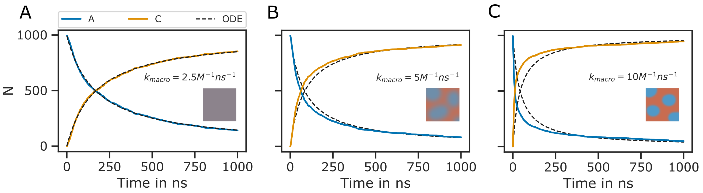

=========
Reactions
=========

The usage of rigid bead models to represent molecules already enables much larger simulations compared to atomistic models. However, what such a model cannot account for are the reactions that occur between proteins and other molecules, for example, post-translational modifications such as phosphorylation or ubiquitination or binding of ligands and ATP. This list could be continued.
In PyRID, reactions are described on several different levels. At the top, we have the molecule level and below the particle level. In addition, reactions are categorized into bi-molecular (second order) and uni-molecular (first order) reactions. Each uni- and bi-molecular reaction can consist of several different reaction paths, each belonging to a different reaction type (for an overview see Fig. :numref:`fig:ReactionsGraph`).
Uni-molecular reactions are divided into the following categories:

#. decay reactions,
#. fission reactions,
#. conversion reactions.

Decay reactions account for the degradation of proteins whereas fission reactions can be used to describe ligand unbinding but also, e.g., the disintegration of protein complexes or even the flux of ions in response to ion channel opening. Conversion reactions on the other hand may be used to describe different folded protein states that change the protein properties, post-translational modifications but also binding and unbinding reactions in the case where we do not need to model the ligands explicitly (which is the case, e.g. if we can assume an infinte ligand pool).
Bi-molecular reactions are divided into

#. fusion reactions,
#. enzymatic reactions.

Fusion reactions can, e.g., describe protein complex formation or ligand binding.

As mentioned above, if we go one level deeper, each uni- and bi-molecular reaction can consist of one or several reaction paths. This is motivated by the minimal coarse-graining approach we take. Two proteins, e.g., can have different sites by which they interact. However, these are not necessarily represented in the rigid bead model. Similarly, a protein may convert to one of a larger set of possible forms. And again, the list could be continued.
In the following sections I will describe the methods by which reactions are evaluated in PyRID in more detai.

.. figure:: Figures/Reactions_Graph.png
    :width: 70%
    :name: fig:ReactionsGraph
    
    Reactions graph.

Unimolecular reactions
----------------------

Unimolecular reactions include fission, conversion, and decay reactions. These can be efficiently simulated using a variant of the Gillespie Stochastic Simulation Algorithm (SSA) \cite{Erban2007, Gillespie1977}. Thereby, the time point of the next reaction is sampled from the probability distribution of expected molecule lifetimes, assuming that in between two time points no interfering event occurs. An interfering event could, e.g., be a bi-molecular reaction. The naive way of simulating uni-molecular reactions would be to check each time step whether the reaction will occur depending on its reaction rate. The Gillespie SSA has the benefit of being exact (partially true since the simulation evolves in finite, discrete time steps) and far more efficient, because we only need to evaluate a reaction once and not each time step. 
For a single molecule having :math:`n` possible reaction paths each with a reaction rate :math:`k_i`, let :math:`k_t = \sum_i^n k_i` be the total reaction rate.
Let :math:`\rho(\tau) d\tau` be the probability that the next reaction occurs within :math:`[t+\tau,t+\tau+d\tau)`, which can be split into :math:`g(\tau)`, the probability that no reaction occurs within :math:`[t,t+\tau)` and probability that a reaction occurs within the time interval :math:`d\tau`, which is given by :math:`k_t d\tau`. Thereby,

.. math::
    \rho(\tau) d\tau = g(\tau) k_t d\tau,

    
where :math:`g(\tau) = e^{-k_t \tau}` :cite:p:`Erban2007`.
From the above equation we easily find :math:`P(\tau) = 1-e^{-k_t \tau}` by integration.
To sample from this distribution, we can use the inverse distribution function.

.. math::
    \tau = P^{-1}(U)

where :math:`U` is uniformly distributed in :math:`(0,1)`. 
From :math:`U = P(\tau) = 1-e^{-k_t \tau}`, we find :math:`P^{-1}(U) = \frac{-log(1-U)}{k_t}`. Since 
`U` is uniformly distributed in :math:`(0,1)`, so is :math:`1-U`. Thereby, we can draw the time point of the next reaction from:
    
.. math::
    \tau = \frac{1}{k_t} \ln\Big[\frac{1}{U}\Big],

With the above method, we accurately sample from the distribution of expected molecule lifetimes :math:`\rho(\tau) = k_t e^{-k_t \tau}`.

At the time point of the reaction, we can sample from the set of reaction paths by a weighted random choice algorithm. Therefore, we compare a second random number, uniformly distributed in :math:`(0,k_{t})`, with the cumulative set of reaction rates :math:`(k_1, k_1+k_2, ... ,k_{t})`. The comparison can be made efficiently via a bisection algorithm.
\newline \newline
\underline{\emph{Particle and molecule reactions}}
\newline

Because in PyRID, molecules are represented by rigid bead models, uni-molecular reactions can occur either on the molecule level or on the particle level. As such, if a conversion or decay reaction is defined on a molecule, executing the reaction will exchange the complete rigid bead molecule by a product molecule, or, in the case of a decay reaction, will remove the complete molecule from the simulation. On the other hand, if the reactions are defined on a particle/bead type, only the particle will be affected.
Whereas decay and conversion reactions are handled very similar for molecules and particles, fission reactions are handled slightly different. Therefore, PyRID offers three types of fission reactions:

#. fission reactions,
#. production reactions,
#. release reactions.

\emph{Standard fission reactions} can only be defined on the molecule level and are executed similar to ReaDDy :cite:p:`Hoffmann2019`. Here, the number of product molecules is limited to two. 
In the case where educt and products are volume molecules, the product molecules are placed within a sphere of radius :math:`R_{fission}`. Therefore, an orientation vector :math:`\boldsymbol{d}` uniformly distributed in the rotation space with a length :math:`<=R_{fission}` is sampled. The two products are then placed according to 

.. math::
    \begin{split}
    \boldsymbol{r}_1 = \boldsymbol{r}_0 + 0.5 \boldsymbol{d}, \\
    \boldsymbol{r}_2 = \boldsymbol{r}_0 - 0.5 \boldsymbol{d},
    \end{split}

where :math:`\boldsymbol{r}_0` is the center of the educt molecule. If the educt and product molecules are surface molecules, the procedure is equivalent except that the direction vector is sampled from a disc on the mesh surface except from a sphere. If the educt is a surface molecule but the product a volume molecule, in addition to the sphere radius, the direction needs to be defined, .i.e whether the product is placed inside or outside the compartment. In both cases, the direction vector is not sampled from the full rotation space but only within the half-sphere cut by the triangle plane. Whenever a mesh compartment is present in the simulation, a ray tracing algorithm is used to resolve any collisions of the direction vectors with the mesh.
\newline

\emph{production reactions}: In addition to the standard fission reaction, PyRID supports reactions with more than two products, which are here called production reactions, because an educt molecule produces a number of product molecules. This type of reaction can, e.g., be used to simulate the influx of ions into a compartment via an ion channel. The procedure by which the reaction is executed is very similar to the fission reaction. However, here, the educt molecule is preserved but may change its type. Also, for each product molecule, a separate direction vector within a sphere of radius :math:`R_{prod}` is sampled. Collisions with the mesh are handled as before, however, collisions between the product molecules are not resolved.
\newline

\emph{release reaction}: PyRID also allows for a fission type reaction to be defined on particles, which is called a release reaction. Release reactions are limited to one particle and one molecule product. When a release reaction is executed, the particle is converted to the product particle type while releasing a product molecule either into the simulation volume or the surface of a mesh compartment. The latter is only possible if the rigid bead molecule the educt particle belongs to is also a surface molecule. Release reactions can, e.g., be used to simulate the release of a ligand from a specific binding site of a rigid bead molecule. The release reaction is introduced as the counter part to the particle absorption reaction (see next section on bi-molecular reactions).

Bi-molecular reactions
----------------------

Bi-molecular reactions cannot be evaluated the same way as uni-molecular reactions since we cannot sample from the corresponding probability space as we have done for the uni-molecular reactions, because we do not know when two molecules meet in advance. Here, we use a reaction scheme introduced by :cite:t:`Doi1976`, which is also used in the Brownian dynamics simulation tool ReaDDy :cite:p:`Schoeneberg2013, Hoffmann2019`. In this scheme, two molecules can only react if the inter-molecular distance :math:`|\boldsymbol{r}_{ij}|` is below a reaction radius :math:`R_{react}`. The probability of having at least one reaction is then given by

.. math::
    p = 1-\exp\Big(-\sum_i^n k_i \Delta t \Big),

where :math:`n` is the number of reaction paths. Here, we assume that the time step :math:`\Delta t` is so small that the molecule can only undergo one reaction. As such, the accuracy of the simulation strongly depends on the proportion between the reaction rate and the time step :math:`\Delta t`. If :math:`k_t \cdot \Delta t>0.1`, PyRID will print out a warning. 
As for uni-molecular reactions, each bi-molecular reaction can contain several reaction paths, each of which can be of a different bi-molecular reaction type. PyRID supports the following bi-molecular reactions:

#. fusion reactions,
	* molecule fusion,
	* particle-molecule absorption,
#. enzymatic reactions (defined on molecules or particles),
#. binding reactions

Molecule fusion reactions are defined on molecule pairs. The product is placed in the middle between the educts. Particle-molecule absorption is also a reaction of the fusion type, however, here a molecule is absorbed by the bead/particle of another molecule. Binding reactions introduces an interaction potential between two beads. Upon binding, the beads can change their respective type. A bead can only be bound to one partner at a time. Bonds can be either persistent or breakable. In the latter case, the bond is removed as soon as the inter-particle distance crosses an unbinding threshold. Similarly, unbinding reactions can be introduced by means of a conversion reaction as bonds are removed if a particle or the corresponding rigid bead molecule are converted.
\newline \newline
\underline{\emph{Choosing the right reaction rate and radius}}
\newline

As described in :cite:p:`Schoeneberg2013`, the reaction radius :math:`R_{react}` may be interpreted as the distance at which two particles can no longer be treated as moving independently, because there interactions becomes significant. Furthermore, :cite:t:`Schoeneberg2013` suggests that the length scale of electrostatic interactions can be used to define :math:`R_{react}`. In general, the reaction radius should not be so large that in dense settings molecules would react with a partner that is not among the nearest neighbours. However, :math:`R_{react}` should also not be smaller than the average change in the distance between molecules, which is given by :math:`\lambda_{AB} = \sqrt{4(D^t_A +D^t_B) \Delta t}`, where :math:`D^t_A` and :math:`D^t_B` are the translational diffusion constants of two molecular species :math:`A` and :math:`B`. Otherwise, a molecule might pass many reaction partners in between two time steps where the bi-molecular reactions are not evaluated :cite:p:`Erban2009`. However, even if :math:`\lambda_{AB} \approx R_{react}` the system would still correctly reproduce the deterministic rate equation description of the reaction kinetics. Of course, in any case, :math:`R_{react}` should not be chosen smaller than the radius of excluded volume of the molecule species in the presence of repulsive interactions. 
A description of the reaction kinetics in terms of a system of differential equations assumes a well mixed system. Therefore, the simulation results are also only directly comparable with the ode approach, if the reactions are reaction rate limited, not diffusion limited such that the system has enough time to equilibrate in between reactions. Let us take a very simple example where :math:` A + B -> C`. If the reaction kinetics are rate limited, the reaction products do not have enough time to mix with the rest of the system. Thereby, regions of low educt concentration evolve where reactions had occurred, while in the regions where no reactions occurred yet, the concentration of educts stays approximately same as in the beginning. Therefore, for the remaining educts in the system, the probability of encounter stays approximately the same. In contrast, if we assume a well stirred system, the concentration of educts would globaly decrease in time, lowering the probability of educt encounters.Therefore, the reaction kinetics are sped up in the stochastic simulation compared to the ode approach (Fig. :numref:`fig:ReactionKinetics_RateVal`). Interestingly, :cite:t:`Schoeneberg2013` found exactly the opposite effect, as the reaction kinetics where slowed down in the stochastic simulation. The reason for this discrepancy in the results is unclear. However, I simulated the very same system in ReaDDy and got the same result as with PyRID.

    
    **Diffusion limited bi-molecular reactions are not accurately described by ODEs.** Shown is the minimal system :math:`\ce{A + B ->[\ce{k_1}] C }` with :math:`R_react = 4.5 nm` and :math:`\sigma_A = 3 nm`, :math:`\sigma_B = 4.5 nm`, :math:`\sigma_C = 3.12 nm`. The same system has been used for validation of ReaDDy in :cite:p:`Schoeneberg2013`. The ODE approach to the description of the reaction kinetics assumes a well mixed system. If the reaction rate is small, the system has enough time to equilibrate in between reactions and the ODE approach (black dotetd lines) and the particle-based SSA approach (colored lines) match (**A**). As the reaction rate increases (**B**-**C**) this is no longer the case, as the system is no longer well mixed at any point in time. Here, the system can be divided into regions of high and low educt concentrations (depicted by the small insets). Thereby, at the onset, the reaction kinetics in the stochastic simulation are faster than predicted by the ODE approach (**B**, **C**). However, when a critical mass of educts have reacted, the slow diffusion has an opposite effect on the reaction kinetics as the probability of isolated single educts to collide becomes lower than in the well mixed case. The slow down effect is especially prominent in **B**, **C** at around 500 ns. The reaction kinetics are therefore better described by two exponential functions instead of one.

Figure ... shows the effect of different reaction radii on the simulation accuracy.
Given a reaction radius :math:`R_{react}`, we would like to know at what reaction rate :math:`k_t` a simulation would match an experimentally measured macroscopic reaction rate :math:`k^{macro}`. For two non-interacting molecule species :math:`A` and :math:`B` with translational diffusion constants :math:`D^t_A` and :math:`D^t_B` and :math:`\lambda_{AB}<<R_{react}`, :math:`k_{macro}` is given by \cite{Erban2009}

.. math:: 
    :label: eq:k_macro

    k_{macro} = 4 \pi (D^t_A+D^t_B) \left[R_{react}-\sqrt{\frac{D^t_A+D^t_B}{k_t}} \, \tanh\left(R_{react} \, \sqrt{\frac{k_t}{D^t_A+D^t_B}}\right)\right]

Equation :math:numref:`eq:k_macro` can solved numerically for :math:`k_t`. Also, if the :math:`k_t \rightarrow \infty`, :math:numref:`eq:k_macro` simplifies to the Smoluchowski equation where we can express the reaction radius in terms of the macroscopic reaction rate :cite:p:`Erban2009`:

.. math:: 
    :label: eq:k_macro2

    R_{react} = \frac{k_{macro}}{4 \pi (D^t_A + D^t_B)}

In the limit where :math:`k_t << \frac{D_A^t+D_B^t}{R_{react}^2}`, Eq. :math:numref:`eq:k_macro` can be Taylor expanded and simplifies to :cite:p:`Erban2009`:

.. math:: 
    :label: eq:k_macro3

    k_t = \frac{k_{macro}}{4/3 \pi R_{react}^3}

The above equations are, however, only valid in the case where molecules are represented by single particles and also only in 3 dimensions.
\newline \newline
\underline{\emph{Bi-molecular reactions between rigid bead molecules}}
\newline

The representation of molecules by single particles neglects the complex structure of molecules. Bi-molecular reactions between proteins can occur via different reaction sites. Therefore, also here, the isotropic picture breaks down. PyRID enables the simulation of reactions between complex molecules having different reaction sites. Different reaction sites are represented by beads/patches that are part of the rigid bead molecules topology. 
Similar to uni-molecular reactions, bi-molecular reactions can be defined on particles or molecules. However, because PyRID only computes the distances between the particles in the system, also reactions that are defined on the molecule level need to be linked to a particle type pair. If the the two particles are within the reaction distance and if the reaction is successful, the reaction itself will, however, be executed on the respective molecule types.
As an example, we again consider the simple system :math:`\ce{A + B <=>[\ce{k_1}][\ce{k_{-1}}] C }`. However, molecules :math:`A` and :math:`B` are each represented by two beads :math:`a_1, a_2` and :math:`b_1, b_2`. Also, we add another reaction path :math:`\ce{A + B ->[\ce{k_2}] D }`. We now may define reactions for different pair permutations of the available beads:

.. math::
    \begin{split}
        \ce{A(a_1) + B(b_1) ->[\ce{k_1, R_1}] C } \\
        \ce{A(a_1) + B(b_1) ->[\ce{k_2, R_2}] D } \\
        \ce{A(a_1) + B(b_2) ->[\ce{k_3, R_3}] C } \\
        \ce{A(a_2) + B(b_2) ->[\ce{k_4, R_4}] C } \\
    \end{split}

where :math:`k_i` are the microscopic reaction rates and :math:`R_i` the reaction radii. For better visualization, also see Fig ... A.
As such, molecules :math:`A` and :math:`B` can undergo fusion to molecule :math:`C` via three pathways, defined by three bead pairs :math:`(a_1, b_1), (a_1, b_2), (a_2, b_2)`. Whereas for the particle pairs :math:`(a_1, b_2)` and :math:`(a_2, b_2)` only one reaction pathway is defined respectively, for the particle pair :math:`(a_1, b_1)` a second reaction path has been defined for the fusion of molecules :math:`A` and :math:`B` to molecule :math:`C`. We may also describe this system in terms of a system of ODEs:

.. math::
    \begin{split}
        \frac{dA}{dt} = -(k_{macro}^1 + k_{macro}^3 + k_{macro}^4) A B - k_{macro}^2 A B + k_{macro}^{-1} C \\
        \frac{dB}{dt} = -(k_{macro}^1 + k_{macro}^3 + k_{macro}^4) A B - k_{macro}^2 A B + k_{macro}^{-1} C \\
        \frac{dC}{dt} = (k_{macro}^1 + k_{macro}^3 + k_{macro}^4) A B - k_{macro}^{-1} C \\
        \frac{dD}{dt} = k_{macro}^2 A B \\
    \end{split}

The macroscopic rate constants :math:`k_{macro}^i` can be calculated from Eq. :math:numref:`eq:k_macro`. Note, however, that for more complex molecules Eq. :math:numref:`eq:k_macro` does not hold true, because we would also need to take into account the rotational motion of the molecule in addition to the translational diffusion constant that describes the motion of the molecule center. In our example, the bead motion is however close enough to that of a single spherical particle such that the results from the Brownian dynamics simulation are in close agreement with the ODE formulation (Fig. :numref:`fig:ReactionKinetics_RBM`).
At this point one might argue that there is only little to no benefit of the rigid bead model description over other SSA schemes. And in principle that is true. Systems such as the above could also be modeled using single particle Brownian dynamics or even ODEs. However, if we take into account the excluded volume of the molecules by introducing a repulsive interactions between the beads, the reaction kinetics diverge from the ODE solution (Fig. :numref:`fig:ReactionKinetics_RBM` **D**). The bead radii are chosen equal to the reaction radius, where :math:`\sigma_{a_1} = 2.0 nm`, :math:`\sigma_{a_2} = 1.5 nm`, :math:`\sigma_{b_1} = 2.0 nm`, :math:`\sigma_{b_2} = 3.0 nm`. Thereby, the molecules react upon contact.
For such simple molecules one could, however, neglect the bead topology and approximate the molecules by single beads with repulsive interactions and get a very similar result. For more complex molecules where the reaction volumes are much more anisotropic, one would, however, expect a larger deviation from the repulsive sphere approximation. The benefits of the rigid bead model approach become more important when we consider binding reactions.
\newline \newline
\underline{\emph{Reactions between surface molecules}}
\newline
As for volume molecules, molecules that reside on the surface/in the membrane of a compartment react with each other if the inter-particle distance is below the reaction radius. However, PyRID only computes the euclidean distance between particles. Therefore, however, surface reactions are only accurate if the local surface curvature is large compared to the reaction radius. Accurate calculation of the geodesic distance on mesh surfaces is computationally very expensive. Algorithms that allow for relatively fast approximations of geodesic distances and shortest paths such as the Dijkstra's algorithm often only provide good approximations for point far away from the source. Therefore the benefit of implementing such algorithms might be negligible. However, much progress has been made in this field :cite:p:`Polthier2006, Crane2017, Trettner2021`.
\newline \newline
\underline{\emph{Binding reactions}}
\newline

.. figure:: Figures/Reaction_kinetics_RBM.png
    :width: 50%
    :name: fig:ReactionKinetics_RBM
    
    **Diffusion limited bi-molecular reactions are not accurately described by ODEs.** Shown is the minimal system :math:`\ce{A + B <=>[\ce{k_1}][\ce{k_{-1}}] C }` with :math:`R_{react} = 4.5 nm` and :math:`\sigma_A = 3 nm`, :math:`\sigma_B = 4.5 nm`, :math:`\sigma_C = 3.12 nm`.

