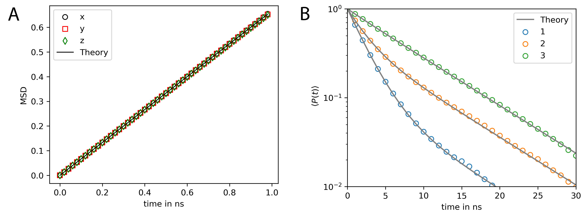
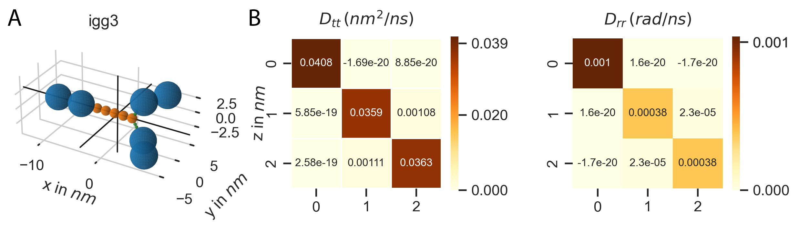
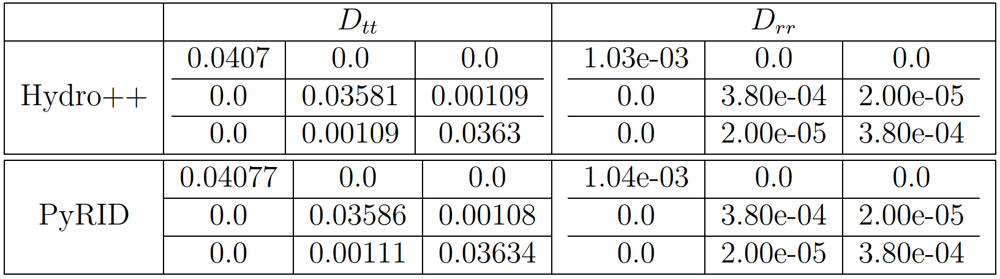
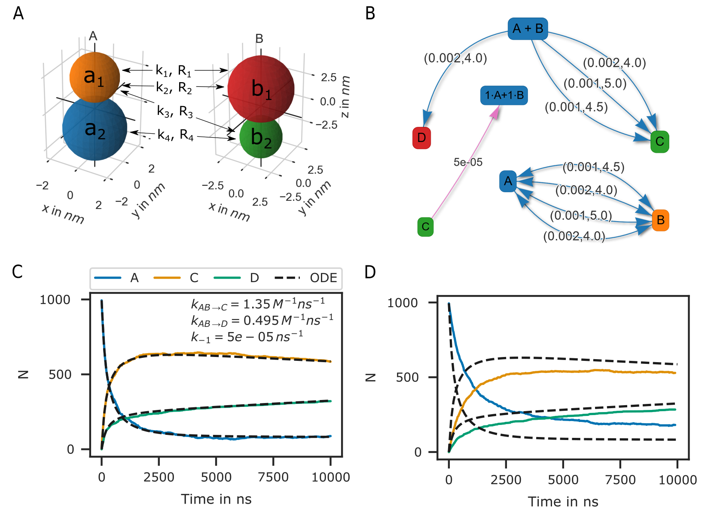
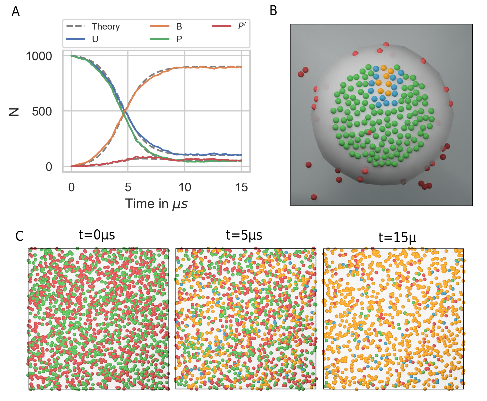
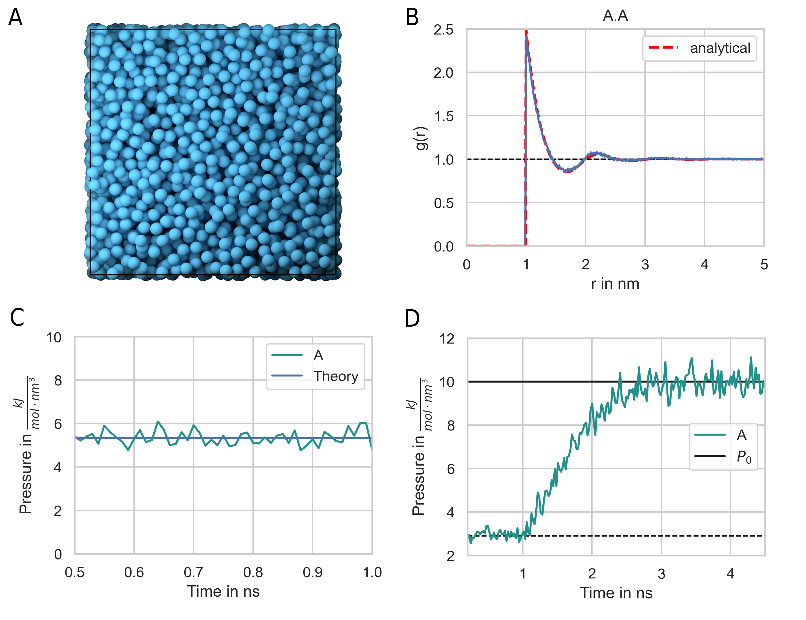
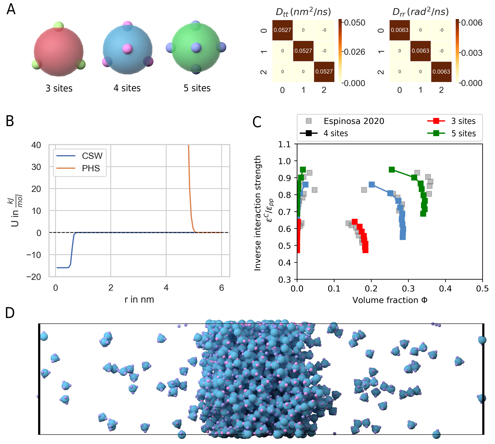
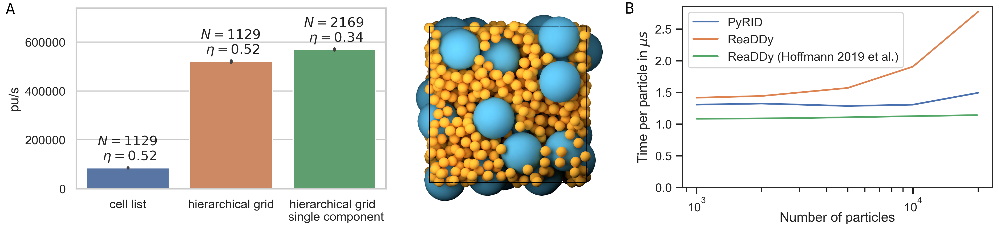

.. _`sec:results_pyrid`:

Results and validation
======================

.. _`sec:val_diff`:

Anisotropic diffusion
---------------------

To validate the implementation of the algorithms for translational and
rotationional diffusion introduced in
:ref:`sec:propagators` I use the same example as in
:cite:p:`Ilie2015`. Here, the translational and rotational
diffusion tensors do not represent any specific molecule:

.. math::

   D_{tt} = 
       \begin{pmatrix}
          0.5 & 0 & 0 \\
           0 & 0.4 & 0 \\
           0 & 0 & 0.1 \\
       \end{pmatrix} \frac{nm^2}{ns},

.. math::

   D_{rr} = 
       \begin{pmatrix}
          0.005 & 0 & 0 \\
           0 & 0.04 & 0 \\
           0 & 0 & 0.1 \\
       \end{pmatrix} \frac{rad^2}{ns},

In order to validate the algorithm, the mean squared displacement (MSD)
and rotational time correlation are compared with theory. The mean
squared displacement (MSD) is given by

.. math:: MSD = \langle |\boldsymbol{x}(t+\Delta t)-\boldsymbol{x}(t)|^2 \rangle

The rotational time correlation function is given by
:cite:p:`Torre1999`:

.. math:: MSD = \frac{3}{2} \langle (\hat{\boldsymbol{n}}(t+\Delta t)\hat{\boldsymbol{n}}(t))^2 \rangle - \frac{1}{2},

where :math:`\hat{\boldsymbol{n}}(t)` is some unitary vector that
describes the current orientation of the molecule at time point
:math:`t`. Fig. `1.1 <#fig:Diff>`__ compares the simulation results to
the theoretical prediction, which, for the rotational time correlation
function, is given by a multi-exponential decay function
:cite:p:`Torre1999`:

.. math::
   :label: eq:P2

   P_{2,l}(t) = \sum_{i=1}^5 a_{i,l} exp(-t/\tau_i),

where :math:`l \in {1,2,3}`. The relaxation times are given by

.. math::

   \begin{split}
       \tau_1 = (6D - 2 \Delta)^{-1} \\
       \tau_2 = (3D - D^{rr,b}_1)^{-1} \\
       \tau_3 = (3D - D^{rr,b}_2)^{-1} \\
       \tau_4 = (3D - D^{rr,b}_3)^{-1} \\
       \tau_5 = (6D - 2 \Delta)^{-1}.
       \end{split}

:math:`D^{rr,b}_1, D^{rr,b}_2, D^{rr,b}_3` are the eigenvalues of the
rotational diffusion tensor :math:`\boldsymbol{D}^{rr,b}` in the
molecule frame and D is the scalar rotational diffusion coefficient
given by :math:`D = \frac{Tr(\boldsymbol{D}^{rr,b})}{3}`. Parameter
:math:`\Delta` is given by

.. math:: \Delta = \sqrt{((D^{rr,b}_1)^2+(D^{rr,b}_2)^2+(D^{rr,b}_3)^2-D^{rr,b}_1 D^{rr,b}_2-D^{rr,b}_1 D^{rr,b}_3-D^{rr,b}_2D^{rr,b}_3)}

The amplitudes of the individual exponential decays are given by

.. math::
   :label: eq:amplitude_rotrelax

   \begin{split}
   a_{1,l} = \frac{3}{4}(F+G) \\
   a_{2,l} = 3 \hat{n}_{l,2}^2 \hat{n}_{l,3}^2 \\
   a_{3,l} = 3 \hat{n}_{l,1}^2 \hat{n}_{l,3}^2 \\
   a_{4,l} = 3 \hat{n}_{l,1}^2 \hat{n}_{l,2}^2 \\
   a_{5,l} = \frac{3}{4}(F-G),
   \end{split}

with :math:`F = - \frac{1}{3} + \sum_{k=1}^3 \hat{n}_k^4` and
:math:`G=\frac{1}{\Delta}\Big( -D + \sum_{k=1}^3 D^{rr,b}_k \Big[ \hat{n}_k^4 + 2 \hat{n}_m^2 \hat{n}_n^2 \Big] \Big)`,
where :math:`m, n \in \{1,2,3\}-\{k\}`.

If we choose the normal vectors of each axis
:math:`\hat{\boldsymbol{n}}_l` such that these are identical with the
basis vectors of the local frame, i.e.
:math:`\hat{\boldsymbol{u}}_1 = \boldsymbol{e}_x = [1,0,0]`,
:math:`\hat{\boldsymbol{u}}_2 = \boldsymbol{e}_y = [0,1,0]`,
:math:`\hat{\boldsymbol{u}}_3 = \boldsymbol{e}_z = [0,0,1]`,
:math:`a_2-a_3` vanish such that we end up with a double exponential
decay (Fig. `1.1 <#fig:Diff>`__ B).

Fig. `1.1 <#fig:Diff>`__ shows that the rotation and translation
propagators result in the correct mean squared distribution and
rotational time correlation.

   **MSD and rotational relaxation times of a rigid bead molecule
   matches the theoretical prediction.** **(A)**  Mean squared
   displacement (MSD) of the rigid bead molecule computed with PyRID.
   The displacement in each dimension (colored markers) is in very good
   agreement with the theory (black line). **(B)** The rotational
   relaxation of the rigid bead molecule is also in close agreement with
   the theory (gray lines,
   Eqs.\ :math:numref:`eq:P2`-:math:numref:`eq:amplitude_rotrelax`)
   for each of the the rotation axes (colored markers).

Diffusion tensor of igG3
------------------------

The methods outlined in section
:ref:`sec:mobility_tensors` have, at least to my
knowledge, only been implemented in the freely available tool Hydro++.
The source code for Hydro++ is, however, not publicly available. To
efficiently set up a system of rigid bead molecules, the method has now
also been implemented directly into PyRID. The implementation is tested
against Hydro++ using a model of the protein igG3 that comes with the
documentation of Hydro++. The results are in good agreement at up to 4
digits (Table `1.4 <#tab:igG3>`__). The slight difference is probably
due to numerical errors that accumulate when numerically inverting the
large supermatrices.

   **The diffusion tensor of igG3 calculated with PyRID.** **(A)** Rigid
   bead molecule representation of igG3 as found in
   :cite:t:`Torre2013`. The black cross marks the center of
   diffusion. **(B)** Translational and rotational diffusion tensor of
   igG3. A comparison of the result from PyRID with those of the Hydro++
   suite can be found in table `1.4 <#tab:igG3>`__.

    
    **Translational and rotational diffusion tensors of the IgG3 rigid bead model.** Here, the result from PyRID is compared to the result gained from the Hydro++ suite. We find small deviations originating from numerical errors that build up mainly during the super-matrix inversion calculations.

Fixed concentration boundary
----------------------------

As mentioned in the methods chapter, fixed concentration boundary
conditions couple the simulation box to a particle bath. Thereby, we can
simulate, e.g., a sub-region within a larger system without the need to
simulate the dynamics of the molecules outside simulation box directly.
As an example system we take a 3d model of synapse. The post- and
presynaptic spine are both contained inside the simulation volume
whereas dendrite and axon are cutoff at the simulation box border (Fig.
`1.3 <#fig:fixed_concentration_val>`__ A). We define three molecular
species: Species A diffuses in the volume outside the spines (in the
extracellular space), species B is located inside the postsynaptic spine
and species C on the surface (within the membrane) of the postsynaptic
spine. All species consist of a single particle with radius
:math:`2\,nm`. The diffusion coefficient is calculated from the the
Einstein relation where the temperature is set to :math:`293.15\,K`. The
viscosity is set to :math:`1\,mPa\cdot s` and the time step to
:math:`10\,ns`. The simulation box size is set to
:math:`250\,nm \cdot 250\,nm \cdot 350\,nm`. At the beginning there are
no molecules inside the simulation box. However, the outside
concentration of each species is set to :math:`1000` molecules per total
volume or total surface area respectively. Thereby, there should be 1000
molecules of each species in the volume and on the surface of each
compartment as soon as the system has reached its equilibrium state.
Indeed, after about :math:`0.5\,ms` the system has reached equilibrium
and the number of each species fluctuates around the number 1000 (Fig.
`1.3 <#fig:fixed_concentration_val>`__ B). As one would expect, species A
fills the simulation volume the fastest as the border area is the
largest. Species B and C which are located in the volume and on the
surfaces of the postsynaptic compartment fill the simulation volume at
about the same rate.

.. figure:: Figures/fixed_concentration_2.png
   :width: 50%
   :name: fig:fixed_concentration_val

   **Fixed concentration boundary conditions result in the system
   approaching a target molecule concentration per compartment.**
   **(A)** We start with an empty scene (left). However, because the
   molecule concentration of virtual molecules outside the simulation
   box is above zero, surface and volume molecules enter the system via
   the boundary (middle). After around 500 ns, the molecule
   concentration inside the simulation box reaches the target
   concentration **(A)** right, **(B)**.

Choosing the right reaction rate and radius
-------------------------------------------

:func:`pyrid.reactions.reactions_util.k_macro`
:func:`pyrid.reactions.reactions_util.k_micro`

As described in :cite:p:`Schoeneberg2013`, the reaction
radius :math:`R_{react}` may be interpreted as the distance at which two
particles can no longer be treated as moving independently, because
there interactions becomes significant. Furthermore,
:cite:t:`Schoeneberg2013` suggest that the length scale of
electrostatic interactions can be used to define :math:`R_{react}`. In
general, the reaction radius should not be so large that in dense
settings molecules would react with a partner that is not among the
nearest neighbours. However, :math:`R_{react}` should also not be
smaller than the average change in the distance between molecules, which
is given by :math:`\lambda_{AB} = \sqrt{4(D^t_A +D^t_B) \Delta t}`,
where :math:`D^t_A` and :math:`D^t_B` are the translational diffusion
constants of two molecular species :math:`A` and :math:`B`. Otherwise, a
molecule might pass many reaction partners in between two time steps
where the bi-molecular reactions are not evaluated
:cite:p:`Erban2009`. However, even if
:math:`\lambda_{AB} \approx R_{react}` the system would still correctly
reproduce the deterministic rate equation description of the reaction
kinetics. Of course, in any case, :math:`R_{react}` should not be chosen
smaller than the radius of excluded volume of the molecule species in
the presence of repulsive interactions. A description of the reaction
kinetics in terms of a system of differential equations assumes a well
mixed system. Therefore, the simulation results are also only directly
comparable with the ODE approach, if the reactions are reaction rate
limited, not diffusion limited such that the system has enough time to
equilibrate in between reactions. Let us take a very simple example
where :math:`\ce{A + B -> C }`. If the reaction kinetics are rate
limited, the reaction products do not have enough time to mix with the
rest of the system. Thereby, regions of low educt concentration evolve
where reactions had occurred, while in the regions where no reactions
occurred yet, the concentration of educts stays approximately same as in
the beginning. Therefore, for the remaining educts in the system, the
probability of encounter stays approximately the same. In contrast, if
we assume a well stirred system, the concentration of educts would
globaly decrease in time, lowering the probability of educt encounters.
Therefore, the reaction kinetics are sped up in the stochastic
simulation compared to the ode approach (Fig.
`1.4 <#fig:ReactionKinetics_RateVal>`__). Interestingly,
:cite:t:`Schoeneberg2013` found exactly the opposite effect,
as the reaction kinetics where slowed down in the stochastic simulation.
The reason for this discrepancy in the results is unclear. However, I
simulated the very same system in ReaDDy and got the same result as with
PyRID.

.. figure:: Figures/Reaction_kinetics_RateVal.png
   :width: 50%
   :name: fig:ReactionKinetics_RateVal

   **Diffusion limited bi-molecular reactions are not accurately
   described by ODEs.** Shown is the minimal system
   :math:`\ce{A + B ->[\ce{k_1}] C }` with :math:`R_{react} = 4.5 nm`
   and :math:`\sigma_A = 3 nm`, :math:`\sigma_B = 4.5 nm`,
   :math:`\sigma_C = 3.12 nm`. The same system has been used for
   validation of ReaDDy in :cite:p:`Schoeneberg2013`. The ODE
   approach to the description of the reaction kinetics assumes a well
   mixed system. If the reaction rate is small, the system has enough
   time to equilibrate in between reactions and the ODE approach (black
   dotted lines) and the particle-based SSA approach (colored lines)
   match (**A**). As the reaction rate increases (**B**-**C**) this is
   no longer the case, as the system is no longer well mixed at any
   point in time. Here, the system can be divided into regions of high
   and low educt concentrations (depicted by the small insets). Thereby,
   at the onset, the reaction kinetics in the stochastic simulation are
   faster than predicted by the ODE approach (**B**, **C**). However,
   when a critical mass of educts have reacted, the slow diffusion has
   an opposite effect on the reaction kinetics as the probability of
   isolated single educts to collide becomes lower than in the well
   mixed case. The slow down effect is especially prominent in **B**,
   **C** at around 500 ns. The reaction kinetics are therefore better
   described by two exponential functions instead of one.

Given a reaction radius :math:`R_{react}`, we would like to know at what
reaction rate :math:`k_t` a simulation would match an experimentally
measured macroscopic reaction rate :math:`k^{macro}`. For two
non-interacting molecule species :math:`A` and :math:`B` with
translational diffusion constants :math:`D^t_A` and :math:`D^t_B` and
:math:`\lambda_{AB}<<R_{react}`, :math:`k_{macro}` is given by
:cite:p:`Erban2009`

.. math::
   :label: eq:k_macro

   k_{macro} = 4 \pi (D^t_A+D^t_B) \left[R_{react}-\sqrt{\frac{D^t_A+D^t_B}{k_t}} \, \tanh\left(R_{react} \, \sqrt{\frac{k_t}{D^t_A+D^t_B}}\right)\right]

Equation :math:numref:`eq:k_macro` can solved numerically for
:math:`k_t`. Also, if the :math:`k_t \rightarrow \infty`,
:math:numref:`eq:k_macro` simplifies to the Smoluchowski equation
where we can express the reaction radius in terms of the macroscopic
reaction rate :cite:p:`Erban2009`:

.. math::
   :label: eq:k_macro2

   R_{react} = \frac{k_{macro}}{4 \pi (D^t_A + D^t_B)}

In the limit where :math:`k_t << \frac{D_A^t+D_B^t}{R_{react}^2}`, Eq.
:math:numref:`eq:k_macro` can be Taylor expanded and simplifies to
:cite:p:`Erban2009`:

.. math::
   :label: eq:k_macro3

   k_t = \frac{k_{macro}}{4/3 \pi R_{react}^3}

The above equations are, however, only valid in the case where molecules
are represented by single particles and also only in 3 dimensions. PyRID
has a build in method to calculate the reaction rates and radii based on
equation :math:numref:`eq:k_macro`.

Bi-molecular reactions between rigid bead molecules
---------------------------------------------------

The representation of molecules by single particles neglects the complex
structure of molecules. Bi-molecular reactions between proteins can
occur via different reaction sites. Therefore, also here, the isotropic
picture breaks down. PyRID enables the simulation of reactions between
complex molecules having different reaction sites. Different reaction
sites are represented by beads/patches that are part of the rigid bead
molecules topology. Similar to uni-molecular reactions, bi-molecular
reactions can be defined on particles or molecules. However, because
PyRID only computes the distances between the particles in the system,
also reactions that are defined on the molecule level need to be linked
to a particle type pair. If the the two particles are within the
reaction distance and if the reaction is successful, the reaction itself
will, however, be executed on the respective molecule types. As an
example, we again consider the simple system
:math:`\ce{A + B <=>[\ce{k_1}][\ce{k_{-1}}] C }`. However, molecules
:math:`A` and :math:`B` are each represented by two beads
:math:`a_1, a_2` and :math:`b_1, b_2`. Also, we add another reaction
path :math:`\ce{A + B ->[\ce{k_2}] D }`. We now may define reactions for
different pair permutations of the available beads:

.. math::
   :label: eq:bimol_reaction_RB

   \begin{split}
      \ce{A(a_1) + B(b_1) ->[\ce{k_1, R_1}] C } \\
      \ce{A(a_1) + B(b_1) ->[\ce{k_2, R_2}] D } \\
      \ce{A(a_1) + B(b_2) ->[\ce{k_3, R_3}] C } \\
      \ce{A(a_2) + B(b_2) ->[\ce{k_4, R_4}] C } \\
   \end{split}

where :math:`k_i` are the microscopic reaction rates and :math:`R_i` the
reaction radii. For better visualization, also see figure
`1.5 <#fig:ReactionKinetics_RBM>`__ A and B. As such, molecules
:math:`A` and :math:`B` can undergo fusion to molecule :math:`C` via
three pathways, defined by three bead pairs
:math:`(a_1, b_1), (a_1, b_2), (a_2, b_2)`. Whereas for the particle
pairs :math:`(a_1, b_2)` and :math:`(a_2, b_2)` only one reaction
pathway is defined respectively, for the particle pair
:math:`(a_1, b_1)` a second reaction path has been defined for the
fusion of molecules :math:`A` and :math:`B` to molecule :math:`C`. We
may also describe this system in terms of a system of ODEs:

.. math::
   :label: eq:bimol_reaction_RB_ODE

   \begin{split}
      &\frac{dA}{dt} = -(k_{macro}^1 + k_{macro}^3 + k_{macro}^4) A B - k_{macro}^2 A B + k_{macro}^{-1} C \\
      &\frac{dB}{dt} = -(k_{macro}^1 + k_{macro}^3 + k_{macro}^4) A B - k_{macro}^2 A B + k_{macro}^{-1} C \\
      &\frac{dC}{dt} = (k_{macro}^1 + k_{macro}^3 + k_{macro}^4) A B - k_{macro}^{-1} C \\
      &\frac{dD}{dt} = k_{macro}^2 A B \\
   \end{split}

The macroscopic rate constants :math:`k_{macro}^i` can be calculated
from Eq. :math:numref:`eq:k_macro`. Note, however, that for more
complex molecules Eq. :math:numref:`eq:k_macro` does not hold true,
because we would also need to take into account the rotational motion of
the molecule in addition to the translational diffusion constant that
describes the motion of the molecule center. In our example, the bead
motion is, however, close enough to that of a single spherical particle
such that the results from the Brownian dynamics simulation are in close
agreement with the ODE formulation (Fig.
`1.5 <#fig:ReactionKinetics_RBM>`__ C).

   **Bi-molecular reaction between two rigid bead
   molecules.(A)** Depiction of the two rigid bead molecules and the
   different reactions defined on their respective particles/beads.
   **(B)** Reaction graphs showing the different reaction paths for the
   fusion reactions :math:`\ce{A + B -> C}` and :math:`\ce{A + B -> D}`
   as well as the fission reaction :math:`\ce{C -> A + B}`. The lower
   right graph simply depicts the different reaction paths between the
   two educts A and B without specifying the products. In total there
   are 4 paths (Eq. :math:numref:`eq:bimol_reaction_RB`).
   **(C)**  If not accounting for any repulsive interaction between
   molecules A and B, the simulation results are in good agreement with
   the ODE description (Eq.
   :math:numref:`eq:bimol_reaction_RB_ODE`). **(D)** 
   However, if we account for the excluded volume of the molecules by a
   repulsive interaction potential, the results of the two approaches
   (particle dynamics and ODE description) differ.

At this point one might argue that there is only little to no benefit of
the rigid bead model description over other SSA schemes. And in
principle that is true. Systems such as the above could also be modeled
using single particle Brownian dynamics or even ODEs. However, if we
take into account the excluded volume of the molecules by introducing a
repulsive interactions between the beads, the reaction kinetics differ
from the ODE solution (Fig. `1.5 <#fig:ReactionKinetics_RBM>`__ D). The
bead radii are chosen equal to the reaction radius, where
:math:`\sigma_{a_1} = 2.0 nm`, :math:`\sigma_{a_2} = 1.5 nm`,
:math:`\sigma_{b_1} = 2.0 nm`, :math:`\sigma_{b_2} = 3.0 nm`. Thereby,
the molecules react upon contact. For such simple molecules one could,
however, neglect the bead topology and approximate the molecules by
single beads with repulsive interactions and get a very similar result.
For more complex molecules where the reaction volumes are much more
anisotropic, one would, however, expect a larger deviation from the
repulsive sphere approximation. The benefits of the rigid bead model
approach become more important when we consider binding reactions.

Reactions between surface molecules
-----------------------------------

As a model, let us consider a four component system and implement a
simple autocatalytic reaction scheme. The system consists of a freely
diffusing transmembrane molecule :math:`U`. In addition, we add a
second, freely diffusing, surface molecule :math:`P`. Let :math:`U` and
:math:`P` form a complex :math:`B` via a fusion reaction:

.. math::
   :label: eq:UP-B

   \ce{U + P ->[\ce{k_{on}}] B }

The reaction rates are set to :math:`k_{on} = 1e-5 ns^{-1}` and
:math:`R_{react}= 4nm`. In addition, we add an enzymatic/katalytic
reaction:

.. math::
   :label: eq:BP-BP2

   \ce{B + P ->[\ce{k_{enz}}] B + P^{\prime} }.

We also account for a reverse reaction where

.. math::
   :label: eq:P2-P

   \ce{P^{\prime} ->[\ce{k_{-enz}}] P }.

Here, :math:`k_{enz} = 1e-3 ns^{-1}`, :math:`k_{-enz} = 5e-5 ns^{-1}`
and :math:`R_{react}= 4nm`. The reaction product :math:`P^{\prime}` has
a much higher binding affinity for :math:`U`:

.. math::
   :label: eq:UP2-B

   \ce{U + P^{\prime} ->[\ce{k_{on}^{\prime}}] B },

with :math:`k_{on}^{\prime} = 1e-2 ns^{-1}` and :math:`R_{react}= 4nm`
(note that :math:`k_{on}^{\prime} >> k_{on}`). The break up of the
complex is accounted for by a fission reaction

.. math::
   :label: eq:B-PU

   \ce{B ->[\ce{k_{off}}] P + U }.

As expected from an autocatalytic reaction, the product :math:`B`
follows a sigmoid function (Fig. `1.6 <#fig:reaction_diffusion_2D>`__).
We may compare the simulation result to the corresponding ODE
description. The above system expressed in terms of a system of ODEs
reads

.. math::
   :label: eq:react_diff_2d

   \begin{split}
      &\frac{dU}{dt} = -U\,P\,k_{macro}^{on}-U\,P^{\prime}\,k_{macro}^{on\prime}+B\,k_{macro}^{off} \\
      &\frac{dB}{dt} = U\,P\,k_{macro}^{on}+U\,P^{\prime}\,k_{macro}^{on\prime}-B\,k_{macro}^{off} \\
      &\frac{dP}{dt} = -U\,P\,k_{macro}^{on}-P\,B\,k_{macro}^{enz}+P^{\prime}\,k_{macro}^{-enz}+B\,k_{macro}^{off} \\
      &\frac{dP^{\prime}}{dt} = B\,P\,k_{macro}^{enz} - P^{\prime}\,k_{macro}^{-enz}-U\,P_act\,k_{macro}^{on\prime}
   \end{split}

However, equation :math:numref:`eq:k_macro` is only valid in the 3D
case and a solution for the 2D case is difficult to derive as the rate
constant is concentration dependent. A closed form analytical expression
has not yet been derived for the Doi scheme
:cite:p:`Erban2009, Galanti2019, Crank1980, Berg1984`. A more
in depth discussion on this topic and theoretical results for the
Smoluchowski theory can be found in :cite:p:`Yogurtcu2015`.
However, for the current system the simulation result can be matched
using a constant reaction rate :math:`k_{macro}^{2D} = k_{macro}/5.6`
despite the decay in molecule density over time (Fig.
`1.6 <#fig:reaction_diffusion_2D>`__\ A). A closed form expression for
:math:`k_{macro}` is extremely useful when setting up a reaction
diffusion simulation. Even if results do not match exactly, the ODE
approach can help to choose the correct parameters for a particle-based
simulation that might take several order longer than solving the system
of ODEs. Whereas the ODE description is useful in many regards, we
usually decide to do a particle based simulation because we are
interested in settings that are not well mixed, or where interactions
between molecules play a role.

Toy model of the PSD
~~~~~~~~~~~~~~~~~~~~

As an example, where the particle-based approach becomes essential, we
may transfer the autocatalytic system from above to a simplified model
of the postsynapse. In our new setting, :math:`P`, :math:`P^{\prime}`
and :math:`B` no longer diffuse but are fixed to a region that we
interpret as being the PSD. In addition, a 3d mesh of a postsynaptic
spine is introduced to the simulation and species :math:`U` enters the
simulation volume where the extrasynaptic region intersects the
simulation box via a fixed concentration boundary. :math:`P` now
represents a receptor binding site, :math:`U` the freely diffusing
receptors and :math:`B` the bound receptor or an occupied binding site.
In this adapted system the autocatalytic reaction scheme results in
receptor clustering (Fig. `1.6 <#fig:reaction_diffusion_2D>`__\ B). Note
that whereas the reaction
:math:`\ce{B + P ->[\ce{k_{enz}}] B + P^{\prime} }` is implemented as an
enzymatic reaction in PyRID, the physical interpretation could be very
different. For example, the conversion of :math:`\ce{P -> P^\prime}`
could occur only indirectly via the complex :math:`B` and by a local
signaling pathway that includes other molecules that we do not model
here explicitly. Important is only that this pathway is triggered by
:math:`B` and that it is locally restricted for receptor clusters to
evolve.

   **Autocatalytic reaction diffusion system in 2D.** **(A)**  Number of
   the different molecular species evolving according to the reactions
   defined by equations
   :math:numref:`eq:UP-B`-:math:numref:`eq:B-PU`. The simulation
   results are matched by the ODE description by fitting the macroscopic
   reaction rates (dotted grey lines). **(B)**  Toy model of the PSD.
   Using the reaction scheme defined by equations
   :math:numref:`eq:UP-B`-:math:numref:`eq:B-PU` but fixing the
   position of species :math:`P`, :math:`P^{\prime}` and :math:`B` we
   observe the formation of species cluster (:math:`U` in red, :math:`P`
   in green, :math:`P^{\prime}` in blue and :math:`B` in yellow).
   **(C)**  Evolution of the autocatalytic reaction system shown in
   **(A)** at different points in time (:math:`U` in red, :math:`P` in
   green, :math:`P^{\prime}` in blue and :math:`B` in yellow).

Hard sphere fluid
-----------------

A hard sphere fluid is very useful for validation as there exist
analytic expressions for the radial distribution function but also for
the pressure.

Radial distribution function
~~~~~~~~~~~~~~~~~~~~~~~~~~~~

Figure `1.7 <#fig:rdf_hard_sphere>`__ shows the radial distribution
function for a hard sphere fluid that is modelled using the harmonic
repulsive interaction potential (Eq.
:math:numref:`eq:Harmonic repulsion`). The sphere
diameter is set to :math:`1\,nm`. The simulation result is is in good
agreement with a closed-form analytical expressions of the hard sphere
radial distribution function :cite:p:`Trokhymchuk2005` (Fig.
`1.7 <#fig:rdf_hard_sphere>`__ B). The analytical expression for the
radial distribution function is too long to be presented here. The
interested reader is referred to :cite:p:`Trokhymchuk2005`.

   **Hard-sphere radial distribution function.** **(A)** The system is
   set up with a packing fraction of :math:`\eta = 0.3`. The particle
   diameter is set to 1 nm and pair interactions occur via a harmonic
   repulsive potential. **(B)** The resulting radial distribution
   function (blue line) is in close agreement with theoretical
   prediction (red line). **(C)** The pressure of the hard-sphere fluid
   obtained from simulations is also in close agreement with theory
   :cite:p:`Trokhymchuk2005`. (D) A hard-sphere fluid NPT
   ensemble simulation. From time 0.5 ns, the Berendsen barostat is
   activated and drives the system to the target pressure
   :math:`P_0 = 10\, \text{kJ}/(\text{mol}\, \text{nm}^3) = 16.6\, \text{MPa} = 166\, \text{bar}`
   .

Pressure
~~~~~~~~

We can use a hard sphere fluid for validation of the pressure
calculation. For a hard sphere fluid, an analytical expression for the
pressure is given in terms of the radial distribution function at
contact and the second virial coefficient :cite:p:`Tao1992`:

.. math:: p = \rho k_B T + \rho^2 k_B T b g(\sigma^+),

where :math:`\sigma` is the hard-sphere diameter, :math:`\rho` the
number density and :math:`b = (2 \pi/3) \sigma^3` the second virial
coefficient. The radial distribution function at contact can be
approximated by the solution to the Percus-Yevick equation
:cite:p:`Hansen2013`:

.. math:: g_{PY}(\sigma) = \frac{1+\eta/2}{(1-\eta)^2},

where :math:`\eta = (\pi/6) \rho \sigma^3` is the packing fraction. The
pressure obtained from the simulation of a hard sphere fluid is in close
agreement with this theoretical result (Fig.
`1.7 <#fig:rdf_hard_sphere>`__ **C**). In addition, the system does
reach the target pressure using the Berendsen barostat (Fig.
`1.7 <#fig:rdf_hard_sphere>`__ D)

LLPs of Patchy Particles
------------------------

Liquid-liquid phase separation (LLPS) gained a lot of interest in recent
years as more experimental evidence has been gathered that many cell
structures are formed by LLPS. LLPS is a compelling mechanism as it
might answer, how cells are able to organize in the presence of a
crowded environment with thousands of molecular species
:cite:p:`Banani2017`. Examples include nucleoli, Cajal
bodies, stress granules but also the PSD :cite:p:`Zeng2016`.
In an number of papers Zeng et al. have shown that many of the proteins
found in the PSD are able to phase separate
:cite:p:`Zeng2016, Zeng2018, Zeng2019`. We would like to
better understand the phase behaviour of the PSD as this might have an
impact especially on the expression of late phase LTP. PSD substructures
change in morphology within half an hour or stay rigid for many hours
:cite:p:`Wegner2018`, indicating that the PSD might switch
back and forth between crystalline, gel like and liquid states. Another
study has shown that synaptic nanomodules, including the PSD are
reallocated and change in size in response to synaptic plasticity
induction :cite:p:`Hruska2018, Bosch2014`. The issue that
arises when investigating the phase behaviour of complex molecules is
that even modern computers are able to only simulate 10-20 small
proteins :cite:p:`Espinosa2020`. Therefore, coarse graining
methods are needed. With models that describe the disordered region of
proteins on the level of amino-sequences simulations with a few hundred
copy numbers are already feasible
:cite:p:`Dignon2018, Espinosa2020`. A minimal coarse graining
approach represents proteins by patchy particles where the multivalent
interaction sites of the proteins are modeled by attractive patches
whereas the excluded volume is represented by a core particle with
repulsive interactions. :cite:t:`Espinosa2020` have used such
a model to investigate the stability and composition of biomolecular
condensates. PyRID is well suited for simulations of patchy particles.
For validation I here reproduce one of the results from
:cite:t:`Espinosa2020`. In their work, patches interact via
an attractive square well interaction potential
:cite:p:`Espinosa2014`:

.. math:: U_{CSW}(r) = - \frac{\epsilon_{CSW}}{2} \Big[1 - \tanh\Big(\frac{r-r_w}{\alpha}\Big)\Big],

where :math:`\alpha = 0.01 \sigma` with :math:`\sigma` being the hard
sphere radius. The core particles interact via a pseudo hard sphere
potential :cite:p:`Jover2012`:

.. math::

   U_{HS}
          =
          \Biggl \lbrace 
          { 
          \lambda_r (\frac{\lambda_r}{\lambda_a})^{\lambda_a} \epsilon_R [(\frac{\sigma}{r})^{\lambda_r}-(\frac{\sigma}{r})^{\lambda_a}]+\epsilon_R,\text{ if } 
             { r < (\frac{\lambda_r}{\lambda_a}) \sigma }
          \atop 
          0, \text{ if } 
             { r < (\frac{\lambda_r}{\lambda_a}) \sigma },
          }

where :math:`\lambda_a = 49` and :math:`\lambda_r = 50`.
:math:`\epsilon_R` is the energy constant, :math:`r_w` is the radius of
the attractive well and :math:`\alpha` determines the steepness of the
potential well edge. To ensure that each patch does at maximum interact
with one other patch at any time, in :cite:p:`Espinosa2020`
:math:`r_w` has been set to :math:`0.12 \sigma`. Here, I did the same,
however, note that thanks to the ability to define binding reactions in
PyRID we could in principle also choose a larger radius for the
attractive interaction potential. To compute the phase diagram/the
coexistence curve for a patchy particle fluid,
:cite:p:`Espinosa2020` used the direct coexistence method.
The system is initialized at a volume density of :math:`\approx 0.3` in
a cubic box with :math:`2000` patchy particles and at a temperature of
:math:`179.71 K`. Periodic boundary conditions are used. The integration
time step was set to :math:`2.5 ps`. A small integration time step is
necessary due to the very short and steep attractive interaction between
patches. Note that for Brownian dynamics simulations one would ideally
use a weaker, soft interaction potential. Also, for such small
integration time steps, the Brownian assumption is not necessarily valid
anymore, e.i. the diffusive motion is not accurately described by a
Markov process. However, we will see that, nevertheless, the results
from :cite:p:`Espinosa2020` can be reproduced fairly
accurately using the Brownian dynamics approach. In the following I
briefly describe the direct coexistence method as used in
:cite:p:`Espinosa2020`. In a first step, the patchy particle
fluid is equilibrated in an NPT simulation at zero pressure and an
energy constant :math:`\epsilon_{CSW}` that is high enough to ensure
phase separation. Thereby, the value of :math:`\epsilon_{CSW}` depends
on the system temperature and the patchy particle valency. As a rule of
thumb, :math:`\frac{k_B T}{\epsilon_{CSW}}` should be smaller than
:math:`0.1`. For the equilibration phase I used the highest value that
is given in table `1.5 <#tab:LLPS_parameters>`__ for the different
valencies respectively. After the equilibration phase the simulation box
is elongated along the x-axis by a factor of 3. Thereby, a two phase
system is created with infinite dense and dilute sheets. The elongated
system is then simulated in the NVT ensemble for various different
values of :math:`\epsilon_{CSW}` (see table
`1.5 <#tab:LLPS_parameters>`__). The simulation is continued until the
system reaches a new equilibrium, which was the case after
:math:`\approx 2e7` steps at approximately :math:`120\, it/s`. Thereby,
a single simulation took :math:`\approx 2\, days`. In total 33 such
simulations, 11 for each of the three valency cases, were executed on a
high compute cluster. In a final step, a concentration profile is
sampled, from which the volume fraction of the dense and dilute phase
are estimated :cite:p:`Espinosa2019`. I found that the
coexistence curves acquired with PyRID were in good agreement with
:cite:p:`Espinosa2020` (Fig. `1.8 <#fig:LLPS>`__). However,
for the 5-valency case, :cite:t:`Espinosa2020` found a
slightly higher volume fraction in the dense phase close to the critical
point. Also, :cite:t:`Espinosa2020` found that the
coexistence curve shows minimum below the critical for the 4-valence
case, which I did not observe. The reason could lie in inaccuracies that
are a result of to the Brownian approximation. More probable is,
however, that the choice of the thermostat is responsible for the
discrepancy as :cite:t:`Espinosa2020` used a Nosé-Hoover
thermostat instead of a Langevin thermostat. However, I would argue that
a Langevin thermostat, or in this case overdamped langevin
dynamics/Brownian dynamics, represent the dilute phase more accurately
as it accounts for the interaction with the solvent molecules.

.. container::
   :name: tab:LLPS_parameters

   .. table:: **Parameters for the patchy particle LLPS simulation.**

      ======= ================================================
      valency :math:`\epsilon_{CSW}` in :math:`\frac{kJ}{mol}`
      ======= ================================================
      sites   :math:`14.5-23.3`
      sites   :math:`12.0-20.0`
      sites   :math:`10.5-16.0`
      ======= ================================================

   **LLPS of patchy particles.** **(A)** Patchy particles with 3, 4 and
   5 sites. Left: The translational and rotational diffusion tensor.
   **(B)** Graph of the continuous square-well potential (CSW) used for
   the attractive patches and the pseudo hard sphere potential (PHS)
   used for the core particle. **(C)** Coexistence curves for the 3, 4
   and 5 sided patchy particle systems and comparison with the results
   from :cite:t:`Espinosa2020`. **(D)** Side view showing the
   dilute and dense phase for the 4-sided patchy particle system.

Benchmarks
----------

To benchmark PyRID I directly compare it to ReaDDy. As a benchmark test
I will therefore use the same that has been used in
:cite:p:`Hoffmann2019`. The system consists of the molecule
types A, B and C with radii :math:`1.5\, nm`, :math:`3.0\, nm`, and
:math:`3.12\, nm`. The viscosity is set to :math:`1.0 mPa \cdot s`,
which is the value for water at about 293 Kelvin (20°C). The molecules
all interact via a harmonic repulsive potential
:cite:p:`Hoffmann2019`:

.. math::

   U(r)
      =
      \Biggl \lbrace 
      { 
      \frac{\kappa}{2}(r-\sigma)^2,\text{ if } 
       { r \leq \sigma }
      \atop 
      0, \text{ otherwise },
      }

where the force constant :math:`\kappa = 10 kJ/mol`. The interaction
distance :math:`\sigma` is given by the radii of the interacting
molecule pair. In addition, the molecules take part in the reaction
:math:`\ce{A + B <=>[\ce{k_1}][\ce{k_{-1}}] C }`. The rate for the
fusion reaction is :math:`k_1 = 0.001 ns^{-1}` and the reaction radius
:math:`R_{react} = 4.5 nm`. The fission reaction rate is set to
:math:`k_{-1}=5 \cdot 10^{-5} ns^{-1}` and the dissociation radius is
set equal to :math:`R_{react}`. The benchmark is carried out for
different values of the total initial molecule number :math:`N_{tot}`,
with :math:`N_A = N_{tot}/4`, :math:`N_B = N_{tot}/4`,
:math:`N_C = N_{tot}/2`. The number density is, however, kept constant
at :math:`\rho_{tot} = 0.00341 nm^{-3}` by scaling the simulation box
accordingly. Simulations are carried out for :math:`300 ns` with an
integration time step of :math:`0.1 ns`. The result of the performance
test is shown in figure `1.9 <#fig:hgrid>`__ B. For particle numbers
between 1.000 and 10.000, the computation time per particle update stays
approximately constant at :math:`1.25 \mu s`, which corresponds to about
800.000 particle updates per second. For particle numbers above 10.000,
the performance starts to drop slightly (Fig. `1.9 <#fig:hgrid>`__ B,
blue line). The benchmark test has been performed on a machine with an
Intel Core i5-9300H with 2.4 GHz and 24 GB DDR4 RAM. Interestingly,
PyRID always performed better than ReaDDy for this benchmark test (Fig.
`1.9 <#fig:hgrid>`__ B, yellow line). Also, ReaDDy scaled less linear
for large particle numbers than PyRID. Shown are the results for ReaDDy
ran on the sequential kernel. In addition, I performed the benchmark
test for the parallel kernel but the results were always worse. However,
in :cite:p:`Hoffmann2019`, where the same benchmark test has
been used, ReaDDy scaled much better and there was almost no performance
drop even at 100.000 particles for the sequential kernel (Fig.
`1.9 <#fig:hgrid>`__ B, green line). Also, performance increased
significantly when using the parallel kernel (down to
:math:`\approx 0.5 \mu s`). The performance has been tested on a
slightly faster but comparable machine with an Intel Core i7 6850K
processor at 3.8GHz and 32GB DDR4 RAM. The faster machine is probably
the cause for the better performance at particle numbers below 10.000
particles in comparison with my results. However, I can only speculate
why ReaDDys’ scaling behavior for large particle numbers is much less
linear in my benchmark test and why multi-threading only let to a
performance loss. The reason might be that in
:cite:p:`Hoffmann2019` ReaDDy was compiled for their
benchmark system whereas I used the binaries distributed by the
developers behind ReaDDy. Nonetheless, the benchmark test shows that
PyRIDs performance is very much comparable with ReaDDy, and at least in
certain situation PyRID can even outperform ReaDDy. Thereby, for a
system with :math:`10^4` particles, PyRID is able to perform at
:math:`\approx 80 it/s` and :math:`\approx 7\cdot 10^6 /day`. At an
integration time step of :math:`1 ns`, therefore, :math:`7 ms` per day
can be simulated on medium machine.

Polydispersity
~~~~~~~~~~~~~~

As mentioned in the methods chapter, PyRID uses a hierarchical to
efficiently handle polydispersity. As a test, a two component system is
used. Both components consist of a single particle. Component A has a
radius of :math:`10\,nm`, component B has a radius of :math:`2.5\,nm`.
The simulation box measures :math:`75\,nm\cdot 75\,nm\cdot 75\,nm`. The
simulation volume is densely packed with both components such that we
reach a volume fraction of :math:`52\%`. The simulation ran for
:math:`1e4` steps. When not using the hierarchical grid approach but the
classical linked cell list algorithm, PyRID only reaches about 80000
particle updates per second (pu/s) on average (Fig. `1.9 <#fig:hgrid>`__
A). However, when using the hierarchical grid, more than 500000 pu/s are
reached (Fig. `1.9 <#fig:hgrid>`__ A). If instead of the two component
system we only simulate a one component system, PyRID also only reaches
about 500000 pu/s (Fig. `1.9 <#fig:hgrid>`__ A). Thereby, PyRID performs
similar independent of whether the system is mono- or polydisperse.

   **Performance test of the hierarchical grid approach.** **(A)**
   Performance hierarchical grid. **(B)** Performance comparison between
   PyRID and ReaDDy. On a benchmark system with an Intel Core i5-9300H
   with 2.4 GHz and 24 GB DDR4 RAM, PyRID (blue line) outperforms ReaDDy
   (yellow). However, :cite:t:`Hoffmann2019` obtained a
   better performance and especially scaling for ReaDDy on a different
   machine with an Intel Core i7 6850K processor at 3.8GHz and 32GB DDR4
   RAM (green line).
