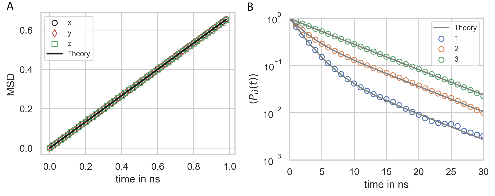

=========
Diffusion
=========

.. code-block:: python
	
	file_path='Files/'
	fig_path = 'Figures/'
	file_name= 'Diffusion_Validation'
	    
	nsteps = 30001
	stride = 300
	obs_stride = 1

	box_lengths = [150.0,150.0,150.0]
	Temp=293.15
	eta=1e-21
	dt = 0.01

	Simulation = prd.Simulation(box_lengths = box_lengths, 
	                            dt = dt, 
	                            Temp = Temp, 
	                            eta = eta, 
	                            stride = stride, 
	                            write_trajectory = True, 
	                            file_path = file_path, 
	                            file_name = file_name, 
	                            fig_path = fig_path, 
	                            boundary_condition = 'periodic', 
	                            nsteps = nsteps, 
	                            seed = 0, 
	                            length_unit = 'nanometer', 
	                            time_unit = 'ns')

.. code-block:: python
	
	Simulation.register_particle_type('Core_1', 2.5) # (Name, Radius)

	A_pos = [[0.0,0.0,0]]
	A_types = ['Core_1']

	Simulation.register_molecule_type('A', A_pos, A_types)

	D_rr = [[0.005,0,0],[0,0.04,0],[0,0,0.1]]
	D_tt = [[0.5,0,0],[0,0.4,0],[0,0,0.1]]

	Simulation.set_diffusion_tensor('A', D_tt, D_rr)

	prd.plot.plot_mobility_matrix('A', Simulation, save_fig = False)

.. code-block:: python
	
	import numpy as np
	from pyrid.system.distribute_vol_util import random_quaternion

	N = 1000

	position = np.zeros((N,3), dtype = np.float64)
	quaternion = np.zeros((N,4), dtype = np.float64)

	for i in range(N):
	    quaternion[i][:] = random_quaternion()
	    
	mol_type_idx = np.zeros(N, dtype = np.int64)

	Simulation.add_molecules('Volume',0, position, quaternion, mol_type_idx)

.. code-block:: python

	Simulation.observe('Orientation', ['A'], obs_stride = obs_stride)

	Simulation.observe('Position', ['A'], obs_stride = obs_stride)

.. code-block:: python

	Timer = Simulation.run(progress_stride = 1000, out_linebreak = False)

	Simulation.print_timer()

.. code-block:: python
	
	Evaluation = prd.Evaluation()
	Evaluation.load_file(file_name)

	#%%

	Evaluation.MSD(100, 2, Simulation, 'A')

	Evaluation.plot_MSD(Simulation, 'A', save_fig = True)

	#%%

	Evaluation.P2(3100, 100, Simulation, 'A')

	Evaluation.plot_P2(Simulation, 'A', save_fig = True, limits = [[0.0,30],[1e-3,1e0]])

    
    **Mean squared displacement and rotational relaxation.**