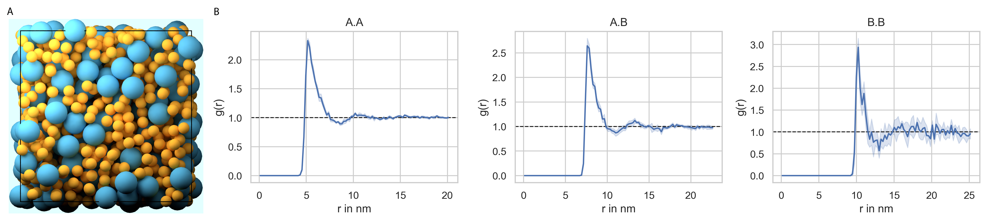

=================
Hard-Sphere Fluid
=================

.. code-block:: python
	
	import pyrid as prd

	file_path='Files//'
	fig_path = 'Figures//'
	file_name='Hard_Sphere_Fluid'
	    
	nsteps = 2e3
	stride = 20
	obs_stride = 200
	box_lengths = [75.0,75.0,75.0]
	Temp=293.15
	eta=1e-21
	dt = 0.1

	Simulation = prd.Simulation(box_lengths = box_lengths, 
	                            dt = dt, 
	                            Temp = Temp, 
	                            eta = eta, 
	                            stride = stride, 
	                            write_trajectory = True, 
	                            file_path = file_path, 
	                            file_name = file_name, 
	                            fig_path = fig_path, 
	                            boundary_condition = 'periodic', 
	                            nsteps = nsteps, 
	                            seed = 0, 
	                            length_unit = 'nanometer', 
	                            time_unit = 'ns')

.. code-block:: python
	
	Simulation.register_particle_type('Core_1', 2.5) # (Name, Radius)
	Simulation.register_particle_type('Core_2', 5.0) # (Name, Radius)

	A_pos = [[0.0,0.0,0.0]]
	A_types = ['Core_1']
	Simulation.register_molecule_type('A', A_pos, A_types)
	D_tt, D_rr = prd.diffusion_tensor(Simulation, 'A')
	Simulation.set_diffusion_tensor('A', D_tt, D_rr)

	B_pos = [[0.0,0.0,0.0]]
	B_types = ['Core_2']
	Simulation.register_molecule_type('B', B_pos, B_types)
	D_tt, D_rr = prd.diffusion_tensor(Simulation, 'B')
	Simulation.set_diffusion_tensor('B', D_tt, D_rr)

	prd.plot.plot_mobility_matrix('A', Simulation, save_fig = False, show = True)

.. code-block:: python
	
	k=100.0 #kJ/(avogadro*nm^2) 

	Simulation.add_interaction('harmonic_repulsion', 'Core_1', 'Core_1', {'k':k}, bond = False)
	Simulation.add_interaction('harmonic_repulsion', 'Core_1', 'Core_2', {'k':k}, bond = False)
	Simulation.add_interaction('harmonic_repulsion', 'Core_2', 'Core_2', {'k':k}, bond = False)

.. code-block:: python

	points, points_types, quaternion = Simulation.distribute('PDS', 'Volume', 0, ['A', 'B'], [1500,125], clustering_factor=1.0, max_trials=300)

	Simulation.add_molecules('Volume',0, points, quaternion, points_types)

	prd.plot.plot_scene(Simulation, save_fig = True)

.. code-block:: python

	Simulation.observe_rdf(rdf_pairs = [['A','A'],['A','B'],['B','B']], rdf_bins = [100,100,100], rdf_cutoff = [20.0,22.5,25.0], stride = obs_stride)

	Simulation.observe('Orientation', molecules = ['A', 'B'], obs_stride = obs_stride)

	Simulation.observe('Position', molecules = ['A', 'B'], obs_stride = obs_stride)

.. code-block:: python
	
	Simulation.run(progress_stride = 1000, out_linebreak = False)

	Simulation.print_timer()

.. code-block:: python

	Evaluation = prd.Evaluation()
	Evaluation.load_file(file_name)

	Evaluation.plot_rdf([['A','A']], steps = range(5,10), average = True, save_fig = True)

	Evaluation.plot_rdf([['A','B']], steps = range(5,10), average = True, save_fig = True)

	Evaluation.plot_rdf([['B','B']], steps = range(5,10), average = True, save_fig = True)

    
    **Radial distribution functions.**