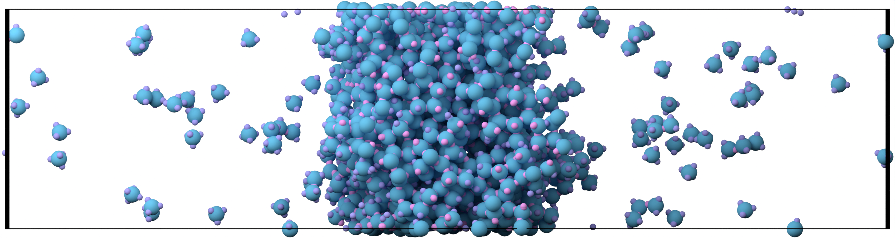

====
LLPS
====

To investigate LLPS via molecular dynamics simulations is very computationally expensive.
Simulating one point in the phase space can take several days.
To get a phase diagram, however, we need several of these points.
Therefore, you should have access to a Compute Cluster in order to do several of these independent simulations in parallel.
In the following I show as an example how such a simulation can be setup on a Linux system running `slurm <https://slurm.schedmd.com/documentation.html>`_ to distribute jobs on the cluster.

When we want to investigate interfacial properties of fluid from MD simulations we first of all need to prepare the system by simulating the fluid in the NPT ensemble until it is in equilibrium. PyRID comes with a Berendsen barostat that we can use. During this step, we choose a temperature or an interaction strength between molecules such that they will phase separate. Only after this step we will investigate the actual phase separating behavior of the fluid under different temperatures/molecular interaction strengths.

In our python script we want to include some lines such that we can pass parameters via a bash script:

.. code-block:: python
	:caption: bash parameters

	import sys

	Interaction_strengths = [0.1,0.5,0.7,0.9]

	Component =   str(sys.argv[1]) #  {'5_sites', '4_sites', '3_sites'}
	Simulation_Phase =  str(sys.argv[2]) # {'NPT', 'NVT'}
	Epsilon = Interaction_strengths[int(sys.argv[3])] # 

We will pass 3 parameters which python will read from sys.argv. The first parameter will be a string that tells python, which type of molecule component we want to simulate, in case we want to run the simulation for different types of components. In our example the components are patchy particles with 3,4 or 5 attractive patches to reproduce the results from Fig 1C in :cite:t:`Espinosa2020`.
The second parameter defines the simulation phase. As stated above, we first need to prepare the system in the NPT ensemble to find a proper volume for the simulation box and to release the system from any mechanical stress.
The third parameter is an integer index that we use to get different values of the pair interaction strength. It makes sense to use different lists of interaction strength for the the three different components since the '3_sites' system we phase separate at higher values of the interaction strength that the '4_sites' and '5_sites' component system.

Next, we create a bash script that we use to start jobs of the first phase (run_NPT.sh):

.. code-block:: bash
	:caption: NPT

	#!/bin/bash
	#SBatch -p medium
	#SBATCH -t 06:00:00
	#SBATCH -o job_output/job-%J.out
	#SBATCH -C scratch
	#SBATCH -n 1
	#SBATCH -c 1

	module purge
	module load anaconda3
	source activate pyrid-env

	python3 -u /scratch/users/mbecker3/PyRID/Espinosa/LLPS.py $1 'NPT' -1

	conda deactivate

This script is written such that we can run jobs on the compute cluster of the gwdg in Göttingen. If you are running this on a different compute cluster with slurm you may need to change the values for -p. When we run this script, first all modules that may have been loaded are purged. Then, we load anaconda and activate our python environment in which we have installed PyRID.
At last, we run our script LLPS.py and pass the three parameters: $1 is actually a parameter that we will pass to this script via yet another bash script (see below) and which is a string containing the name of our molecule component ({'5_sites', '4_sites', '3_sites'}). The second parameter is a string stating that we want to simulate in the NPT ensemble and -1 is the index we pass to python that is used to get the interaction strength. -1 means that we will take the last and thereby highest value in the list such that we are sure the system will be in the two phase regime.

With the next script, we will start the actual simulation where we use the direct coexistence method (run_NVT.sh):

.. code-block:: bash
	:caption: NVT

	#!/bin/bash
	#SBatch -p medium
	#SBATCH -t 48:00:00
	#SBATCH -o job_output/job-%J.out
	#SBATCH -C scratch
	#SBATCH -n 1
	#SBATCH -c 11
	#SBATCH -a 0-10

	module purge
	module load anaconda3
	source activate pypatch-env

	python3 -u /scratch/users/mbecker3/PyPatch/Espinosa/LLPS.py $1 'NVT' $SLURM_ARRAY_TASK_ID

	conda deactivate

This script will run much longer (48h, the maximum allowed time on the gwdg cluster). Also we do not only start one job but several jobs (11), which will all use as the initial state the result from the NPT simulation. Again, we pass parameter $1, NVT and, this is new, $SLURM_ARRAY_TASK_ID.
$SLURM_ARRAY_TASK_ID is an array of integers that we defined by -a 0-10. This means that slurm will distribute 11 jobs and $SLURM_ARRAY_TASK_ID runs from 0-11 (again,we use these integer values to choose the interaction strength in the python script).

Finally, we come to the main script, which is the only one we will actually call but that will itself call the scripts we just set up (main.sh):

.. code-block:: bash
	:caption: Main

	#!/bin/bash

	for exp in '5_sites' '4_sites' '3_sites'
	do
	        my_id=$(sbatch --parsable run_NPT.sh $exp)
	        sbatch -d afterok:$my_id run_NVT.sh $exp
	done

This bash script consists of a simple for loop iterating over the different components we want to use in our simulation. It then calls our run_NPT.sh script to run the NPT setup. Importantly, we save the job id in a variable called my_id. The run_NVT.sh script will only start once the NPT simulation has finished (afterok), because the NVT simulation depends on the result of the NPT simulation as we use the final system state of the one simulation as the initial condition for the other one.

After we have set up our bash scripts, let us write our actual PyRID python script LLPS.py:

.. code-block:: python
	:caption: Direct coexistence method

	import numpy as np
	import pyrid as prd

	# sys.stdout = open('output/'+fileName+'.out', 'w')

	#%%

	#-----------------------------------------------------
	# Set Parameters
	#-----------------------------------------------------

	exp =  '5_sites' #'3_sites'# '4_sites' # str(sys.argv[1]) #
	phase = 'Equil' # str(sys.argv[2]) # DC # 
	ia_id = -1 # int(sys.argv[3]) # 

	print('exp: ', exp)
	print('phase: ', phase)
	print('ia_id: ', ia_id)

	# File name and path
	if exp == '3_sites':  
	    interaction_strength = np.round(np.linspace(43.5,70,11)/3,1)
	    file_path='3_sites/Files/'
	    fig_path = '3_sites/Figures/'
	    if phase == 'DC':
	        file_name = '3_sites_'+phase+'_'+str(interaction_strength[ia_id])
	    elif phase == 'Equil':
	        file_name= '3_sites_'+phase
	elif exp == '4_sites': 
	    interaction_strength = np.round(np.linspace(48,80,11)/4,1)
	    file_path='4_sites/Files/'
	    fig_path = '4_sites/Figures/'
	    if phase == 'DC':
	        file_name = '4_sites_'+phase+'_'+str(interaction_strength[ia_id])
	    elif phase == 'Equil':
	        file_name = '4_sites_'+phase
	elif exp == '5_sites':
	    interaction_strength = np.round(np.linspace(52.5,80,11)/5,1)
	    file_path='5_sites/Files/'
	    fig_path = '5_sites/Figures/'
	    if phase == 'DC':
	        file_name = '5_sites_'+phase+'_'+str(interaction_strength[ia_id])
	    elif phase == 'Equil':
	        file_name = '5_sites_'+phase

	print('interaction_strength: ', interaction_strength[ia_id])

	#Simulation properties
	if phase == 'DC':
	    nsteps = 1e9 + 1 #
	    sim_time = 47.5*60*60
	    use_checkpoint = True
	elif phase == 'Equil':
	    nsteps = 1600000 
	    sim_time = None
	    use_checkpoint = False # True #

	stride = int(nsteps/100)
	obs_stride = int(nsteps/100)

	#%%

	#System physical properties

	if exp == '5_sites':
	    box_lengths = np.array([74.0,74.0,74.0])
	elif exp == '3_sites':  
	    box_lengths = np.array([83.0,83.0,83.0])
	elif exp == '4_sites': 
	    box_lengths = np.array([78.3,78.3,78.3])

	Temp=179.71
	eta=1e-21
	dt = 0.0025

	#%%

	#-----------------------------------------------------
	# Initialize System
	#-----------------------------------------------------

	Simulation = prd.Simulation(box_lengths = box_lengths, 
	                            dt = dt, 
	                            Temp = Temp, 
	                            eta = eta, 
	                            stride = stride, 
	                            write_trajectory = True, 
	                            file_path = file_path, 
	                            file_name = file_name, 
	                            fig_path = fig_path, 
	                            boundary_condition = 'periodic', 
	                            nsteps = nsteps, 
	                            seed = 0, 
	                            length_unit = 'nanometer', 
	                            time_unit = 'ns'
	                            )

	#%%

	#-----------------------------------------------------
	# Add Barostat
	#-----------------------------------------------------

	if phase == 'Equil':
	    
	    P0 = 0.0
	    Tau_P=1.0
	    start = 266667
	    
	    Simulation.add_barostat_berendsen(Tau_P, P0, start)

	#%%

	#-----------------------------------------------------
	# Add Checkpoints
	#-----------------------------------------------------

	if exp == '5_sites':
	    Simulation.add_checkpoints(1000, "5_sites/checkpoints/", 1) # stride, directory, max_saves
	elif exp == '3_sites':  
	    Simulation.add_checkpoints(1000, "3_sites/checkpoints/", 1) # stride, directory, max_saves
	elif exp == '4_sites': 
	    Simulation.add_checkpoints(1000, "4_sites/checkpoints/", 1) # stride, directory, max_saves

	#%%

	#-----------------------------------------------------
	# Define Particle Types
	#-----------------------------------------------------

	Simulation.register_particle_type('Core_1', 2.5) # (Name, Radius)
	Simulation.register_particle_type('Patch_1', 0.0)

	#%%

	#-----------------------------------------------------
	# Add Global repulsive Pair Interactions
	#-----------------------------------------------------

	lr = 50
	la = 49
	EpsR = Simulation.System.kbt/1.5

	Simulation.add_interaction('PHS', 'Core_1', 'Core_1', {'EpsR':EpsR, 'lr':lr, 'la':la})

	#%%

	#-----------------------------------------------------
	# Add Pair Binding Reaction
	#-----------------------------------------------------

	sigma = 2.5*2
	alpha =  sigma*0.01 # 0.005 #
	rw = 0.12*sigma

	if exp == '5_sites':
	    eps_csw = interaction_strength[ia_id]
	elif exp == '3_sites': 
	    eps_csw = interaction_strength[ia_id]
	elif exp == '4_sites': 
	    eps_csw = interaction_strength[ia_id]

	Simulation.add_bp_reaction('bind', ['Patch_1', 'Patch_1'], ['Patch_1', 'Patch_1'], 100/dt, 1.75*rw, 'CSW', {'rw':rw, 'eps_csw':eps_csw, 'alpha':alpha})

	#%%

	prd.plot.plot_potential(Simulation, [(prd.potentials.CSW, np.array([rw, eps_csw, alpha])), (prd.potentials.PHS, np.array([sigma, EpsR, lr, la]))], yU_limits = [-60,430], yF_limits = [-1.7e5,5e5], r_limits = [0,0.006])

	#%%

	import matplotlib.pyplot as plt

	for molecule_name in Simulation.System.molecule_types:
	    plt.plot([0,Simulation.System.molecule_types[molecule_name].r_mean_pair],[0,0])
	    print(Simulation.System.molecule_types[molecule_name].r_mean_pair)

	#%%

	#-----------------------------------------------------
	# Define Molecule Structure
	#-----------------------------------------------------

	if exp == '5_sites':
	    A_pos = prd.distribute_surf.evenly_on_sphere(5,2.5)
	    A_types = np.array(['Core_1','Patch_1','Patch_1', 'Patch_1', 'Patch_1', 'Patch_1'], dtype = np.dtype('U20'))
	    
	elif exp == '3_sites': 
	    A_pos = prd.distribute_surf.evenly_on_sphere(3,2.5)
	    A_types = np.array(['Core_1','Patch_1','Patch_1', 'Patch_1'], dtype = np.dtype('U20'))

	elif exp == '4_sites': 
	    A_pos = prd.distribute_surf.evenly_on_sphere(4,2.5)
	    A_types = np.array(['Core_1','Patch_1','Patch_1', 'Patch_1', 'Patch_1'], dtype = np.dtype('U20'))

	#%%

	#-----------------------------------------------------
	# Register Molecules
	#-----------------------------------------------------

	Simulation.register_molecule_type('A', A_pos, A_types)

	D_tt, D_rr = prd.diffusion_tensor(Simulation, 'A')
	Simulation.set_diffusion_tensor('A', D_tt, D_rr)

	prd.plot.plot_mobility_matrix('A', Simulation, save_fig = True, show = True)

	#%%          

	#-----------------------------------------------------
	# Distribute Molecules
	#-----------------------------------------------------

	    
	if use_checkpoint == False:
	    
	    pos, mol_type_idx, quaternion = Simulation.distribute('PDS', 'Volume', 0, ['A'], [2000], clustering_factor=2, max_trials=1000)
	           
	    Simulation.add_molecules('Volume',0, pos, quaternion, mol_type_idx)
	    
	    prd.plot.plot_scene(Simulation, save_fig = False) 
	    
	else:

	    if exp == '5_sites':
	        Simulation.load_checkpoint('5_sites_Equil', 0, directory = '5_sites/checkpoints/')

	    elif exp == '3_sites':  
	        Simulation.load_checkpoint('3_sites_Equil', 0, directory = '3_sites/checkpoints/')
	    elif exp == '4_sites': 
	        Simulation.load_checkpoint('4_sites_Equil', 0, directory = '4_sites/checkpoints/')

	    Simulation.System.box_lengths[0] *= 3
	    Simulation.System.Vol = Simulation.System.box_lengths.prod()
	    

	#%%

	#-----------------------------------------------------
	# Add Observables
	#-----------------------------------------------------

	Simulation.observe('Energy', obs_stride = obs_stride)

	Simulation.observe('Volume', obs_stride = obs_stride)

	Simulation.observe('Pressure', molecules = ['A'], obs_stride = obs_stride)

	#%%

	#-----------------------------------------------------
	# Start the Simulation
	#-----------------------------------------------------

	Simulation.run(progress_stride = 1000, progress_bar_properties = ['Pressure', 'Volume', 'Vol_Frac'], out_linebreak = True)

	Simulation.print_timer()

	#%%

	Evaluation = prd.Evaluation()

	Evaluation.load_file(file_name, path = file_path+'/hdf5/')

	Evaluation.plot_observable('Energy', save_fig = True)
	Evaluation.plot_observable('Pressure', save_fig = True)
	Evaluation.plot_observable('Volume', save_fig = True)

Figure :ref:`fig:Phase-diagram_Esp` shows the phase diagrams for 3,4, and 5 sites of interactions and compares the result with those from :cite:p:`Espinosa2020`. The analysis of the data is not discussed here for now, however, the interested reader is referred to :cite:p:`Espinosa2020` and :func:`pyrid.evaluation.direct_coexistence_method_util`.

    
    **Phase diagram.**

