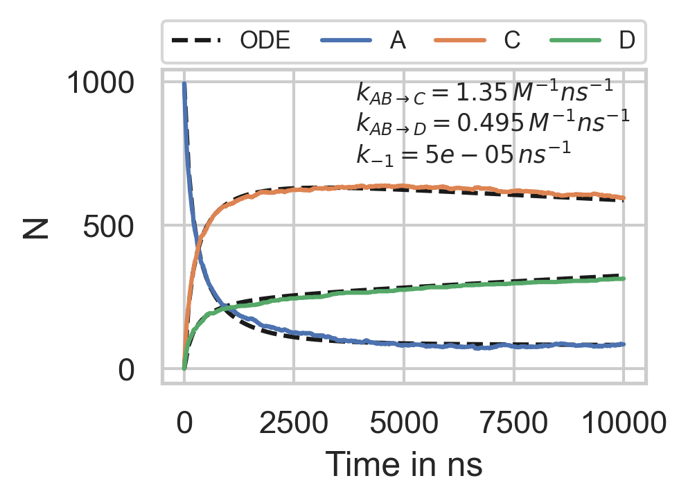

=========
Reactions
=========

.. code-block:: python

		import numpy as np
		import pyrid as prd

		file_path='Files//'
		fig_path = 'Figures//'
		file_name='Reaction_Kinetics'
		    
		nsteps = 1e5
		stride =  int(nsteps/1000)
		obs_stride = int(nsteps/1000)

		box_lengths = np.array([75.0,75.0,75.0])
		Temp=293.15
		eta=1e-21
		dt = 0.1

		Simulation = prd.Simulation(box_lengths = box_lengths, 
		                            dt = dt, 
		                            Temp = Temp, 
		                            eta = eta, 
		                            stride = stride, 
		                            write_trajectory = True, 
		                            file_path = file_path, 
		                            file_name = file_name, 
		                            fig_path = fig_path, 
		                            boundary_condition = 'periodic', 
		                            nsteps = nsteps, 
		                            seed = 0, 
		                            length_unit = 'nanometer', 
		                            time_unit = 'ns')

.. code-block:: python

		Simulation.register_particle_type('Core_1a', 2.0) # (Name, Radius)
		Simulation.register_particle_type('Core_1b', 1.5)
		Simulation.register_particle_type('Core_2a', 2.0)
		Simulation.register_particle_type('Core_2b', 3.0)
		Simulation.register_particle_type('Core_3', 3.59)

		A_pos = np.array([[0.0,0.0,0.0],[0.0,0.0,2.0+1.5]])
		A_types = np.array(['Core_1a', 'Core_1b'], dtype = np.dtype('U20'))
		Simulation.register_molecule_type('A', A_pos, A_types, 1)
		D_tt, D_rr = prd.diffusion_tensor(Simulation, 'A')
		Simulation.set_diffusion_tensor('A', D_tt, D_rr)

		B_pos = np.array([[0.0,0.0,0.0],[0.0,0.0,3.0+2.0]])
		B_types = np.array(['Core_2a', 'Core_2b'], dtype = np.dtype('U20'))
		Simulation.register_molecule_type('B', B_pos, B_types, 1)
		D_tt, D_rr = prd.diffusion_tensor(Simulation, 'B')
		Simulation.set_diffusion_tensor('B', D_tt, D_rr)

		C_pos = np.array([[0.0,0.0,0.0]])
		C_types = np.array(['Core_3'], dtype = np.dtype('U20'))
		Simulation.register_molecule_type('C', C_pos, C_types, 1)
		D_tt, D_rr = prd.diffusion_tensor(Simulation, 'C')
		Simulation.set_diffusion_tensor('C', D_tt, D_rr)

		D_pos = np.array([[0.0,0.0,0.0]])
		D_types = np.array(['Core_3'], dtype = np.dtype('U20'))
		Simulation.register_molecule_type('D', D_pos, D_types, 1)
		D_tt, D_rr = prd.diffusion_tensor(Simulation, 'D')
		Simulation.set_diffusion_tensor('D', D_tt, D_rr)

.. code-block:: python
		
		Simulation.add_um_reaction('fission', 'C', 5e-5, ['A']+['B'], [0]+[0], [1]+[1], 4.5)

		Simulation.add_bm_reaction('fusion', ['A', 'B'], ['C'], [['Core_1a', 'Core_2a']], [0.002], [4.0])
		Simulation.add_bm_reaction('fusion', ['A', 'B'], ['C'], [['Core_1a', 'Core_2b']], [0.001], [5.0])
		Simulation.add_bm_reaction('fusion', ['A', 'B'], ['C'], [['Core_1b', 'Core_2b']], [0.001], [4.5])
		Simulation.add_bm_reaction('fusion', ['A', 'B'], ['D'], [['Core_1a', 'Core_2a']], [0.002], [4.0])

		Evaluation = prd.Evaluation()

		Evaluation.plot_reactions_graph(Simulation, graph_type = 'Bimolecular')
		Evaluation.plot_reactions_graph(Simulation, graph_type = 'Unimolecular')

.. code-block:: python
		
		V = box_lengths.prod()
		VA = 4/3*np.pi*1.5**3
		VB = 4/3*np.pi*3.0**3
		n = int(V/(VA+VB)*0.3)
		print('n = ', n)

		pos, mol_type_idx, quaternion = Simulation.distribute('MC', 'Volume', 0, ['A','B'], [n, n])

		Simulation.add_molecules('Volume',0, pos, quaternion, mol_type_idx)

.. code-block:: python
		
		Simulation.observe('Number', molecules = ['A', 'B', 'C', 'D'], obs_stride = obs_stride)

		Simulation.observe('Reactions', reactions = [0,1], obs_stride = obs_stride, binned = True)

.. code-block:: python
		
		Simulation.run(progress_stride = 1000, out_linebreak = True)

		Simulation.print_timer()

**Evaluation**

.. math::
	
	k_{macro} = 4 \pi (D_A + D_B) \Big( R-\sqrt{\frac{D_A+D_B}{k_{micro}}} \tanh\Big[R \sqrt{\frac{k_{micro}}{D_A+D_B}}\Big] \Big). 

.. math::
	
	\frac{dA}{dt} = - k_{macro} A^2

.. math::
	
	A(t) = \frac{1}{A_0^{-1} + k_{macro}t}

:cite:t:`Erban2009`

.. code-block:: python
		
		from scipy.integrate import odeint

		DA = Simulation.System.molecule_types['A'].Dtrans
		DB = Simulation.System.molecule_types['B'].Dtrans
		k_macro_C = Simulation.k_macro(DA, DB, 0.002, 4.0) + Simulation.k_macro(DA, DB, 0.001, 5.0) + Simulation.k_macro(DA, DB, 0.001, 4.5)
		k_macro_D = Simulation.k_macro(DA, DB, 0.002, 4.0)

		def Reaction(y, t, k1a, k1b, k2):

		    A, B, C, D = y

		    dydt = [-k1a*A*B-k1b*A*B+k2*C, -k1a*A*B-k1b*A*B+k2*C, k1a*A*B-k2*C, k1b*A*B]

		    return dydt

		y0 = [n/box_lengths.prod(), n/box_lengths.prod(), 0, 0]
		t = np.linspace(0, nsteps*dt, 101)
		sol = odeint(Reaction, y0, t, args=(k_macro_C, k_macro_D, 5e-5))

.. code-block:: python
		
		import matplotlib.pyplot as plt
		from matplotlib.font_manager import FontProperties
		fontLgd = FontProperties()
		fontLgd.set_size('x-small')
		import seaborn as sns
		sns.set_style("whitegrid")
		col=sns.color_palette("colorblind", 10)

		Evaluation.load_file(file_name)
		Evaluation.read_observable('Number')

		fig = plt.figure(figsize=(3,2), dpi=150)

		plt.plot(t, sol[:, 0]*box_lengths.prod(), '--k', label='ODE')
		plt.plot(t, sol[:, 2]*box_lengths.prod(), '--k')
		plt.plot(t, sol[:, 3]*box_lengths.prod(), '--k')

		for molecule in ['A', 'C', 'D']:
		    plt.plot(Evaluation.Observables['stepwise']['Number']['time'], Evaluation.Observables['stepwise']['Number'][molecule], label = molecule)
		            
		plt.xlabel('Time in {}'.format(Simulation.System.time_unit))
		plt.ylabel('N')

		plt.text(0.40,0.9,'$k_{{AB \\rightarrow C}} = {0:.3g} \, M^{{-1}} ns^{{-1}}$'.format(k_macro_C), transform=fig.axes[0].transAxes, font=fontLgd)
		plt.text(0.40,0.8,'$k_{{AB \\rightarrow D}} = {0:.3g} \, M^{{-1}} ns^{{-1}}$'.format(k_macro_D), transform=fig.axes[0].transAxes, font=fontLgd)
		plt.text(0.40,0.70,'$k_{{-1}} = {0:.3g} \, ns^{{-1}}$'.format(5e-5), transform=fig.axes[0].transAxes, font=fontLgd)

		lgd = plt.legend(bbox_to_anchor=(0,1.02,1,0.2), loc="lower left", mode="expand", borderaxespad=0, ncol=4, prop=fontLgd)

		plt.savefig('Figures//ReactionKinetics.png', dpi = 300, bbox_inches="tight")

		plt.savefig('Figures//ReactionKinetics.svg', dpi = 300, bbox_inches="tight")

    
    **Reaction kinetics.**

.. raw:: html
	
	<iframe width="560" height="315" src="https://www.youtube.com/embed/8WmnQdF9Xr4" title="YouTube video player" frameborder="0" allow="accelerometer; autoplay; clipboard-write; encrypted-media; gyroscope; picture-in-picture; web-share" allowfullscreen></iframe>