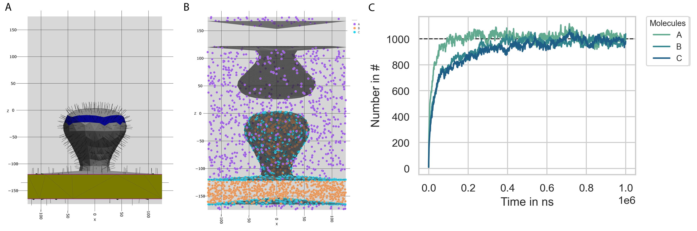

============================
Fixed concentration boundary
============================

.. code-block:: python

	import pyrid as prd

.. code-block:: python
	
	file_path='Files//'
	fig_path = 'Figures//'
	file_name='Fixed_Concentration'  

	nsteps = 1e5
	stride = int(nsteps/1000)
	obs_stride = int(nsteps/1000)
	box_lengths = [250.0,250.0,350.0]
	Temp=293.15
	eta=1e-21
	dt = 10.0

	Simulation = prd.Simulation(box_lengths = box_lengths, 
	                            dt = dt, 
	                            Temp = Temp, 
	                            eta = eta, 
	                            stride = stride, 
	                            write_trajectory = True, 
	                            file_path = file_path, 
	                            file_name = file_name, 
	                            fig_path = fig_path, 
	                            boundary_condition = 'fixed concentration', 
	                            nsteps = nsteps, 
	                            seed = 0, 
	                            length_unit = 'nanometer', 
	                            time_unit = 'ns')

.. code-block:: python
	
	Simulation.register_particle_type('Core_0', 2.5)
	Simulation.register_particle_type('Core_1', 2.5)
	Simulation.register_particle_type('Core_2', 2.5)

.. code-block:: python
	
	vertices, triangles, Compartments = prd.load_compartments('Compartments//Synapse.obj')

	Simulation.set_compartments(Compartments, triangles, vertices, mesh_scale = 1e3/2)

	prd.plot.plot_compartments(Simulation, save_fig = False, show = True)

.. code-block:: python
	
	A_pos = np.array([[0.0,0.0,0.0]])
	A_types = np.array(['Core_0'], dtype = np.dtype('U20'))

	B_pos = np.array([[0.0,0.0,0.0]])
	B_types = np.array(['Core_1'], dtype = np.dtype('U20'))

	C_pos = np.array([[0.0,0.0,0.0]])
	C_types = np.array(['Core_2'], dtype = np.dtype('U20'))

	Simulation.register_molecule_type('A', A_pos, A_types, collision_type = 1)
	D_tt, D_rr = prd.diffusion_tensor(Simulation, 'A')
	Simulation.set_diffusion_tensor('A', D_tt, D_rr)

	Simulation.register_molecule_type('B', B_pos, B_types, collision_type = 1)
	D_tt, D_rr = prd.diffusion_tensor(Simulation, 'B')
	Simulation.set_diffusion_tensor('B', D_tt, D_rr)

	Simulation.register_molecule_type('C', C_pos, C_types, collision_type = 1)
	D_tt, D_rr = prd.diffusion_tensor(Simulation, 'C')
	Simulation.set_diffusion_tensor('C', D_tt, D_rr)
	
	
.. code-block:: python
	
	concentration = 100/Simulation.System.volume
	Simulation.fixed_concentration_at_boundary('A', concentration, 'Box', 'Volume')

	concentration = 100/Simulation.System.Compartments[1].volume
	Simulation.fixed_concentration_at_boundary('B', concentration, 'Postsynapse', 'Volume')

	concentration = 100/Simulation.System.Compartments[1].area
	Simulation.fixed_concentration_at_boundary('C', concentration, 'Postsynapse', 'Surface')

.. code-block:: python
	
	Simulation.observe('Number',  molecules = ['A', 'B', 'C'], obs_stride = obs_stride)

.. code-block:: python

	Simulation.run(progress_stride = 1000, out_linebreak = False)

	Simulation.print_timer()

.. code-block:: python

	Evaluation = prd.Evaluation()

	Evaluation.load_file(file_name)

	import matplotlib.pyplot as plt

	Evaluation.plot_observable('Number', molecules = ['A', 'B', 'C'], save_fig = True)

	plt.axhline(1000, color = 'k', linestyle = '--', linewidth = 1, zorder = 0)

	plt.savefig('Figures//Fixed_Concentration_Number.png', bbox_inches="tight", dpi = 300)

    
    **The molecule concentration inside the simulation box approaches the outside molecule concentration (C).**