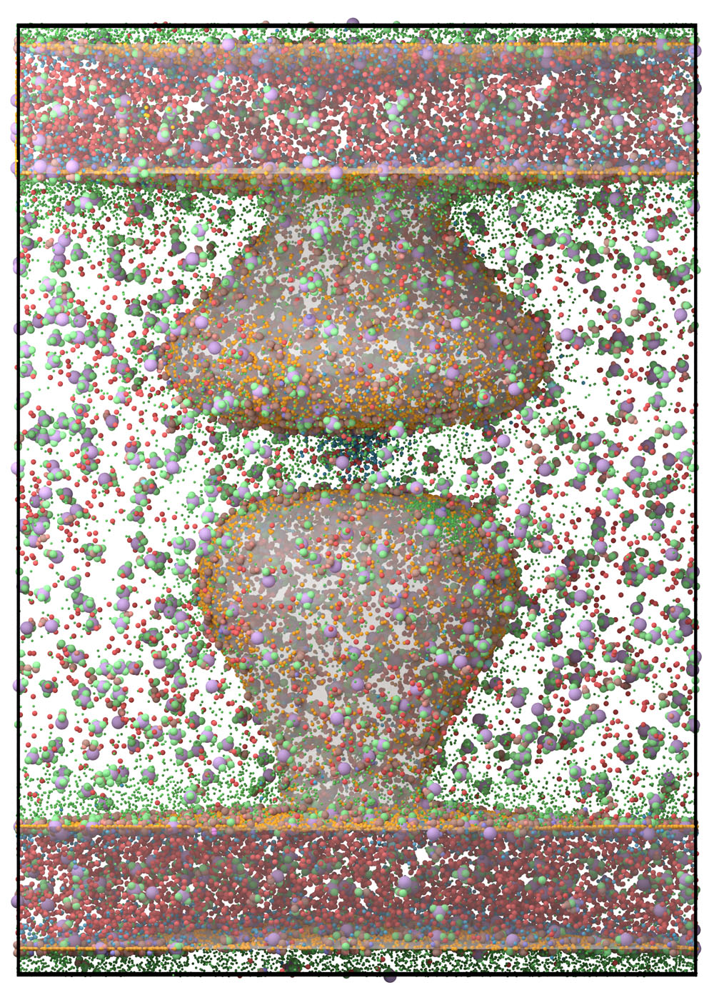

=====================
Large scale toy-model
=====================

.. code-block:: python
	
	import pyrid as prd

	file_path='Files//'
	fig_path = 'Figures//'
	file_name='Large_Toy_Model'
	    
	nsteps = 1e4
	stride = int(nsteps/100)
	obs_stride = int(nsteps/100)
	use_checkpoint = False #  True #
	checkp = False

	box_lengths = [250.0,250.0,350.0]
	Temp=293.15
	eta=1e-21
	dt = 0.1

	Simulation = prd.Simulation(box_lengths = box_lengths, 
                            dt = dt, 
                            Temp = Temp, 
                            eta = eta, 
                            stride = stride, 
                            write_trajectory = True, 
                            file_path = file_path, 
                            file_name = file_name, 
                            fig_path = fig_path, 
                            boundary_condition = 'periodic', 
                            nsteps = nsteps, 
                            seed = 1000, 
                            wall_force = 100.0, 
                            length_unit = 'nanometer', 
                            time_unit = 'ns')

    Simulation.add_checkpos(int(nsteps/10), "checkpos/", 1) # stride, directory, max_saves

.. code-block:: python
	
	Simulation.register_particle_type('Core_1', 1.5) # (Name, Radius)
	Simulation.register_particle_type('Core_1a', 1.5)
	Simulation.register_particle_type('Patch_1', 0.0)
	Simulation.register_particle_type('Patch_2', 0.0)
	Simulation.register_particle_type('Core_2', 2.5)
	Simulation.register_particle_type('Core_2a', 2.5)
	Simulation.register_particle_type('Core_3', 1.0)
	Simulation.register_particle_type('Core_4', 0.5)
	Simulation.register_particle_type('Core_5', 0.75)
	Simulation.register_particle_type('Core_6', 0.75)
	Simulation.register_particle_type('Patch_3', 0.0)

	A_pos = [[0.0,0.0,1.5], [0.0,0.0,-1.5], [-1.5,0.0,1.5], [1.5,0.0,-1.5]]
	A_types = ['Core_1','Core_1','Patch_1','Patch_2']

	B_pos = prd.distribute_surf.evenly_on_sphere(4,2.5)
	B_types = ['Core_2','Patch_1','Patch_1', 'Patch_1', 'Patch_1']

	B2_pos = [[0.0,0.0,1.5], [0.0,0.0,-2.5], [-1.5,0.0,1.5], [1.5,0.0,1.5], [2.5,0.0,-2.5]]
	B2_types = ['Core_1a','Core_2a','Patch_1','Patch_1','Patch_2']

	C_pos = [[0.0,0.0,0.0]]
	C_types = ['Core_3']

	D_pos = [[0.0,0.0,0.0]]
	D_types = ['Core_4']

	E_pos =[[0.0,0.0,0.0]]
	E_types =['Core_5']

	F_pos =[[0.0,0.0,0.0]]
	F_types = ['Core_6']

	Simulation.register_molecule_type('A', A_pos, A_types)
	Simulation.register_molecule_type('B', B_pos, B_types)
	Simulation.register_molecule_type('B2', B2_pos, B2_types)
	Simulation.register_molecule_type('C', C_pos, C_types, 1)
	Simulation.register_molecule_type('D', D_pos, D_types, 1)
	Simulation.register_molecule_type('E', E_pos, E_types, 1)
	Simulation.register_molecule_type('F', F_pos, F_types, 1)

	D_tt, D_rr, D_tr, D_rt, rOD_A, rCoM_A = prd.diffusion_tensor(Simulation, 'A', return_CoD = True, return_coupling = True, return_CoM = True)
	Simulation.set_diffusion_tensor('A', D_tt, D_rr)

	D_tt, D_rr, D_tr, D_rt, rOD_B, rCoM_B = prd.diffusion_tensor(Simulation, 'B', True, True, True)
	Simulation.set_diffusion_tensor('B', D_tt, D_rr)

	D_tt, D_rr, D_tr, D_rt, rOD_B2, rCoM_B2 = prd.diffusion_tensor(Simulation, 'B2', True, True, True)
	Simulation.set_diffusion_tensor('B2', D_tt, D_rr)

	D_tt, D_rr, D_tr, D_rt, rOD_C, rCoM_C = prd.diffusion_tensor(Simulation, 'C', True, True, True)
	Simulation.set_diffusion_tensor('C', D_tt, D_rr)

	D_tt, D_rr, D_tr, D_rt, rOD_D, rCoM_D = prd.diffusion_tensor(Simulation, 'D', True, True, True)
	Simulation.set_diffusion_tensor('D', D_tt, D_rr)

	D_tt, D_rr, D_tr, D_rt, rOD_E, rCoM_E = prd.diffusion_tensor(Simulation, 'E', True, True, True)
	Simulation.set_diffusion_tensor('E', D_tt, D_rr)

	D_tt, D_rr, D_tr, D_rt, rOD_F, rCoM_F = prd.diffusion_tensor(Simulation, 'F', True, True, True)
	Simulation.set_diffusion_tensor('F', D_tt, D_rr)

	prd.plot.plot_mobility_matrix('A', Simulation, save_fig = True, show = True)
	prd.plot.plot_mobility_matrix('B', Simulation, save_fig = True, show = True)
	prd.plot.plot_mobility_matrix('B2', Simulation, save_fig = True, show = True)
	prd.plot.plot_mobility_matrix('C', Simulation, save_fig = True, show = True)

.. code-block:: python
	
	#-----------------------------------------------------
	# Add Global Pair Interactions
	#-----------------------------------------------------

	k=100.0 #kJ/(avogadro*nm^2) 

	Simulation.add_interaction('harmonic_repulsion', 'Core_1', 'Core_1', {'k':k}, bond = False)
	Simulation.add_interaction('harmonic_repulsion', 'Core_1', 'Core_2', {'k':k}, bond = False)
	Simulation.add_interaction('harmonic_repulsion', 'Core_2', 'Core_2', {'k':k}, bond = False)

	#-----------------------------------------------------
	# Add Pair Binding Reaction
	#-----------------------------------------------------

	k=100.0
	h=50.0
	d=0.0
	rc = 2.0

	Simulation.add_bp_reaction('bind', ['Patch_1', 'Patch_3'], ['Patch_1', 'Patch_3'], 10.0, 2.0, 'harmonic_attraction', {'k':k, 'h':h , 'rc':rc})
	Simulation.add_bp_reaction('bind', ['Patch_1', 'Patch_2'], ['Patch_1', 'Patch_2'], 10.0, 2.0, 'harmonic_attraction', {'k':k, 'h':h , 'rc':rc})
	Simulation.add_bp_reaction('bind', ['Patch_1', 'Patch_1'], ['Patch_1', 'Patch_1'], 10.0, 2.0, 'harmonic_attraction', {'k':k, 'h':h , 'rc':rc})
	Simulation.add_bp_reaction('bind', ['Patch_2', 'Patch_3'], ['Patch_2', 'Patch_3'], 10.0, 2.0, 'harmonic_attraction', {'k':k, 'h':h , 'rc':rc})
	Simulation.add_bp_reaction('bind', ['Patch_2', 'Patch_2'], ['Patch_2', 'Patch_2'], 10.0, 2.0, 'harmonic_attraction', {'k':k, 'h':h , 'rc':rc})
	Simulation.add_bp_reaction('bind', ['Patch_3', 'Patch_3'], ['Patch_3', 'Patch_3'], 10.0, 2.0, 'harmonic_attraction', {'k':k, 'h':h , 'rc':rc})

	prd.plot.plot_potential(Simulation, [(prd.potentials.harmonic_repulsion, [3.0,k]), (prd.potentials.piecewise_harmonic, [2.0,k,h,d])], yU_limits = [-60,300], yF_limits = [-60 ,300 ], r_limits = [0,4], save_fig = True)

	#%%

	#-----------------------------------------------------
	# Add Particle Conversion Reaction
	#-----------------------------------------------------

	Simulation.add_up_reaction('conversion', 'Patch_1', 0.01, ['Patch_2'])

	#-----------------------------------------------------
	# Add Particle Enzymatic Reaction
	#-----------------------------------------------------

	Simulation.add_bp_reaction('enzymatic', ['Patch_2', 'Core_6'], ['Patch_3', 'Core_6'], 1.0, 3.0)

	#-----------------------------------------------------
	# Add Molecule Production Reaction
	#-----------------------------------------------------

	Simulation.add_um_reaction('production', 'A', 0.01, ['B2']+['D']*5+['C']*5+['E']*10+['B']*2, [1]+[0]*5+[0]*5+[1]*10+[1]*2, [1]+[1]*5+[-1]*5+[1]*10+[1]*2, 10.0)

	#-----------------------------------------------------
	# Add Molecule Fusion Reaction
	#-----------------------------------------------------

	Simulation.add_bm_reaction('fusion', ['B', 'B'], ['A'], [['Core_2', 'Core_2']], [0.1], [5.0])
	Simulation.add_bm_reaction('fusion', ['B', 'B'], ['C'], [['Core_2', 'Core_2']], [0.1], [5.0])
	Simulation.add_bm_reaction('fusion', ['B', 'B'], ['C'], [['Core_2', 'Core_2']], [0.05], [5.0])
	Simulation.add_bm_reaction('fusion', ['A', 'B'], ['B2'], [['Core_1', 'Core_2']], [0.01], [5.0])
	Simulation.add_bm_reaction('fusion', ['A', 'B2'], ['C'], [['Core_1', 'Core_2a']], [0.01], [5.0])
	Simulation.add_bm_reaction('fusion', ['A', 'B2'], ['C'], [['Core_1', 'Core_1a']], [0.05], [5.0])

	#-----------------------------------------------------
	# Add Molecule Enzymatic Reaction
	#-----------------------------------------------------

	Simulation.add_bm_reaction('enzymatic_mol', ['C', 'E'], ['F', 'E'], [['Core_3', 'Core_5']], [0.1], [3.0])

	#%%

	Evaluation = prd.Evaluation()

	Evaluation.plot_reactions_graph(Simulation, graph_type = 'Bimolecular')
	Evaluation.plot_reactions_graph(Simulation, graph_type = 'Interactions')
	Evaluation.plot_reactions_graph(Simulation, graph_type = 'Unimolecular')

.. code-block:: python
	
	vertices, triangles, Compartments = prd.load_compartments('Compartments//Synapse.obj')

	Simulation.set_compartments(Compartments, triangles, vertices, mesh_scale = 1e3/2)

	prd.plot.plot_compartments(Simulation, save_fig = True, show = False)

.. code-block:: python
	
	#-----------------------------------------------------
	# Add a release event
	#-----------------------------------------------------

	Simulation.add_release_site('Volume', 1000, 0, Number = [300,50], Types = ['C', 'D'], origin = [0.0, 0.0, 24.5], jitter = 1.0)

	Simulation.add_release_site('Surface', 2000, 1, Number = [500], Types = ['D'], triangle_id = Simulation.System.Compartments[1].triangle_ids[50], jitter = 5.0)

.. code-block:: python
	
	if checkp == False:
    
	    pos, mol_type_idx, quaternion = Simulation.distribute('PDS uniform', 'Volume', 0, ['B'], [2000], multiplier = 50)
	    
	    Simulation.add_molecules('Volume',0, pos, quaternion, mol_type_idx)
	    
	    # prd.plot.plot_sphere_packing(0, Simulation, pos, mol_type_idx)
	    
	    
	    # Postysnapse:
	    
	    pos, mol_type_idx, quaternion = Simulation.distribute('PDS uniform', 'Volume', 1, ['B'], [500], multiplier = 50)
	    
	    Simulation.add_molecules('Volume',1, pos, quaternion, mol_type_idx)
	    
	    # prd.plot.plot_sphere_packing(1, Simulation, pos, mol_type_idx)
	    
	    
	    pos, mol_type_idx, quaternion, face_ids  = Simulation.distribute('MC', 'Surface', 1, ['A', 'B'], [200,200])
	    
	    Simulation.add_molecules('Surface',1, pos, quaternion, mol_type_idx, face_ids)
	    
	    # prd.plot.plot_sphere_packing(1, Simulation, pos, mol_type_idx)
	    
	    
	    # Presynapse:
	    
	    pos, mol_type_idx, quaternion = Simulation.distribute('PDS uniform', 'Volume', 2, ['B'], [500], multiplier = 50)
	    
	    Simulation.add_molecules('Volume',2, pos, quaternion, mol_type_idx)
	    
	    # prd.plot.plot_sphere_packing(1, Simulation, pos, mol_type_idx)
	    
	    
	    pos, mol_type_idx, quaternion, face_ids  = Simulation.distribute('PDS', 'Surface', 2, ['A', 'B'], [200,200])
	    
	    Simulation.add_molecules('Surface',2, pos, quaternion, mol_type_idx, face_ids)

	else:
	    
	    Simulation.load_checkpoint('Large_Toy_Model', 0)

	prd.plot.plot_scene(Simulation, save_fig = True, show = False)

.. code-block:: python
	
	Simulation.observe_rdf(rdf_pairs = [['A','A'],['A','B'],['A','C']], rdf_bins = [100,100,100], rdf_cutoff = [20.0,20.0,20.0], stride = obs_stride)

	Simulation.observe('Force', molecules = ['A', 'B', 'C'], obs_stride = obs_stride, binned = True)

	Simulation.observe('Torque', molecules = ['A', 'B', 'C'], obs_stride = obs_stride)

	Simulation.observe('Energy', obs_stride = obs_stride, binned = False)

	Simulation.observe('Volume', obs_stride = obs_stride, binned = False)

	Simulation.observe('Pressure', molecules = ['A'], obs_stride = obs_stride, binned = False)

	Simulation.observe('Virial', molecules = ['A'], obs_stride = obs_stride, binned = False)

	Simulation.observe('Virial Tensor', molecules = ['A'], obs_stride = obs_stride, binned = False)

	Simulation.observe('Number', molecules = ['A', 'B', 'C', 'B2', 'D', 'E', 'F'], obs_stride = obs_stride, binned = False)

	Simulation.observe('Reactions', obs_stride = obs_stride, binned = True)

	Simulation.observe('Bonds', obs_stride = obs_stride)

	Simulation.observe('Orientation', molecules = ['A'], obs_stride = obs_stride)

	Simulation.observe('Position', molecules = ['A'], obs_stride = obs_stride)

.. code-block:: python
	
	Simulation.run(progress_stride = 1000, out_linebreak = False)

	Simulation.print_timer()

.. code-block:: python
	
	prd.plot.plot_concentration_profile(Simulation, axis = 0, save_fig = True)

	#%%

	Evaluation.load_file(file_name)

	Evaluation.read_observable('Number')
	Evaluation.read_observable('Bonds')
	Evaluation.read_observable('Reactions', Reaction_Type = 'bind')
	Evaluation.read_observable('Reactions', Reaction_Type = 'fusion')

	#%%

	Evaluation.plot_observable('Reactions', Reaction_Type = 'bind', educt = 'Patch_1+Patch_3', save_fig = True)

	Evaluation.plot_observable('Reactions', Reaction_Type = 'enzymatic', educt = 'Patch_2+Core_6', save_fig = True)

	Evaluation.plot_observable('Reactions', Reaction_Type = 'fusion', educt = 'A+B2', particle_educt = 'Core_1+Core_2a', save_fig = True)

	Evaluation.plot_observable('Bonds', bond_pairs = 'All', save_fig = True)
	Evaluation.plot_observable('Number', molecules = ['A', 'B', 'C'], save_fig = True)
	Evaluation.plot_observable('Energy', save_fig = True)
	Evaluation.plot_observable('Pressure', save_fig = True)
	Evaluation.plot_observable('Virial', save_fig = True)

	#%%

	Evaluation.plot_observable('Force', molecules = ['B'], step = 10, save_fig = True)

	Evaluation.plot_observable('Torque', molecules = ['B'], step = 10, save_fig = True)

    
    **Render.**