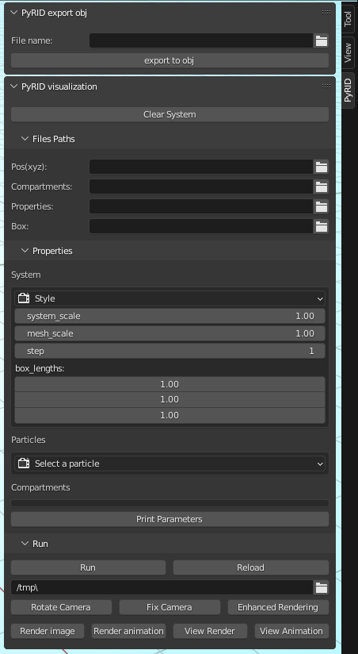

.. _userguide_blender_addon:

==============
Blender Add-on
==============

PyRID writes the molecule trajectories to a .xyz file. To visualize the molecule dynamics of a simulation you could use, e.g., VMD. However, VMD is not able to visualize the mesh compartments. Also, to get nice looking renders or even animations difficult. 
Therefore, I have written an add-on for Blender. In addition to the .xyz file containing the molecule trajectories, the Blender addon also needs a .prop file that PyRID writes to the same directory as the .xyz file. The .prop file simply contains information about the moelcule properties such as particle radii. In addition, you can load an .obj file of the mesh compartments and a .box file that contains the size of the simulation box, in case you would like to visualize the fluctuations of the box size when having added a Berendsen barostat.
The add-on in addition helps you to create nice looking renders and animations by the click of a button.

    
    **Blender add-on GUI.**

Linux users
-----------

Any progress output, e.g. when loading files or when rendering will be output to the console. Therefore, 
Linux users should always start blender from the console! For Windows users, the Blender console (not available for Linux) will open automatically when running the PyRID addon.