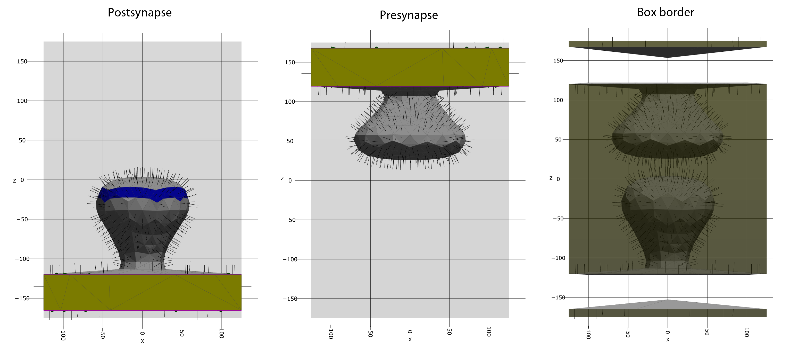

.. _userguide_compartments:

============
Compartments
============

In order for cells to be able to organize or even be able to execute the uncountable number of different processes it needs to be able to compartmentalize these processes. By far the most common method of compartmentalization is the phospholipid bilayer from which cell membranes are formed. Cell membrane serves various functions:

#. It forms a diffusive barrier for ions and molecules, such as proteins,
#. Proteins can be embedded in the membrane where they freely diffuse or become anchored to other proteins
#. The membrane can interact with other molecules via surface charges
#. By the interaction with protein filaments such as actin and microtubules membranes can take various diverse forms.
#. Membrane compartments (organelles) can fuse with other membrane compartments (vesicles) via exocytosis. Exocytosis is used to transport cargo such as neurotransmitters from one side of a membrane to the other.
#. Parts of the membrane and its transmembrane proteins can be seperated by endocytosis.

This list could be continued. However, it already shows that membranes are an essential part of cells. Therefore, in PyRID membrane compartments can be represented by triangulated meshes. Meshes are a highly coarse grained representation of the complex structure that is the plasma membrane. Therefore, it is not possible to account for all the membrane properties. However, two essential features can be accounted for:

#. The diffusion of molecules in the membrane surface,
#. the diffusive barrier.

Processes such as exocytosis can be accounted for by 'release events' (see :ref:`userguide_distribution`).

Meshes
------

PyRID only supports triangulated meshes in the .obj format but does not support all features of the .obj format. Therefore, I recommend to use the PyRID add-on for Blender that can be used to export meshes to .obj files that PyRID can handle. Your mesh can be a 3D scan or modeled by hand. However, the mesh should be a manifold-mesh, i.e., it should not contain any holes.
The .obj file may contain several meshes. Each will be handled as a separate compartment by PyRID.
In addition, you can define face groups, which are groups of mesh triangles. These can be used, e.g., to distributed molecules in specific regions of the mesh surface.

Once you have a correctly formatted mesh, you can import it into PyRID by

.. code-block:: python

   vertices, triangles, Compartments = prd.load_compartments('Compartments/my_mesh.obj')

Here, vertices is an array, containing all the vertices of all the meshes in my_mesh.obj and triangles contains the indices of all the vertices that make up the individual mesh faces. Compartments is a dictionary containing for each compartment the list of triangle indices and the triangle indices for the face groups, if defined.
The mesh has only been read but not yet added to the simulation. This can be done by

.. code-block:: python
   
   mesh_scale = 1.0
   Simulation.set_compartments(Compartments, triangles, vertices, mesh_scale)

Here, mesh_scale is a parameter, by which we can scale the mesh, if needed. By default, mesh_scale = 1.
PyRID allows us to visualize the individual compartments using the 3D capabilities of the plotly library (:numref:`fig:Meshes`):

.. code-block:: python

   prd.plot.plot_compartments(Simulation, save_fig = True)

    
    **Mesh compartments.** The intersection of the mesh with the simulation box is highlighted in yellow. These triangles will be rendered transparent is we us periodic or fixed concentration boundary conditions. The blue faces highlight face groups with no specific purpose. Face groups can, e.g., be used for molecule distribution. On the right, the simulation box border is visualized.

Molecule collision types
------------------------

PyRID somehow needs to resolve the collision of molecules with the mesh. If the expected displacement of a molecule per time step is small compared to the particles radii, collisions can be resolved by a repulsive interaction potential. This approach is relatively accurate. However, PyRID uses a fairly simple approach in order to calculate the repulsive forces between molecules an meshes and more accurate solutions exists. More complex methods are mainly developed and used for discrete element method simulations.
For fast moving molecules or atoms, however, the force approach does not work. Instead, PyRID uses a ray tracing approach similar to what is used in, e.g., `MCell <https://mcell.org/>`_. Thereby, the displacement vector is traced through the simualtion volume and any collisions are resolved via reflection. However, PyRID does not automatically decide whether to use the force, or the ray tracing approach. Instead, we can set the collision type when adding a new molecule type:

.. code-block:: python

   Simulation.register_molecule_type('C', C_pos, C_types, collision_type = 1)

By default, collision_type = 0 (force approach).