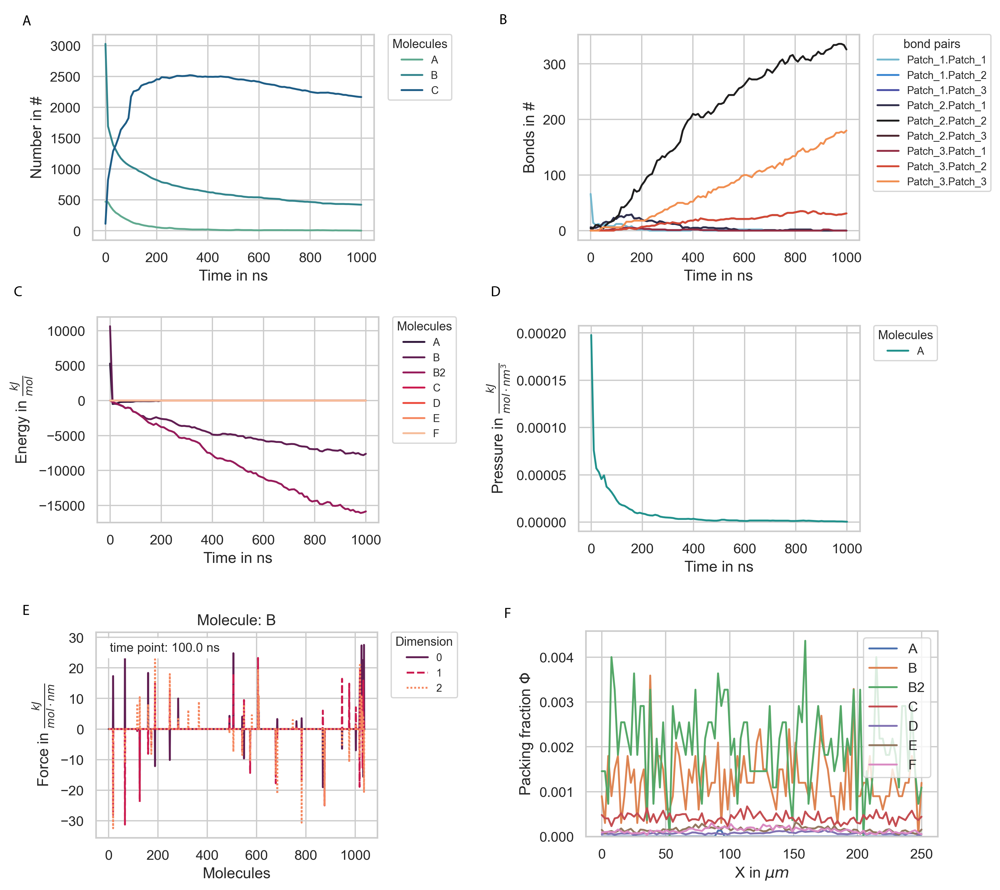

==========
Evaluation
==========

There are many ways in which one could want to analyze the data gathered during a simulation.
Via the Evaluation class, PyRID offers a straight forward way to read the data from the hdf5 files and even to do some analysis on these or do basic plots (Fig. :ref:`fig:evaluation`). 
We can create an instance of the Evaluation class by

.. code-block:: python
	
	Evaluation = prd.Evaluation()

and then load an hdf5 file:

.. code-block:: python

	Evaluation.load_file('my_hdf5_file', path = 'my_path/')

Reading and plotting data
-------------------------

Now, we can do several things, such as reading certain observables from the file, e.g., molecule numbers:

.. code-block:: python
	
	Evaluation.read_observable('Number', sampling = 'stepwise', molecules = 'All')

Here, we told PyRID to read the numbers of all molecules that have been sampled and to read the stepwise sampled data. If you want to read the binned samples of a property, set sampling = 'binned'.
Now that we have read the data, we can access it to, e.g., plot the data:

.. code-block:: python

	import matplotlib.pyplot as plt

	fig = plt.figure(figsize=(3,2), dpi=150)

	for molecule in ['A', 'C', 'D']:
	    
	    plt.plot(Evaluation.Observables['stepwise']['Number']['time'], Evaluation.Observables['stepwise']['Number'][molecule], label = molecule)

Reading other observables works analog to the above example. If we want to read reactions, we also have to pass the type of reaction we want to read:

.. code-block:: python
	
	Evaluation.read_observable('Reactions', Reaction_Type = 'bind')

	Evaluation.read_observable('Reactions', Reaction_Type = 'fusion')

In addition to reading the data and creating our own plots as shown above, we can also ask PyRID to do some basic plots. For example, to plot the number of fusion reactions that occurred for a specific educt pair:

.. code-block:: python
	
	Evaluation.plot_observable('Reactions', Reaction_Type = 'fusion', educt = 'A+B', particle_educt = 'core_1+core_2')

Since a fusion reaction can be executed via different particle pairs we also have to pass the particle educts involved. A feature by which all fusion reactions defined on an educt pair are summed up is still missing.
We can also plot any of the other measures, such as the number of bonds between particle pairs:

.. code-block:: python

	Evaluation.plot_observable('Bonds', bond_pairs = 'All', save_fig = True)

You do not actually need to read the data before plotting, PyRID will do that for you. However, you need to have loaded the hdf5 file of course:

.. code-block:: python
	
	Evaluation.plot_observable('Number', molecules = ['A', 'B', 'C'])
	Evaluation.plot_observable('Energy')
	Evaluation.plot_observable('Pressure')
	Evaluation.plot_observable('Virial')

If you want to plot the force, torque, position, or orientation, you also need to pass the sampling step (time point) from which to read the data:

.. code-block:: python

	Evaluation.plot_observable('Force', molecules = ['B'], step = 0)
	Evaluation.plot_observable('Torque', molecules = ['B'], step = 0)

As already mentioned in :ref:`userguide_reactions`, you visualize the reactions defined in a graphs:

.. code-block:: python

	Evaluation.plot_reactions_graph(Simulation, graph_type = 'Bimolecular')
	Evaluation.plot_reactions_graph(Simulation, graph_type = 'Interactions')
	Evaluation.plot_reactions_graph(Simulation, graph_type = 'Unimolecular')

Analyzing data
--------------

Currently, PyRID does not support many methods for analyzing the data.

**Concentration profile**

You can, e.g., plot a concentration profile:

.. code-block:: python

	prd.plot.plot_concentration_profile(Simulation, axis = 0, save_fig = True)

**MSD**

You can calculate and plot the mean squared displacement of a molecule type population:

.. code-block:: python

	Evaluation.MSD(100, 2, Simulation, 'A')

	Evaluation.plot_MSD(Simulation, 'A', save_fig = True)

**rotational time correlation function**

or the rotational time correlation function

.. code-block:: python
	
	Evaluation.P2(3100, 100, Simulation, 'A')

	Evaluation.plot_P2(Simulation, 'A', save_fig = True, limits = [[0.0,30],[1e-3,1e0]])

**Radial distribution function**

You can sample and plot the radial distribution function for a molecule pair:

.. code-block:: python

	Evaluation.plot_rdf([['A','A']], steps = range(5,10), average = True, save_fig = True)

    
    **Plots of various observables.**