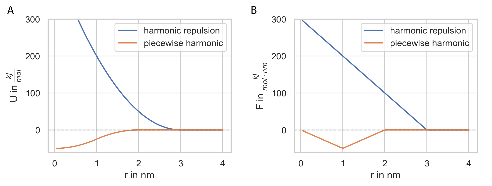

.. _userguide_potentials:

======================
Interaction potentials
======================

PyRID supports any short ranged pair interaction potential. However, PyRID is not optimized for long ranged interactions and these will result in significant performance loss. Very useful for Brownian dynamics simulations are the harmonic repulsion and the attractive weak piecewise harmonic interactions that are used by the simulation tool `ReaDDy <https://readdy.github.io/>`_ as these allow for relatively large integration time steps.

**Weak piecewise harmonic**

.. math::

   U_{wph}(r)
   = 
    \begin{cases}
        \frac{1}{2}k(r-(d_1+d_2))^2-h,& \text{if } r<(d_1+d_2), \\
        \frac{h}{2}(\frac{r_c-(d_1+d_2)}{2})^{-2}(r-(d_1+d_2))^2-h,& \text{if } d \le r < d + \frac{r_c-(d_1+d_2)}{2}, \\
        -\frac{h}{2}(\frac{r_c-(d_1+d_2)}{2})^{-2}(r-r_c)^2,& \text{if } d + \frac{r_c-(d_1+d_2)}{2} \le r < r_c, \\
        0,              & \text{otherwise}
    \end{cases}

**Harmonic repulsion**

.. math::

   U_{hr}(r)
   = 
    \begin{cases}
        \frac{1}{2}k(r-(d_1+d_2))^2 ,& \text{if } r<(d_1+d_2), \\
        0,              & \text{otherwise}
    \end{cases}

Here, :math:`k` is the force constant, :math:`r` the inter-particle distance and :math:`d_1`´, :math:`d_2` the radii of the two interacting particles. PyRID also comes with some plotting abilities based on the matplotlib, seaborn, and plotly (for 3D) libraries.
You can, .e.g., plot the interaction potential energy and force (Fig. :numref:`fig:interaction_potentials`) by calling

.. code-block:: python
   
   k = 100.0
   h=50.0
   d=0.0
   rc = 2.0

   prd.plot.plot_potential(Simulation, [(prd.potentials.harmonic_repulsion, [3.0,k]), 
                                       (prd.potentials.piecewise_harmonic, [2.0,k,h,d])], 
                                       yU_limits = [-60,300], yF_limits = [-60 ,300 ], r_limits = [0,4], 
                                       save_fig = True)

    
    **Interaction energy and force for the harmonic repulsive and the weak piecewise harmonic interaction potential.**

We will only add repulsive interactions between the core particles:

.. code-block:: python

   Simulation.add_interaction('harmonic_repulsion', 'core_1', 'core_1', {'k':100.0})
   Simulation.add_interaction('harmonic_repulsion', 'core_1', 'core_2', {'k':100.0})
   Simulation.add_interaction('harmonic_repulsion', 'core_2', 'core_2', {'k':100.0})

The first argument is just the name of the interaction potential, the next two are the names of the interacting particles. A python dictionary with the required parameters is passed. For the repulsive interaction we only have two parameters, the force constant :math:`k` and the particle radii. The particle radii do not need to be included in the dictionary as we have already defined these when we added the particle types (see :ref:`userguide_molecules`.).