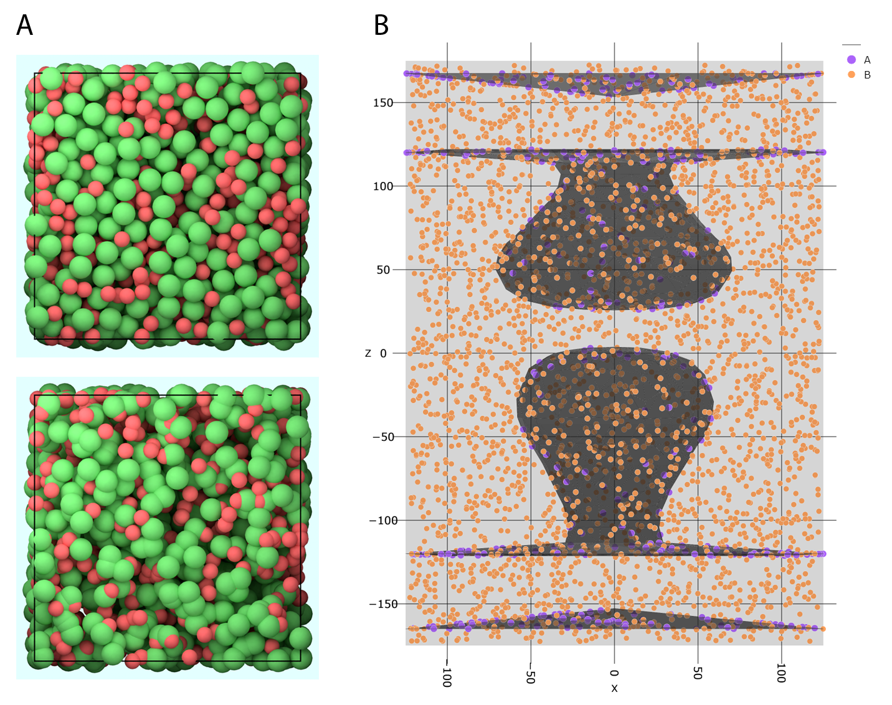

.. _userguide_distribution:

=====================
Molecule distribution
=====================

Before we can start a simulation, we need to initialize the system by distributing the molecules in the simulation volume and on the compartment surfaces.

Distribute in volume
--------------------

For the distribution of molecules in the volume of a compartment, PyRID offers three approaches.

1) Specify molecule positions and orientations manually:

.. code-block:: python
	
	position = np.random.rand(1000,3)
	quaternion = np.array([[1.0,0.0,0.0,0.0]*1000])
	mol_type_index = np.array([0]*500+[1]*500)

	Simulation.add_molecules('Volume',1, position, quaternion, mol_type_index)

The mol_type_index array comprises the molecule type indices of the molecules which to distribute. The quaternion array defines the molecule orientations. The second argument in add_molecules() is the index of the compartment. The index 0 is reserved for the simulation box, i.e. outside any mesh compartment. 

2) PyRID supports the Poisson disc sampling method. Thereby, spheres are packed inside the simulation box or a compartment such that there is no overlap. The sphere radii correspond to the size of the rigid bead molecules which to distribute. Therefore, this method is well suited for close to spherical molecules but less suited for highly non-spherical/elongated molecules. PyRid offers two variants of Poisson disc sampling. For dense packing use:

.. code-block:: python
	
	position, mol_type_index, quaternion = Simulation.distribute('PDS', 'Volume', 0, ['A','B'], [1000,2000]) 

	Simulation.add_molecules('Volume',0, position, quaternion, mol_type_index)

Here, 1000 molecules A and 2000 molecules B are distributed in compartment 0 (the box volume). With this method volume fractions of around 35% are possible. For dilute uniform packing use:

.. code-block:: python

	position, mol_type_index, quaternion = Simulation.distribute('PDS uniform', 'Volume', 0, ['A','B'], [1000,2000])

	Simulation.add_molecules('Volume',0, position, quaternion, mol_type_index)

3) For highly non-spherical/elongated molecules or packing densities above 35% PyRID currently does not offer a good method to distribute molecules without overlap. However, molecules can be distributed randomly inside a compartment using the Monte Carlo method where position vectors are sampled uniformly inside the compartment volume (not to be confused with the Metropolis Monte Carlo method). To reduce the molecule-molecule overlap, one could, e.g.,  in addition simulate the system with soft repulsive interactions between the particles:

.. code-block:: python

	position, mol_type_index, quaternion = Simulation.distribute('MC', 'Volume', 0, ['A','B'], [1000, 2000])

	Simulation.add_molecules('Volume',0, position, quaternion, mol_type_index)

Distribute on surface
---------------------

To distribute molecules on the surface of a mesh compartment, PyRID also offers a Poisson disc sampling method:

.. code-block:: python

	position, mol_type_index, quaternion, face_idx  = Simulation.distribute('PDS', 'Surface', 2, ['A', 'B'], [500,1000], facegroup = 'active_zone')

	Simulation.add_molecules('Surface',2, position, quaternion, mol_type_index, face_idx)

Here, 500 A molecules and 1000 B molecules are distributed on the faces belonging to the face group 'active_zone'of mesh compartment 2. The facegroup is optional and if no facegroup name is passed, the molecules are distributed across the hole mesh surface. The face_idx array contains the indices of the faces/triangles where each molecule is located.

Again, you can also use the Monte Carlo sampling method:

.. code-block:: python
	
	position, mol_type_index, quaternion, face_idx  = Simulation.distribute('MC', 'Surface', 2, ['A', 'B'], [500,1000], facegroup = 'active_zone')

	Simulation.add_molecules('Surface',2, position, quaternion, mol_type_index, face_idx)

For visualization of the molecule distribution you can call (see Fig. :ref:`fig:molecule_dictribution` B):

.. code-block:: python
	
	prd.plot.plot_scene(Simulation, save_fig = True)

    
    **Molecule distributions.** **(A)** Top: No overlap between particles. This can be achieved either by using the PDS (Poisson Disc Sampling) methods offered by PyRID, or by the MC (Monte Carlo) method and subsequent simulation with soft repulsive particle-particle interactions. Bottom: If the Monte Carlo method is used, particles will overlap. **(B)** Visualization of the molecule distribution including the different mesh compartments.

Release events
--------------

It is also possible to distribute new molecules during the simulation (apart from molecular reactions) by what we here call release events. A release event can occur in the volume of on a mesh surface.
To define a release event in the volume of a Compartment call:

.. code-block:: python

	Simulation.add_release_site('Volume', 10000, 0, Number = [300,50], Types = ['A', 'B'], origin = [0.0, 0.0, 24.5], jitter = 1.0)

Here, 300 A molecules and 50 B molecules are distributed around the point [0.0, 0.0, 24.5] in the compartment with index 0. The release event is scheduled for time step 10000. The parameter 'jitter' sets the standard deviation of the molecule distribution around the given origin.
Similarly, we can define a release event on a surface by:

.. code-block:: python
	
	Simulation.add_release_site('Surface', 2000, 1, Number = [500], Types = ['A'], triangle_id = 50, jitter = 2.0)

However, we do not directly set origin but instead pass a triangle index. The moelcules will then be distributed around the centroid of the corresponding mesh triangle.