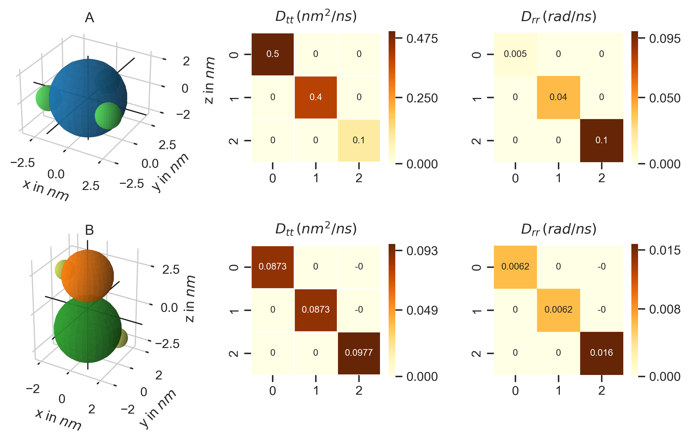

.. _userguide_molecules:

=========
Molecules
=========

In PyRID, molecules are represented by rigid bead models. In the following, bead and particle are synonymous and used interchangeably. Each rigid bead molecule consists of a number of Particles with fixed positions relative to the local coordinate frame of the molecule. In PyRID, molecules can be either located in the volume of a compartment (in the following called volume molecules) or on the surface of a mesh compartment (surface molecules).
Before we can define molecules, we need to register the corresponding particle types. As an example, let us construct two toy molecules named A and B. We will use the name 'core particle' for particles that represent the excluded volume of the molecule and which interact with each other by repulsive forces. We will use the name 'patchy particle' for particles that represent attractive interaction sites via which molecule pairs can form bonds. 
Let molecule A consists of 1 core particle 'core_1' and 3 patchy particles 'patch_1', and molecule B out of two core particles 'core_2', 'core_3' and two patchy particles 'patch_2'.
We can add new particle types to the system by

.. code-block:: python
	
	Simulation.register_particle_type('core_1', 2.5) # (name, radius)
	Simulation.register_particle_type('core_2', 1.5)
	Simulation.register_particle_type('core_3', 2.0)
	Simulation.register_particle_type('patch_1', 0.0)
	Simulation.register_particle_type('patch_2', 0.0)
	
Here, the first argument is the particle name, and the second the particle radius. The radius does not have any meaning/effect by default but can be used by PyRID to calculate the molecule's diffusion tensor for translation and rotation, or when we add repulsive interactions between particles.
Now that the particles have been defined, we can use these to construct a rigid bead model. Therefore, we need to create two lists, one containing the particle types, the other the particle positions. As just mentioned, PyRID comes with a method to calculate the diffusion tensors of a rigid bead molecule. We can, however, also manually set a diffusion tensor, e.g., one that has been measured experimentally for a certain molecule/protein. However, if we want to use the build in method, it is important that we take into account the particle radii such that there is no overlap between particles!

.. code-block:: python
   
   A_pos = prd.distribute_surf.evenly_on_sphere(3,2.5)  # (number, radius)
   A_types = ['core_1','patch_1','patch_1', 'patch_1']

   B_pos = [[0.0,0.0,1.5], [0.0,0.0,-2.0], [-1.5,0.0,1.5], [2.0,0.0,-2.0]]
   B_types = ['core_2','core_3','patch_2','patch_2']

In our example, we used the function evenly_on_sphere(n,r) from PyRIDs distribute_surf module in order to get the position data for molecule A. This function distributes n points on the surface of a sphere of radius r such that the minimum distance between all points is approximately maximized, i.e. the points are approximately evenly distributed. For molecule B, the position vector has been set manually.
Next, we still need to register the two molecule types:

.. code-block:: python

   Simulation.register_molecule_type('A', A_pos, A_types)
   Simulation.register_molecule_type('B', B_pos, B_types, h_membrane = 1.5)

The parameter h_membrane is optional and shifts the position of surface molecules along the z axis. by default h_membrane = 0, i.e., the molecule is inserted into the mesh surface at its center (0,0,0).
We still need to pass information about the molecule diffusion properties to PyRID.
Let us assume that molecule A should represent some protein, for which the translational and rotational diffusion tensor have been measured, either by experiment or molecular dynamics simulations. We can then set the diffusion tensors by

.. code-block:: python
   
   D_rr = [[0.005,0,0],[0,0.04,0],[0,0,0.1]]
   D_tt = [[0.5,0,0],[0,0.4,0],[0,0,0.1]]

   Simulation.set_diffusion_tensor('A', D_tt, D_rr)

For molecule B no such data is available. Therefore, we calculate the diffusion tensors using PyRIDs diffusion_tensor method. Here, it is important to note that the method not only calculates the diffusion tensors but also shifts the center of the molecule to the center of diffusion! As such, while molecule A will still rotate about the origin ([0,0,0]) as defined by the position vector above, for molecule B the particle positions will be shifted such that the center coincides with the center of diffusion!

.. code-block:: python
   
   D_tt, D_rr = prd.diffusion_tensor(Simulation, 'A')

   Simulation.set_diffusion_tensor('B', D_tt, D_rr)

By default diffusion_tensor() only returns the translational and rotational diffusion tensors. However, we can also ask for the translation rotation coupling, the center of diffusion, and the center of mass (the center of mass is actually not used by PyRID at any point. However, it might be interesting to compare it to the center of diffusion).

.. code-block:: python
   
   D_tt, D_rr, D_tr, D_rt, r_CoD, r_CoM = prd.diffusion_tensor(Simulation, 'B', return_CoD = True, return_coupling = True, return_CoM = True)

   Simulation.set_diffusion_tensor('B', D_tt, D_rr)

PyRID also allows us to now plot the rigid bead model structure and diffusion tensors (:numref:`fig:moelcules_a_b`):

.. code-block:: python
   
   prd.plot.plot_mobility_matrix('A', Simulation, save_fig = True, show = True)
   prd.plot.plot_mobility_matrix('B', Simulation, save_fig = True, show = True)

    
    **Structure (left) and translational (middle) and rotational (right) diffusion tensors for the molecules A and B.** As one would expect, for molecule B, diffusion about the z axis is much higher than about the x or y axis. For molecule A, the diffusion tensors do not correspond to the molecule structure as we have set these manually.

Fixed concentration boundary conditions
---------------------------------------

In the case that we set the boundary condition to 'fixed concentration', we also need to define the concentration of the different molecule types outside the simulation box. By default, the concentration is zero. We need to set concentration separately for the volume and for the surface:

.. code-block:: python
   
   Simulation.fixed_concentration_at_boundary('A',0.01, 'Box', 'Volume')
   
   Simulation.fixed_concentration_at_boundary('A', 0.05, 'Postsynapse', 'Surface')

