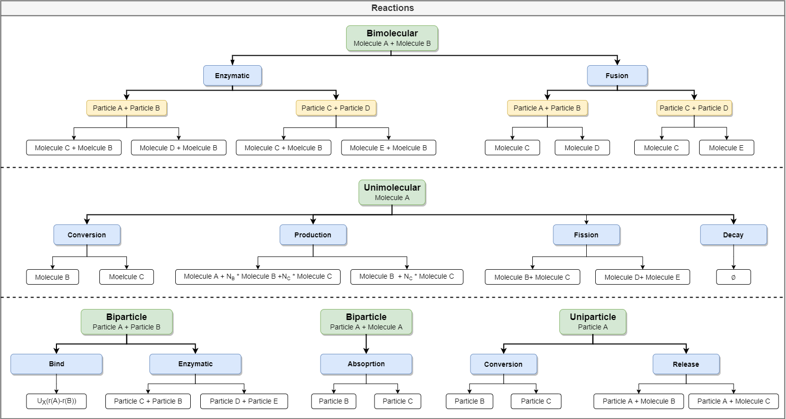
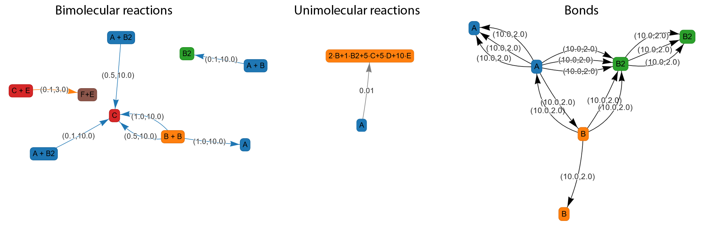

.. _userguide_reactions:

=========
Reactions
=========

PyRID supports various uni- and bimolecular reactions. For bimolecular reactions, PyRID uses the Doi scheme. Thereby, two particles/molecules react with some rate :math:`k` if the inter-particle distance is below a certain reaction radius :math:`R_{react}`. Unimolecular reactions are handled using a variant of the Gillespie stochastic simulation algorithm, i.e. the time point of the next reaction is sampled from the expected lifetime distribution of the particle/molecule. :numref:`fig:reactions_graph` gives an overview over the possible reactions that are supported by PyRID.

    
    **PyRID subdivied reactions into bimolecular, unimolecular, biparticle and uniparticle reactions.** For each of these categories various reaction types exist, such as binding, fusion or enzymatic reactions.

Binding reactions
-----------------

We can, e.g., define a binding reactions between particles belonging to different molecules. A binding reaction is a biparticle reaction (bp). Therefore, we call the add_bp_reaction() method. We can link a binding reaction to any interaction potential (even solely repulsive). In addition, we need to set the educt particle types, the reaction radius and the reaction rate. We can also pass two product particle types, in case we want the particle types to change upon binding. Changing the particle types, e.g., allows us to also define an unbinding reaction. Therefore, we define a conversion reaction for the product particles. Any bond between particles will be removed as soon as a particle or a molecule changes its type. Type changes can occur via conversion reactions or by enzymatic reactions. Of no such unbinding reaction has been defined, bonds are removed as soon as the inter-particle distance crosses the cutoff radius of the interaction potential. For the weak piecwise harmonic potential (harmonic_attraction), the cutoff radius is, e.g., :math:`d_1+d_2+r_c` (see :ref:`userguide_potentials`).
Let us define a binding reaction between the particle types 'patch_1' and 'patch_2':

.. code-block:: python
   
   k=100.0
   h=50.0
   d=0.0
   rc = 2.0

   r_react = 2.0
   rate = 1.0

   Simulation.add_bp_reaction('bind', ['patch_1', 'patch_2'], ['patch_1', 'patch_2'], rate, r_react, 'harmonic_attraction', {'k':k, 'h':h , 'rc':rc})

There are many other reactions we can define on our two molecules and the respective particles. The system we have defined so far is to small to be able to account for all. Therefore, in the following I will give an example for each type of reaction defined on the two molecules, however, all these reactions should not be applied at ones.

Fusion reactions
----------------

**Molecule fusion**

For the fusion reaction we need to define a third molecule for the fusion product:

.. code-block:: python

   Simulation.add_particle_type('core_4', 3.0)

   C_pos = [[0.0,0.0,0.0]]
   C_types = ['core_4']

   Simulation.register_molecule_type('C', C_pos, C_types)

   D_tt, D_tr = prd.diffusion_tensor(Simulation, 'C')
   Simulation.set_diffusion_tensor('C', D_tt, D_rr)

Next, we define the fusion reaction :math:`\ce{A + B ->[\ce{k_1}] C }`. However, because in PyRID, molecules are represented by a set of particles, we actually need to tell PyRID, which particles are involved in the fusion reaction. Under the hood, PyRID only determines the distances between particles, but not molecules. We want the fusion reaction to occur whenever any of the molecules core particles are within some reaction distance. Since molecule A only consists of the core particle 'core_1' and molecule B of the two core particles 'core_2' and 'core_3', we may setup the fusion reaction like this:

.. code-block:: python

   educt_molecules = ['A', 'B']
   product_molecule = ['C']
   educt_particle_pairs = [['core_1', 'core_2'], ['core_1', 'core_3']]
   reaction_rates = [0.5, 0.1]
   reaction_radii = [1.0, 2.0]

   Simulation.add_bm_reaction('fusion', educt_molecules, product_molecule, educt_particle_pairs, reaction_rates, reaction_radii)

Here, 'core_1' and 'core_2' react with rate 0.5 if the inter-particle distance is below 1.0 nm. 'core_1' and 'core_3' react with rate 0.5 if the inter-particle distance is below 2.0 nm. In both cases, the corresponding educt molecules A and B are fused to form molecule C. If we are not interested in the effects of molecule topology and anisotropic reaction probabilities on the reaction kinetics we could also simplify the system. For example, we could take one particle each for the reaction or even define a particle at the molecule center for the purpose of handling the fusion reaction.
Another thing to keep in mind is that not all bimolecular reactions are allowed. Restrictions on reactions an interactions are mainly imposed on the educt locations:

#. If both particles are in the same compartment

   * and at least one is a volume molecule, interactions and reactions are always allowed. However, if a volume and a surface molecule fuse, the product will always be a surface molecule. Also, if there exists an obstacle (a mesh element) in the linear path connecting the two educt centers, the reaction always fails.
   * If both particles are surface molecules, interactions are always valid but reactions are only allowed if the angle between the molecules' triangle normals is less than 90 degree.

#. If both particles are in different compartments

   * and both particles are volume molecules, neither interactions nor reactions are allowed.
   * If both particles are surface particles, interactions are allowed, however, not reactions except binding reactions!
   * If one of the particles belongs to a surface molecule and the other to a volume molecule reactions are always allowed if one of the compartments is the simulation box (System), otherwise neither reactions, nor interactions are allowed.

**Molecule-Particle absorption**

The fusion reaction from above is only defined on molecule educts and products. However, a similar reaction can also be defined on molecule particle pairs. Thereby, a particle of molecule A absorbs molecule B.

.. code-block:: python

   educt_particles = ['patch_1', 'core_2']
   product_particle = ['patch_2']
   reaction_rate = 0.001
   reaction_radius = 3.0

   Simulation.add_bp_reaction('absorption', educt_particles, product_particle, reaction_rate, reaction_radius)

The reaction is be executed as follows: particle 'patch_1' is converted to 'patch_2' and the molecule belonging to the particle 'core_2' is deleted. Note, that PyRID does in general not test to which type of molecule a particle belongs. Therefore, a reaction will be executed on all molecule types, where a specific particle type is used. To ensure that bimolecular reactions are unique to a specific molecule type, currently one should use different particle types for every molecule type. This is, however, a bit inconvenient and should be changed in future iteration of PyRID.

Enzymatic reactions
-------------------

**Molecules**

Enzymatic reactions can be defined on multiple particle pairs, analog to the molecule fusion reaction. Enzymatic reactions defined on rigid bead molecules are named 'enzymatic_mol' to differentiate from enzymatic reactions defined on particles:

.. code-block:: python

   educt_molecules = ['A', 'B']
   product_molecules = ['C', 'B']
   educt_particle_pairs = [['core_1', 'core_2']]
   reaction_rates = [0.5]
   reaction_radii = [2.0]

   Simulation.add_bm_reaction('enzymatic_mol', educt_molecules, product_molecules, educt_particle_pairs, reaction_rates, reaction_radii)

Note that the second educt molecule (here B) is always defined to be the enzyme! Currently, a list of two products is passed, the reason being that I was thinking about generalizing the reaction by adding the possibility to also change the type of the enzyme. I am, however, not sure whether this would be useful in any scenario. Currently, such a reaction where both molecules change their type could, however, be implemented by two enzymatic reactions.

**Particles**

Enzymatic reactions can also be defined on particles:

.. code-block:: python

   educt_particles = ['patch_1', 'patch_2']
   product_particles = ['patch_2', 'patch_2']
   reaction_rate = 0.02
   reaction_radius = 1.0

   Simulation.add_bp_reaction('enzymatic', educt_particles, product_particles, reaction_rate, reaction_radius)

Fission reactions
-----------------

**Molecule fission**

A fission reaction is the inverse of the molecule fusion reaction and thereby limited to two products.
Also, if the educt is a surface molecule, we need to define whether to place the product on the surface or in the volume. If the product is placed in the volume, we also need to define for each product, if it is placed inside or outside the compartment. For volume molecules the situation is a bit easier as PyRID only allows for the products to also be volume molecules.
The fission reaction :math:`\ce{C->[\ce{k_{-1}}] A + B}` is setup as follows:

.. code-block:: python
   
   educt_molecule = 'C'
   product_molecules = ['A']+['B']
   products_location = [1]+[0]
   products_direction = [1]+[-1]
   rate = 5e-5,
   reaction_radius = 4.5

   Simulation.add_um_reaction('fission', educt_molecule, rate, product_molecules, products_location, products_direction, reaction_radius)
   
Here, the product location can be either 0 (volume) or 1 (surface). The products direction can be either 1 (outside the compartment) or -1 (inside the compartment). In the example above, for a surface molecule C, the product A will also be a surface molecule (C will be converted into A) whereas molecule B is released into the compartment volume. The direction value for product A is not actually needed but currently still needs to be set.

**Molecule production**

The molecule production reaction is very similar to the fission reaction but allows for more than two products:

.. code-block:: python

   educt_molecule = 'A'
   product_molecules = ['C']*5+['B']*2
   products_location = [0]*5+[0]*2
   products_direction = [-1]*5+[-1]*2
   rate = 0.01,
   reaction_radius = 10.0

   Simulation.add_um_reaction('production', educt_molecule, rate, product_molecules, products_location, products_direction, reaction_radius)

**Molecule-Particle release**

The release reaction is the inverse of the absorption reaction in that a new molecule is released from molecule's particle. It is thereby analog to the fission reaction:

.. code-block:: python

   educt_particle = 'patch_2'
   products = ['patch_1']+['B']
   products_location = 0
   products_direction = -1
   rate = 5e-5,
   reaction_radius = 4.5

   Simulation.add_up_reaction('release', educt_molecule, rate, product_molecules, products_location, products_direction, reaction_radius)

Here, the particle 'patch_2', belonging to some surface molecule, is converted to 'patch_1' while releasing a molecule B into the compartment.

Conversion reactions
--------------------

**Molecule conversion**

For molecules, a conversion reaction can be setup by:

.. code-block:: python
   
   Simulation.add_um_reaction('conversion_mol', 'A', 0.01, ['B'])

**Particle conversion**

For particles, a conversion reaction can be setup by:

.. code-block:: python

   Simulation.add_up_reaction('conversion', 'patch_1', 0.01, ['patch_2'])

**Molecule decay**

Decay reactions are currently only supported for molecules, but not particles:

.. code-block:: python
   
   Simulation.add_um_reaction('decay', 'A', 0.01)

Due to the many possible combinations of reactions and other interactions it can become difficult keep to keep track over all the different relations in the system. Therefore, PyRID enables you to create interaction graphs (based on the pyvis library) for better visualization and analysis of the model (see :numref:`fig:ReactionsGraph2`). This feature is available via PyRIDs evaluation module that is introduced in detail later on.
To create reaction graphs, first create an instance of PyRIDs EValuation class:

.. code-block:: python

   Evaluation = prd.Evaluation()

Graphs visualizing the bimolecular, unimolecular and interaction bonds in the system can then be create by:

.. code-block:: python

   Evaluation.plot_reactions_graph(Simulation, graph_type = 'Bimolecular')
   Evaluation.plot_reactions_graph(Simulation, graph_type = 'Interactions')
   Evaluation.plot_reactions_graph(Simulation, graph_type = 'Unimolecular')

    
    **Graph showing the reactions and bond interactions.** The number pairs on the edges show the reaction rate and radius respectively.

